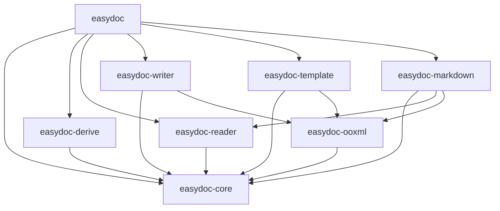

# easydoc-rust

**Rust DOC/DOCX document operations library -- read, write, template fill, Markdown conversion, and streaming event processing with O(1) memory.**

[](https://github.com/easy-4-rust/easydoc-rust/actions)
[](https://crates.io/crates/easydoc)
[](https://docs.rs/easydoc)
[](LICENSE)
[](https://www.rust-lang.org)

> `easydoc-rust` is the DOC/DOCX counterpart of [`easyexcel-rust`](https://github.com/easy-4-rust/easyexcel-rust), sharing the same fluent builder + trait extension + proc-macro architecture. It provides a unified `EasyDoc` static factory for all document operations: write, read, edit, template fill, Markdown conversion, streaming SAX events, and multi-mode view rendering.

---

## Key Capabilities

| Capability | Status | Description |
|---|---|---|
| Document write | Stable | Fluent builder for headings, paragraphs, tables, images, page breaks |
| Table write from structs | Stable | `#[derive(DocxRow)]` + `EasyDoc::write_table()` one-liner |
| Document read | Stable | Text extraction, typed table deserialization, DOC/DOCX auto-detection |
| SAX streaming read | Stable | O(1) memory event-driven reading (paragraphs, tables, images, formulas, lists, hyperlinks, nested tables, merged cells) |
| ViewMode rendering | Stable | 4 modes: Plain, Annotated (LLM-friendly), Outline, Stats |
| Semantic model | Stable | `DocumentContent` read-modify-write round-trip |
| Template fill | Stable | `{key}` scalar, `{.field}` collection, `{prefix.field}` named collection |
| Markdown conversion | Stable | Headings, rich text, GFM tables, merged cells, lists, code blocks, images, footnotes, front matter |
| DocxRow derive macro | Stable | `#[derive(DocxRow)]` with `width`, `format`, `align`, `wrap`, `converter` annotations |
| Custom converters | Stable | `DocConverter<T>` trait + `ConverterRegistry` runtime dispatch |
| Write lifecycle hooks | Stable | `DocWriteHandler` at document/paragraph/table/cell level |
| Edit existing docs | Stable | Text replacement in existing DOCX files |
| In-memory output | Stable | `document_to_bytes()` / `write_table_to_bytes()` |

---

## Format Support

| Format | Read | Write | Edit | Template | Markdown | Notes |
|---|:---:|:---:|:---:|:---:|:---:|---|
| DOCX (.docx) | Full | Full | Full | Full | Full | SAX streaming, semantic model, binary image extraction |
| DOC (.doc) | Full | -- | -- | -- | Full | Read-only via `office_oxide`; format auto-detection |

### SAX Streaming Content Coverage

| Content Type | Read | Details |
|---|:---:|---|
| Paragraphs | Yes | Text runs with bold/italic/strikethrough/hyperlink |
| Headings | Yes | H1-H6 with level |
| Tables | Yes | Including nested tables, merged cells (gridSpan/vMerge) |
| Images | Yes | Binary data extracted from `word/media/*` via rels mapping |
| OMML formulas | Yes | Inline `<m:oMath>` and display `<m:oMathPara>` |
| Lists | Yes | `<w:numPr>` detection (ordered/unordered) |
| Hyperlinks | Yes | `<w:hyperlink>` with relationship resolution |
| Page/Column breaks | Yes | `<w:br>` |

---

## Quick Start

```toml
[dependencies]
easydoc = "0.1"
```

### Write a table from struct data

```rust
use easydoc::prelude::*;

#[derive(DocxRow)]
#[docx(banded_rows = true)]
struct User {
    #[docx(name = "Name", order = 0, width = "30%")]
    name: String,
    #[docx(name = "Age", order = 1, width = "15%")]
    age: u32,
    #[docx(name = "Email", order = 2, width = "55%")]
    email: String,
}

let users = vec![
    User { name: "Alice".into(), age: 30, email: "alice@example.com".into() },
    User { name: "Bob".into(), age: 25, email: "bob@example.com".into() },
];

EasyDoc::write_table("users.docx", &users)
    .title("User Report")
    .header_style(TableStyle::header())
    .banded_rows(true)
    .do_write()?;
```

### Read a document (streaming, O(1) memory)

```rust
use easydoc::prelude::*;

// Quick text extraction
let text = EasyDoc::read_text("document.docx")?;

// Typed table extraction
let tables: Vec<Vec<User>> = EasyDoc::read_tables::<User>("document.docx")?;

// SAX event streaming -- O(1) memory, suitable for large documents
struct MySink;
impl EventSink for MySink {
    fn on_event(&mut self, event: &DocumentEvent) -> easydoc::Result<()> {
        match event {
            DocumentEvent::Heading { level, runs } => {
                println!("H{level}: {}", runs.iter().map(|r| r.text.as_str()).collect::<String>());
            }
            DocumentEvent::Table(table) => {
                println!("Table: {} rows", table.rows.len());
            }
            DocumentEvent::Image(img) => {
                println!("Image: {} bytes", img.data.as_ref().map_or(0, |d| d.len()));
            }
            _ => {}
        }
        Ok(())
    }
}

EasyDoc::read_events("large.docx", &mut MySink)?;
```

### ViewMode -- LLM-friendly document rendering

```rust
use easydoc::prelude::*;

// Plain text
let plain = EasyDoc::view_as("doc.docx", &ViewMode::Plain)?;

// Annotated -- structural markers for LLM context
let annotated = EasyDoc::view_as("doc.docx", &ViewMode::Annotated)?;
// Output: "[Heading1] Introduction\n[Paragraph 1] Hello world\n[Table 1: 3x4] ..."

// Outline -- headings only
let outline = EasyDoc::view_as("doc.docx", &ViewMode::Outline { max_level: 3 })?;

// Stats -- document statistics
let stats = EasyDoc::view_as("doc.docx", &ViewMode::Stats)?;
// Output: "Paragraphs: 12\nTables: 3\nImages: 2\nWords: 1500"
```

### Convert to Markdown

```rust
// Quick conversion
let markdown = EasyDoc::to_markdown("document.docx")?;

// Full control: image extraction, front matter, atomic output
let result = EasyDoc::markdown("document.docx")
    .image_directory("output/assets")
    .image_reference_prefix("assets")
    .include_front_matter(true)
    .write_to("output/document.md")?;

for warning in &result.warnings {
    eprintln!("conversion fallback: {}", warning.message);
}
```

### Build a full document

```rust
EasyDoc::document("report.docx")
    .title("Annual Report")
    .author("Zhang San")
    .add_heading("Chapter 1: Overview", HeadingLevel::H1)
    .add_paragraph(
        Paragraph::new()
            .add_text("This is body text with ")
            .add_run(Run::new("highlighted").bold().color(0xFF0000))
            .add_text(" content.")
            .alignment(HorizontalAlignment::Both)
    )
    .add_table(Table::from_data(&users).banded_rows(true))
    .add_page_break()
    .save()?;
```

### Template fill

```rust
use std::collections::HashMap;

let mut data = HashMap::new();
data.insert("name".into(), "Alice".into());
data.insert("date".into(), "2026-08-10".into());

EasyDoc::fill_template("template.docx", "output.docx", &data)?;
```

### Semantic model round-trip

```rust
// Read -> Modify -> Write
let mut content = EasyDoc::load("input.docx")?;
// ... modify content.blocks ...
EasyDoc::write_content(&content, "output.docx")?;

// In-memory
let bytes = EasyDoc::write_content_to_bytes(&content)?;
```

---

## Complete API Reference

### EasyDoc Static Factory (18 methods)

```rust
// === Write ===
EasyDoc::document(path) -> DocBuilder                    // Build a full document
EasyDoc::write_table(path, &data) -> TableWriteBuilder   // Write struct data as table
EasyDoc::document_to_bytes(f) -> Result<Vec<u8>>         // Build document in memory
EasyDoc::write_table_to_bytes(data) -> Result<Vec<u8>>   // Write table to memory
EasyDoc::edit(path) -> Result<DocEditor>                 // Edit existing DOCX
EasyDoc::fill_template(tpl, out, &data) -> Result<()>    // Scalar placeholder fill
EasyDoc::fill_template_list(tpl, out, &[T], field)       // Collection expansion fill

// === Read ===
EasyDoc::read(path) -> DocReadBuilder                    // Streaming reader builder
EasyDoc::read_text(path) -> Result<String>               // Quick text extraction
EasyDoc::read_tables::<T>(path) -> Result<Vec<Vec<T>>>   // Typed table extraction
EasyDoc::read_events(path, &mut sink) -> Result<()>      // SAX event streaming (O(1) memory)
EasyDoc::view_as(path, &ViewMode) -> Result<String>      // Multi-mode view rendering

// === Markdown ===
EasyDoc::markdown(path) -> MarkdownBuilder               // Markdown conversion builder
EasyDoc::to_markdown(path) -> Result<String>             // Quick Markdown conversion
EasyDoc::write_markdown(src, out) -> Result<MarkdownResult>  // Convert and write to file

// === Semantic Model ===
EasyDoc::load(path) -> Result<DocumentContent>           // Read into semantic model
EasyDoc::write_content(content, path) -> Result<()>      // Write semantic model to file
EasyDoc::write_content_to_bytes(content) -> Result<Vec<u8>>  // Write semantic model to memory
```

### ViewMode (4 modes, LLM-friendly)

| Mode | Constructor | Output Example |
|---|---|---|
| **Plain** | `ViewMode::Plain` | `Hello world\nNext paragraph` |
| **Annotated** | `ViewMode::Annotated` | `[Heading1] Title\n[Paragraph 1] Hello\n[Table 1: 3x4] ...` |
| **Outline** | `ViewMode::Outline { max_level: 3 }` | `# H1 Title\n## H2 Subtitle` |
| **Stats** | `ViewMode::Stats` | `Paragraphs: 12\nTables: 3\nImages: 2\nWords: 1500` |

---

## `#[derive(DocxRow)]` -- Typed Table Mapping

The derive macro generates `schema()`, `from_row()`, `to_row()`, and their converter-aware variants automatically.

```rust
use easydoc::prelude::*;

struct StatusConverter;
impl DocConverter<String> for StatusConverter {
    fn support_type() -> std::any::TypeId { std::any::TypeId::of::<String>() }
    fn to_doc_value(&self, value: &String, _col: &TableColumn) -> easydoc::Result<DocValue> {
        Ok(DocValue::String(format!("[{}]", value)))
    }
    fn from_doc_value(&self, value: &DocValue, _col: &TableColumn) -> easydoc::Result<String> {
        match value {
            DocValue::String(s) => Ok(s.trim_matches(|c| c == '[' || c == ']').to_string()),
            _ => Ok(String::new()),
        }
    }
}

#[derive(DocxRow)]
#[docx(banded_rows = true)]
struct Report {
    #[docx(name = "ID", order = 0, width = "2cm")]
    id: u32,

    #[docx(name = "Amount", order = 1, width = "3cm", format = "#,##0.00", align = "right")]
    amount: f64,

    #[docx(name = "Date", order = 2, width = "4cm", format = "yyyy-mm-dd")]
    date: String,

    #[docx(name = "Status", order = 3, converter = StatusConverter)]
    status: String,

    #[docx(name = "Notes", order = 4, wrap = true)]
    note: Option<String>,

    #[docx(ignore)]
    internal_id: String,
}
```

### Derive Attributes Reference

**Struct-level:**

| Attribute | Type | Example | Effect |
|---|---|---|---|
| `banded_rows` | bool | `#[docx(banded_rows = true)]` | Zebra striping |
| `table_width` / `auto_width` | bool | `#[docx(table_width = Auto)]` | Auto-fit table width |

**Field-level:**

| Attribute | Type | Example | Effect |
|---|---|---|---|
| `name` | string | `#[docx(name = "Full Name")]` | Column header text |
| `index` | usize | `#[docx(index = 0)]` | Zero-based column index |
| `order` | u32 | `#[docx(order = 1)]` | Column sort order (lower = leftmost) |
| `width` | string | `#[docx(width = "2cm")]` | Column width: `"2cm"`, `"80px"`, `"50%"`, `"auto"` |
| `format` | string | `#[docx(format = "#,##0.00")]` | Number/date format string |
| `align` | string | `#[docx(align = "right")]` | `"left"`, `"center"`, `"right"`, `"both"` / `"justify"` |
| `wrap` | bool | `#[docx(wrap = true)]` | Text wrapping in cells |
| `converter` | type path | `#[docx(converter = MyConverter)]` | Custom `DocConverter<T>` implementation |
| `ignore` | flag | `#[docx(ignore)]` | Skip this field during read/write |

### How Annotations Map to OOXML

| Annotation | OOXML Output |
|---|---|
| `width="2cm"` / `"80px"` / `"50%"` / `"auto"` | `<w:tcW w:w="..." w:type="dxa\|pct\|auto"/>` |
| `format="#,##0.00"` / `"yyyy-mm-dd"` | `<w:numFmt w:val="..."/>` |
| `align="right"` / `"center"` / `"left"` / `"both"` | `<w:jc w:val="..."/>` |
| `wrap=false` | `<w:noWrap/>` |
| `converter="MyConverter"` | `ConverterRegistry` runtime dispatch |

---

## Extension Traits

| Trait | Purpose | Analogous to (easyexcel-rust) |
|---|---|---|
| `DocxRow` | Struct <-> table row bidirectional mapping | `ExcelRow` |
| `DocConverter<T>` | Type <-> DocValue conversion | `Converter<T>` |
| `DocReadListener<T>` | Streaming read callbacks | `ReadListener<T>` |
| `DocWriteHandler` | Write lifecycle hooks (document/paragraph/table/cell) | `WriteHandler` |
| `DocumentReader` | Unified read entry trait | -- |
| `EventSink` | SAX event consumption interface | -- |

---

## Architecture

```
easydoc-rust/
├── Cargo.toml                        workspace manifest
├── crates/
│   ├── easydoc/                      facade -- EasyDoc static factory
│   ├── easydoc-core/                 backend-agnostic model, traits, errors, styles
│   ├── easydoc-derive/               #[derive(DocxRow)] proc-macro
│   ├── easydoc-ooxml/                safe OOXML rewrite, resource limits, atomic output
│   ├── easydoc-reader/               DOC/DOCX reading via office_oxide + SAX
│   ├── easydoc-writer/               DOCX creation via docx-rs
│   ├── easydoc-template/             template placeholder fill
│   └── easydoc-markdown/             DOC/DOCX -> Markdown conversion
├── docs/
├── README.md
└── README_zh.md
```



---

## Security & Resource Limits

| Limit | Default |
|---|---|
| Max ZIP entries | 10,000 |
| Max single entry size | 256 MB |
| Max total expanded size | 1 GB |
| Max compression ratio | 1,000:1 |
| Output strategy | atomic (temp file + persist) |

---

## Related Projects

- [`easyexcel-rust`](https://github.com/easy-4-rust/easyexcel-rust) -- Excel counterpart (same architecture: fluent builder + derive macro + converter registry)
- Java: [easy4j-easydoc](https://github.com/easy-4-rust/easy4j-easydoc) (Apache POI + docx4j baseline)

### Comparison with Java EasyExcel/Hutool

| Feature | Java EasyExcel/Hutool | easydoc-rust |
|---|---|---|
| Typed row mapping | `@ExcelRow` annotation | `#[derive(DocxRow)]` proc-macro |
| Custom converters | `Converter<T>` interface | `DocConverter<T>` trait + runtime registry |
| Streaming read | SAX event listener | `EventSink` trait + SAX parser |
| Write lifecycle | `WriteHandler` callback | `DocWriteHandler` trait |
| Template fill | `ExcelWriter.fill()` | `EasyDoc::fill_template()` |
| In-memory output | `ByteArrayOutputStream` | `document_to_bytes()` |
| Safety | JVM sandbox | ZIP limits + atomic output + `unsafe_code = "forbid"` |

---

## Roadmap

- [x] Phase 1: Infrastructure (8-crate workspace, OOXML base, atomic output)
- [x] Phase 2: Semantic model (`DocumentContent`, reader conversion, Markdown)
- [x] Phase 3: Event chain (`DocumentEvent`, `EventSink`, `DocumentReader`, SAX streaming)
- [x] Phase 3.5: Derive macro annotations (`width`, `format`, `align`, `wrap`, `converter`) fully wired to OOXML output
- [x] Phase 3.5: ViewMode rendering (Plain, Annotated, Outline, Stats)
- [x] Phase 3.5: SAX content coverage (OMML formulas, lists, hyperlinks, nested tables, merged cells, image binary)
- [x] Phase 3.5: `numbering.xml` parsing for correct ordered list numbering
- [x] Phase 3.5: Hyperlink relationship resolution (`word/_rels/document.xml.rels`)
- [ ] Phase 4: Equations (OMML -> LaTeX conversion)
- [ ] Phase 4: Comments and revision tracking
- [ ] Phase 4: Conditional template engine
- [ ] Phase 5: `easydoc-cli` command-line tool
- [ ] Phase 5: `easydoc-mcp` MCP integration
- [ ] Phase 5: Benchmarks, golden tests, fuzz tests

---

## License

Apache-2.0 -- see [LICENSE](LICENSE) for details.
