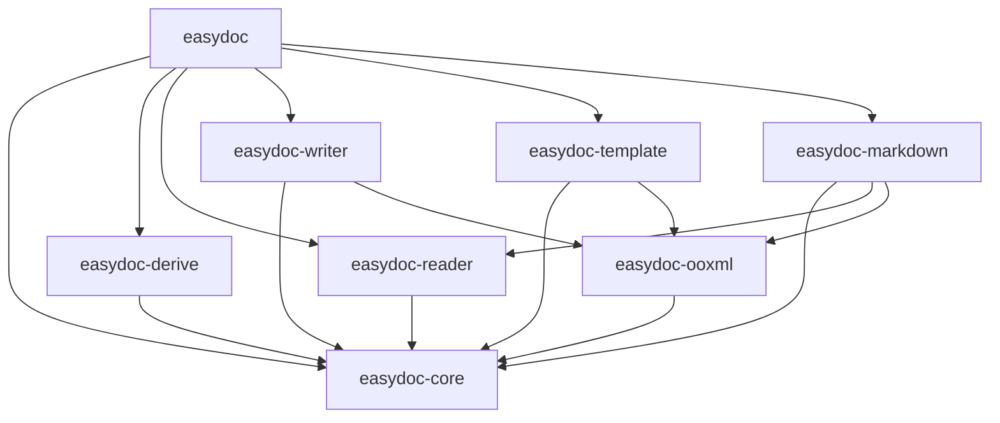
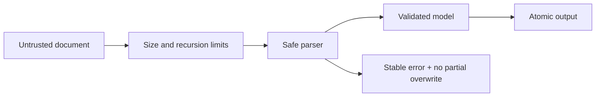

# easydoc-rust

**Easy DOC/DOCX document operations in Rust.**

[](LICENSE)
[](https://www.rust-lang.org)

> `easydoc-rust` is the DOC/DOCX counterpart of [`easyexcel-rust`](https://github.com/easy-4-rust/easyexcel-rust), following the same fluent builder + trait extension + proc-macro architecture for ergonomic document manipulation.

---

## Format & Operation Support Matrix

| Format | Read | Create | Edit | Template Fill | Convert to MD | Status Evidence |
|---|:---:|:---:|:---:|:---:|:---:|---|
| DOCX (.docx) | ✅ | ✅ | ✅ | ✅ | ✅ | `writer_test.rs`, `markdown_conversion_test.rs` |
| DOC (.doc) | ✅ | ❌ | ❌ | ❌ | ✅ | `office_oxide` IR; format auto-detection tested |

Status legend: ✅ stable · ❌ not supported · read-only via backend

## Document Processing Pipeline

```text
Input file / template
        │
        ▼
Format detection (ZIP magic / OLE2 magic)
        │
        ▼
┌──────────────────────────────────────────────┐
│ office_oxide IR    │  docx-rs / PackageRewriter│
│ (read path)        │  (write / fill path)      │
└────────┬───────────┴───────────┬──────────────┘
         │                       │
         ▼                       ▼
    DocumentContent         AtomicFile::write()
    (core semantic model)   (temp + persist)
         │                       │
         ├──► read_text()        ├──► out.docx
         ├──► read_tables<T>()   └──► out.docx (filled)
         └──► to_markdown() ──► Markdown + assets + warnings
```

## Quick Start

```toml
[dependencies]
easydoc = "0.1"
```

### Write a table from struct data

```rust
use easydoc::prelude::*;

#[derive(DocxRow)]
#[docx(banded_rows = true)]
struct User {
    #[docx(name = "Name", width = 0.3, order = 0)]
    name: String,
    #[docx(name = "Age", width = 0.15, order = 1)]
    age: u32,
    #[docx(name = "Email", width = 0.55, order = 2)]
    email: String,
}

let users = vec![
    User { name: "Alice".into(), age: 30, email: "alice@e.com".into() },
    User { name: "Bob".into(), age: 25, email: "bob@e.com".into() },
];

EasyDoc::write_table("users.docx", &users)
    .title("User Report")
    .header_style(TableStyle::header())
    .banded_rows(true)
    .do_write()?;
```

### Build a full document

```rust
EasyDoc::document("report.docx")
    .title("Annual Report")
    .author("Zhang San")
    .add_heading("Chapter 1: Overview", HeadingLevel::H1)
    .add_paragraph(
        Paragraph::new()
            .add_text("This is body text with ")
            .add_run(Run::new("highlighted").bold().color(0xFF0000))
            .add_text(" content.")
            .alignment(HorizontalAlignment::Both)
    )
    .add_table(Table::from_data(&users).banded_rows(true))
    .add_page_break()
    .save()?;
```

### Template fill

```rust
use std::collections::HashMap;

let mut data = HashMap::new();
data.insert("name".into(), "Alice".into());
data.insert("date".into(), "2026-07-21".into());

EasyDoc::fill_template("template.docx", "output.docx", &data)?;
```

Template capabilities:
- `{key}` scalar replacement across split `<w:t>` runs
- `{.field}` collection expansion in table rows
- `{prefix.field}` named collection placeholders
- XML special character escaping (`&`, `<`, `>`, `"`, `'`)
- Binary ZIP entries preserved byte-for-byte
- Atomic output (temp file + persist)

### Read documents

```rust
// Extract all text
let text = EasyDoc::read_text("document.docx")?;

// Extract tables into typed structs
let tables: Vec<Vec<User>> = EasyDoc::read_tables::<User>("document.docx")?;

// DOC and DOCX both supported transparently
let text = EasyDoc::read_text("legacy.doc")?;
```

### Convert to Markdown

```rust
// Quick conversion
let markdown = EasyDoc::to_markdown("document.docx")?;

// Full control: image extraction, front matter, atomic output
let result = EasyDoc::markdown("document.docx")
    .image_directory("output/assets")
    .image_reference_prefix("assets")
    .include_front_matter(true)
    .write_to("output/document.md")?;

for warning in &result.warnings {
    eprintln!("conversion fallback: {}", warning.message);
}
```

Markdown capabilities:
- Headings (H1–H6 with bold text)
- Rich text (bold, italic, strikethrough, hyperlinks)
- GFM tables (pipe escaping, auto column width)
- Merged cells → HTML `<table>` with warning
- Ordered / unordered nested lists
- Code blocks with language tag
- Footnotes and endnotes
- Image extraction with configurable directory and reference prefix
- YAML front matter (title, author, subject, keywords)
- Thematic breaks, page breaks, column breaks

### Edit existing documents

```rust
EasyDoc::edit("input.docx")?
    .replace_text("Old Company", "New Company")
    .save_as("updated.docx")?;
```

---

## Workspace & Crate Architecture

```
easydoc-rust/
├── Cargo.toml                        workspace manifest
├── crates/
│   ├── easydoc/                      facade — EasyDoc static factory
│   ├── easydoc-core/                 backend-agnostic model, traits, errors, styles
│   ├── easydoc-derive/               #[derive(DocxRow)] proc-macro
│   ├── easydoc-ooxml/                safe OOXML rewrite, resource limits, atomic output
│   ├── easydoc-reader/               DOC/DOCX reading via office_oxide
│   ├── easydoc-writer/               DOCX creation via docx-rs
│   ├── easydoc-template/             template placeholder fill
│   └── easydoc-markdown/             DOC/DOCX → Markdown conversion
├── docs/
│   ├── easydoc-rust-Architecture.md           architecture (English)
│   ├── easydoc-rust-Architecture.zh_CN.md     架构设计（中文）
│   ├── usage-guide.md                usage guide
│   └── roadmap.md                    roadmap
├── README.md
└── README_zh.md
```



## Round-trip Fidelity & Unknown Content

| Content | Read | Modify | Round-trip Preserve | Verification |
|---|:---:|:---:|:---:|---|
| Known text / cells / objects | ✅ | ✅ | ✅ | structural assert |
| Styles and themes | ✅ | partial | partial | XML diff |
| Unknown extension nodes | transparent | ❌ | ✅ | golden fixture [设计目标] |
| Binary resources (images) | ✅ | — | ✅ | byte-for-byte test |
| Macros / scripts | reject | ❌ | by policy | security test [设计目标] |

## Template Fill Semantics

| Dimension | Definition |
|---|---|
| Placeholder syntax | `{key}`, `{.field}`, `{prefix.field}` |
| Scope | `word/document.xml` only |
| Expansion direction | vertical (table row duplication) |
| Style inheritance | preserved from template row |
| XML escaping | automatic for all dynamic values |
| Cross-run support | placeholders split across `<w:t>` nodes |
| Error behavior | unchanged target on failure |

## Security & Resource Limits

| Limit | Default |
|---|---|
| Max ZIP entries | 10,000 |
| Max single entry size | 256 MB |
| Max total expanded size | 1 GB |
| Max compression ratio | 1,000:1 |
| Output strategy | atomic (temp + persist) |



## Backend Dependencies

| Function | Crate | Version | License |
|---|---|---|---|
| DOCX write | [`docx-rs`](https://crates.io/crates/docx-rs) | 0.4 | MIT |
| DOCX/DOC read | [`office_oxide`](https://crates.io/crates/office_oxide) | 0.1 | MIT |
| ZIP operations | [`zip`](https://crates.io/crates/zip) | 8.6 | MIT |
| Error types | [`thiserror`](https://crates.io/crates/thiserror) | 2.0 | MIT/Apache-2.0 |

## Testing

```bash
# Format check
cargo fmt --all -- --check

# Lint
cargo clippy --workspace --all-targets -- -D warnings

# All tests
cargo test --workspace

# Docs (strict)
RUSTDOCFLAGS="-D warnings" cargo doc --workspace --no-deps
```

Current status: 31 tests pass, 0 failures, 8 ignored.

## Roadmap

| Phase | Scope | Status |
|---|---|---|
| Phase 1: Infrastructure | 8-crate workspace, OOXML base, atomic output | ✅ Done |
| Phase 2: Semantic Model | `DocumentContent`, reader conversion, Markdown | 🔧 In Progress |
| Phase 3: Event Chain | `DocumentEvent`, `EventSink`, `DocumentReader` trait | Planned |
| Phase 4: Advanced | equations, comments, revisions, conditional templates | Planned |
| Phase 5: Ecosystem | CLI, MCP, Web adapter, benchmarks, fuzz | Planned |

## Related Projects

- [`easyexcel-rust`](https://github.com/easy-4-rust/easyexcel-rust) — Excel counterpart

## License

Apache-2.0 — see [LICENSE](LICENSE) for details.
