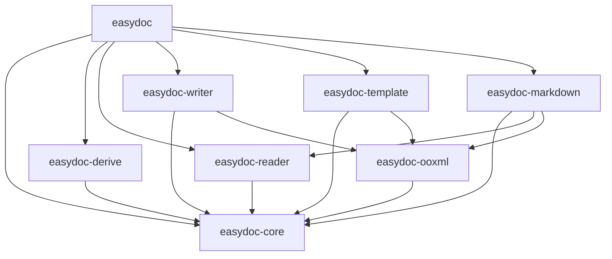
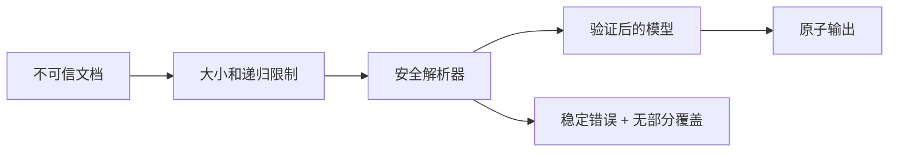

# easydoc-rust

**Rust 快捷 DOC/DOCX 文档操作库。**

[](LICENSE)
[](https://www.rust-lang.org)

> `easydoc-rust` 是 [`easyexcel-rust`](https://github.com/easy-4-rust/easyexcel-rust) 的 DOC/DOCX 对应物，遵循相同的 fluent builder + trait 扩展 + 派生宏架构。

---

## 格式与操作支持矩阵

| 格式 | 读取 | 创建 | 编辑 | 模板填充 | 转 Markdown | 状态证据 |
|---|:---:|:---:|:---:|:---:|:---:|---|
| DOCX (.docx) | ✅ | ✅ | ✅ | ✅ | ✅ | `writer_test.rs`, `markdown_conversion_test.rs` |
| DOC (.doc) | ✅ | ❌ | ❌ | ❌ | ✅ | `office_oxide` IR；格式自动检测已测试 |

状态说明：✅ 稳定 · ❌ 不支持 · 只读后端支持

## 文档处理流水线

```text
输入文件 / 模板
        │
        ▼
格式识别（ZIP 魔数 / OLE2 魔数）
        │
        ▼
┌──────────────────────────────────────────────┐
│ office_oxide IR    │  docx-rs / PackageRewriter│
│ （读取路径）        │  （写入 / 填充路径）       │
└────────┬───────────┴───────────┬──────────────┘
         │                       │
         ▼                       ▼
    DocumentContent         AtomicFile::write()
    （核心语义模型）         （临时文件 + 原子替换）
         │                       │
         ├──► read_text()        ├──► out.docx
         ├──► read_tables<T>()   └──► out.docx（已填充）
         └──► to_markdown() ──► Markdown + 资源 + 降级警告
```

## 快速开始

```toml
[dependencies]
easydoc = "0.1"
```

### 从结构体数据写表格

```rust
use easydoc::prelude::*;

#[derive(DocxRow)]
#[docx(banded_rows = true)]
struct User {
    #[docx(name = "姓名", width = 0.3, order = 0)]
    name: String,
    #[docx(name = "年龄", width = 0.15, order = 1)]
    age: u32,
    #[docx(name = "邮箱", width = 0.55, order = 2)]
    email: String,
}

let users = vec![
    User { name: "张三".into(), age: 30, email: "zhangsan@e.com".into() },
    User { name: "李四".into(), age: 25, email: "lisi@e.com".into() },
];

EasyDoc::write_table("users.docx", &users)
    .title("用户报表")
    .header_style(TableStyle::header())
    .banded_rows(true)
    .do_write()?;
```

### 构建完整文档

```rust
EasyDoc::document("report.docx")
    .title("年度报告")
    .author("张三")
    .add_heading("第一章：概述", HeadingLevel::H1)
    .add_paragraph(
        Paragraph::new()
            .add_text("这是正文内容，其中")
            .add_run(Run::new("高亮部分").bold().color(0xFF0000))
            .add_text(" 已标注。")
            .alignment(HorizontalAlignment::Both)
    )
    .add_table(Table::from_data(&users).banded_rows(true))
    .add_page_break()
    .save()?;
```

### 模板填充

```rust
use std::collections::HashMap;

let mut data = HashMap::new();
data.insert("name".into(), "张三".into());
data.insert("date".into(), "2026-07-21".into());

EasyDoc::fill_template("template.docx", "output.docx", &data)?;
```

模板能力：
- `{key}` 标量替换，支持跨拆分 `<w:t>` 节点
- `{.field}` 表格行集合扩展
- `{prefix.field}` 命名集合占位符
- XML 特殊字符自动转义（`&`, `<`, `>`, `"`, `'`）
- 二进制 ZIP 条目逐字节保留
- 原子输出（临时文件 + 替换）

### 读取文档

```rust
// 提取全部文本
let text = EasyDoc::read_text("document.docx")?;

// 提取表格并反序列化为结构体
let tables: Vec<Vec<User>> = EasyDoc::read_tables::<User>("document.docx")?;

// 透明支持 DOC 和 DOCX
let text = EasyDoc::read_text("legacy.doc")?;
```

### 转换 Markdown

```rust
// 快速转换
let markdown = EasyDoc::to_markdown("document.docx")?;

// 完整控制：图片提取、front matter、原子输出
let result = EasyDoc::markdown("document.docx")
    .image_directory("output/assets")
    .image_reference_prefix("assets")
    .include_front_matter(true)
    .write_to("output/document.md")?;

for warning in &result.warnings {
    eprintln!("转换降级: {}", warning.message);
}
```

Markdown 能力：
- 标题（H1–H6，文本加粗）
- 富文本（粗体、斜体、删除线、超链接）
- GFM 表格（管道转义、自动列宽）
- 合并单元格 → HTML `<table>` + 降级警告
- 有序 / 无序嵌套列表
- 代码块（带语言标记）
- 脚注与尾注
- 图片提取（可配置输出目录和引用前缀）
- YAML front matter（title、author、subject、keywords）
- 分隔线、分页、分栏

### 编辑已有文档

```rust
EasyDoc::edit("input.docx")?
    .replace_text("旧公司", "新公司")
    .save_as("updated.docx")?;
```

---

## Workspace 与 Crate 架构

```
easydoc-rust/
├── Cargo.toml                        workspace 清单
├── crates/
│   ├── easydoc/                      门面 — EasyDoc 静态工厂
│   ├── easydoc-core/                 后端无关模型、trait、错误、样式
│   ├── easydoc-derive/               #[derive(DocxRow)] 派生宏
│   ├── easydoc-ooxml/                安全 OOXML 重写、资源限制、原子输出
│   ├── easydoc-reader/               DOC/DOCX 读取 via office_oxide
│   ├── easydoc-writer/               DOCX 创建 via docx-rs
│   ├── easydoc-template/             模板占位符填充
│   └── easydoc-markdown/             DOC/DOCX → Markdown 转换
├── docs/
│   ├── easydoc-rust-Architecture.md           architecture (English)
│   ├── easydoc-rust-Architecture.zh_CN.md     架构设计（中文）
│   ├── usage-guide.md                使用指南
│   └── roadmap.md                    路线图
├── README.md
└── README_zh.md
```



## 往返保真与未知内容

| 内容 | 读取 | 修改 | 往返保留 | 验证方式 |
|---|:---:|:---:|:---:|---|
| 已知文本 / 单元格 / 对象 | ✅ | ✅ | ✅ | 结构断言 |
| 样式与主题 | ✅ | 部分 | 部分 | XML diff |
| 未知扩展节点 | 透传 | ❌ | ✅ | golden fixture [设计目标] |
| 二进制资源（图片） | ✅ | — | ✅ | 字节对比测试 |
| 宏 / 脚本 | 拒绝 | ❌ | 按策略 | 安全测试 [设计目标] |

## 模板填充语义

| 维度 | 定义 |
|---|---|
| 占位符语法 | `{key}`、`{.field}`、`{prefix.field}` |
| 作用域 | 仅 `word/document.xml` |
| 扩展方向 | 纵向（表格行复制） |
| 样式继承 | 保留模板行样式 |
| XML 转义 | 所有动态值自动转义 |
| 跨 Run 支持 | 占位符可拆分到多个 `<w:t>` 节点 |
| 错误行为 | 失败时原目标文件不变 |

## 安全与资源限制

| 限制项 | 默认值 |
|---|---|
| 最大 ZIP 条目数 | 10,000 |
| 单条目最大解压字节数 | 256 MB |
| 总解压字节数 | 1 GB |
| 最大压缩比 | 1,000:1 |
| 输出策略 | 原子（临时文件 + 替换） |



## 后端依赖

| 功能 | Crate | 版本 | 许可证 |
|---|---|---|---|
| DOCX 写入 | [`docx-rs`](https://crates.io/crates/docx-rs) | 0.4 | MIT |
| DOCX/DOC 读取 | [`office_oxide`](https://crates.io/crates/office_oxide) | 0.1 | MIT |
| ZIP 操作 | [`zip`](https://crates.io/crates/zip) | 8.6 | MIT |
| 错误类型 | [`thiserror`](https://crates.io/crates/thiserror) | 2.0 | MIT/Apache-2.0 |

## 测试

```bash
# 格式检查
cargo fmt --all -- --check

# Lint
cargo clippy --workspace --all-targets -- -D warnings

# 全部测试
cargo test --workspace

# 文档（严格模式）
RUSTDOCFLAGS="-D warnings" cargo doc --workspace --no-deps
```

当前状态：31 个测试通过，0 个失败，8 个 ignored。

## 路线图

| 阶段 | 范围 | 状态 |
|---|---|---|
| Phase 1: 基础设施 | 8 crate workspace、OOXML 基础、原子输出 | ✅ 已完成 |
| Phase 2: 语义模型 | `DocumentContent`、reader 转换、Markdown | 🔧 进行中 |
| Phase 3: Event 链 | `DocumentEvent`、`EventSink`、`DocumentReader` trait | 计划中 |
| Phase 4: 高级能力 | 公式、批注、修订、条件模板 | 计划中 |
| Phase 5: 生态 | CLI、MCP、Web 适配器、benchmarks、fuzz | 计划中 |

## 相关项目

- [`easyexcel-rust`](https://github.com/easy-4-rust/easyexcel-rust) — Excel 对应物

## 许可证

Apache-2.0 — 详见 [LICENSE](LICENSE)。
