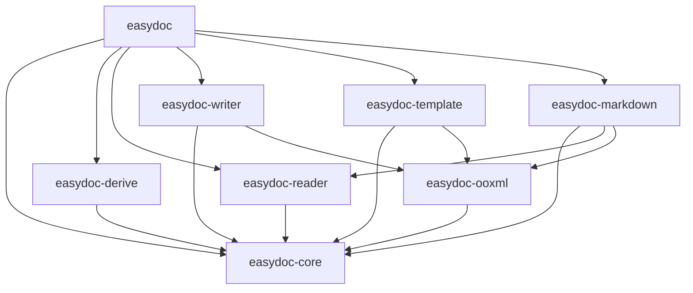

# easydoc-rust

**Rust DOC/DOCX 文档操作库 -- 读取、写入、模板填充、Markdown 转换、流式事件处理，内存占用 O(1)。**

[](https://github.com/easy-4-rust/easydoc-rust/actions)
[](https://crates.io/crates/easydoc)
[](https://docs.rs/easydoc)
[](LICENSE)
[](https://www.rust-lang.org)

> `easydoc-rust` 是 [`easyexcel-rust`](https://github.com/easy-4-rust/easyexcel-rust) 的 DOC/DOCX 对应物，共享相同的 fluent builder + trait 扩展 + 派生宏架构。通过统一的 `EasyDoc` 静态工厂提供所有文档操作：写入、读取、编辑、模板填充、Markdown 转换、SAX 流式事件、多模式视图渲染。

---

## 核心能力

| 能力 | 状态 | 说明 |
|---|---|---|
| 文档写入 | 稳定 | Fluent builder 构建标题、段落、表格、图片、分页 |
| 结构体表格写入 | 稳定 | `#[derive(DocxRow)]` + `EasyDoc::write_table()` 一行搞定 |
| 文档读取 | 稳定 | 文本提取、类型化表格反序列化、DOC/DOCX 自动检测 |
| SAX 流式读取 | 稳定 | O(1) 内存事件驱动读取（段落、表格、图片、公式、列表、超链接、嵌套表、合并单元格） |
| ViewMode 视图渲染 | 稳定 | 4 种模式：纯文本、带标注（LLM 友好）、大纲、统计 |
| 语义模型 | 稳定 | `DocumentContent` 读-改-写闭环 |
| 模板填充 | 稳定 | `{key}` 标量、`{.field}` 集合展开、`{prefix.field}` 命名集合 |
| Markdown 转换 | 稳定 | 标题、富文本、GFM 表格、合并单元格、列表、代码块、图片、脚注、front matter |
| DocxRow 派生宏 | 稳定 | `#[derive(DocxRow)]` 支持 `width`、`format`、`align`、`wrap`、`converter` 注解 |
| 自定义转换器 | 稳定 | `DocConverter<T>` trait + `ConverterRegistry` 运行时分发 |
| 写入生命周期钩子 | 稳定 | `DocWriteHandler` 四级钩子：文档/段落/表格/单元格 |
| 编辑已有文档 | 稳定 | 替换已有 DOCX 中的文本 |
| 内存输出 | 稳定 | `document_to_bytes()` / `write_table_to_bytes()` |

---

## 格式支持

| 格式 | 读取 | 写入 | 编辑 | 模板 | Markdown | 说明 |
|---|:---:|:---:|:---:|:---:|:---:|---|
| DOCX (.docx) | 完整 | 完整 | 完整 | 完整 | 完整 | SAX 流式、语义模型、二进制图片提取 |
| DOC (.doc) | 完整 | -- | -- | -- | 完整 | 通过 `office_oxide` 只读支持；格式自动检测 |

### SAX 流式读取内容覆盖

| 内容类型 | 支持 | 说明 |
|---|:---:|---|
| 段落 | 是 | 文本运行，含粗体/斜体/删除线/超链接 |
| 标题 | 是 | H1-H6，含级别信息 |
| 表格 | 是 | 含嵌套表格、合并单元格（gridSpan/vMerge） |
| 图片 | 是 | 从 `word/media/*` 提取真实二进制，通过 rels 映射 |
| OMML 公式 | 是 | 内联 `<m:oMath>` 和块级 `<m:oMathPara>` |
| 列表 | 是 | `<w:numPr>` 检测（有序/无序） |
| 超链接 | 是 | `<w:hyperlink>` 含关系解析 |
| 分页/分栏 | 是 | `<w:br>` |

---

## 快速开始

```toml
[dependencies]
easydoc = "0.1"
```

### 从结构体写表格

```rust
use easydoc::prelude::*;

#[derive(DocxRow)]
#[docx(banded_rows = true)]
struct User {
    #[docx(name = "姓名", order = 0, width = "30%")]
    name: String,
    #[docx(name = "年龄", order = 1, width = "15%")]
    age: u32,
    #[docx(name = "邮箱", order = 2, width = "55%")]
    email: String,
}

let users = vec![
    User { name: "张三".into(), age: 30, email: "zhangsan@example.com".into() },
    User { name: "李四".into(), age: 25, email: "lisi@example.com".into() },
];

EasyDoc::write_table("users.docx", &users)
    .title("用户报表")
    .header_style(TableStyle::header())
    .banded_rows(true)
    .do_write()?;
```

### 读取文档（流式，O(1) 内存）

```rust
use easydoc::prelude::*;

// 快速提取文本
let text = EasyDoc::read_text("document.docx")?;

// 类型化表格提取
let tables: Vec<Vec<User>> = EasyDoc::read_tables::<User>("document.docx")?;

// SAX 事件流式读取 -- O(1) 内存，适合处理大文档
struct MySink;
impl EventSink for MySink {
    fn on_event(&mut self, event: &DocumentEvent) -> easydoc::Result<()> {
        match event {
            DocumentEvent::Heading { level, runs } => {
                println!("H{level}: {}", runs.iter().map(|r| r.text.as_str()).collect::<String>());
            }
            DocumentEvent::Table(table) => {
                println!("表格: {} 行", table.rows.len());
            }
            DocumentEvent::Image(img) => {
                println!("图片: {} 字节", img.data.as_ref().map_or(0, |d| d.len()));
            }
            _ => {}
        }
        Ok(())
    }
}

EasyDoc::read_events("large.docx", &mut MySink)?;
```

### ViewMode -- LLM 友好的文档渲染

```rust
use easydoc::prelude::*;

// 纯文本
let plain = EasyDoc::view_as("doc.docx", &ViewMode::Plain)?;

// 带标注 -- 为 LLM 提供结构上下文
let annotated = EasyDoc::view_as("doc.docx", &ViewMode::Annotated)?;
// 输出: "[标题1] 引言\n[段落 1] 你好世界\n[表格 1: 3行x4列] ..."

// 大纲 -- 仅标题
let outline = EasyDoc::view_as("doc.docx", &ViewMode::Outline { max_level: 3 })?;

// 统计 -- 文档统计信息
let stats = EasyDoc::view_as("doc.docx", &ViewMode::Stats)?;
// 输出: "段落数: 12\n表格数: 3\n图片数: 2\n字数: 1500"
```

### 转换 Markdown

```rust
// 快速转换
let markdown = EasyDoc::to_markdown("document.docx")?;

// 完整控制：图片提取、front matter、原子输出
let result = EasyDoc::markdown("document.docx")
    .image_directory("output/assets")
    .image_reference_prefix("assets")
    .include_front_matter(true)
    .write_to("output/document.md")?;

for warning in &result.warnings {
    eprintln!("转换降级: {}", warning.message);
}
```

### 构建完整文档

```rust
EasyDoc::document("report.docx")
    .title("年度报告")
    .author("张三")
    .add_heading("第一章：概述", HeadingLevel::H1)
    .add_paragraph(
        Paragraph::new()
            .add_text("这是正文内容，其中")
            .add_run(Run::new("高亮部分").bold().color(0xFF0000))
            .add_text(" 已标注。")
            .alignment(HorizontalAlignment::Both)
    )
    .add_table(Table::from_data(&users).banded_rows(true))
    .add_page_break()
    .save()?;
```

### 模板填充

```rust
use std::collections::HashMap;

let mut data = HashMap::new();
data.insert("name".into(), "张三".into());
data.insert("date".into(), "2026-08-10".into());

EasyDoc::fill_template("template.docx", "output.docx", &data)?;
```

### 语义模型读-改-写

```rust
// 读取 -> 修改 -> 写回
let mut content = EasyDoc::load("input.docx")?;
// ... 修改 content.blocks ...
EasyDoc::write_content(&content, "output.docx")?;

// 内存输出
let bytes = EasyDoc::write_content_to_bytes(&content)?;
```

---

## 完整 API 速查

### EasyDoc 静态工厂（18 个方法）

```rust
// === 写入 ===
EasyDoc::document(path) -> DocBuilder                    // 构建完整文档
EasyDoc::write_table(path, &data) -> TableWriteBuilder   // 结构体数据写表格
EasyDoc::document_to_bytes(f) -> Result<Vec<u8>>         // 内存构建文档
EasyDoc::write_table_to_bytes(data) -> Result<Vec<u8>>   // 表格写入内存
EasyDoc::edit(path) -> Result<DocEditor>                 // 编辑已有 DOCX
EasyDoc::fill_template(tpl, out, &data) -> Result<()>    // 标量占位符填充
EasyDoc::fill_template_list(tpl, out, &[T], field)       // 集合展开填充

// === 读取 ===
EasyDoc::read(path) -> DocReadBuilder                    // 流式读取构建器
EasyDoc::read_text(path) -> Result<String>               // 快速提取文本
EasyDoc::read_tables::<T>(path) -> Result<Vec<Vec<T>>>   // 类型化表格提取
EasyDoc::read_events(path, &mut sink) -> Result<()>      // SAX 事件流式（O(1) 内存）
EasyDoc::view_as(path, &ViewMode) -> Result<String>      // 多模式视图渲染

// === Markdown ===
EasyDoc::markdown(path) -> MarkdownBuilder               // Markdown 转换构建器
EasyDoc::to_markdown(path) -> Result<String>             // 快速 Markdown 转换
EasyDoc::write_markdown(src, out) -> Result<MarkdownResult>  // 转换并写入文件

// === 语义模型 ===
EasyDoc::load(path) -> Result<DocumentContent>           // 读取为语义模型
EasyDoc::write_content(content, path) -> Result<()>      // 语义模型写入文件
EasyDoc::write_content_to_bytes(content) -> Result<Vec<u8>>  // 语义模型写入内存
```

### ViewMode（4 种，LLM 友好）

| 模式 | 构造方式 | 输出示例 |
|---|---|---|
| **纯文本** | `ViewMode::Plain` | `你好世界\n下一段` |
| **带标注** | `ViewMode::Annotated` | `[标题1] 标题\n[段落 1] 你好\n[表格 1: 3行x4列] ...` |
| **大纲** | `ViewMode::Outline { max_level: 3 }` | `# H1 标题\n## H2 副标题` |
| **统计** | `ViewMode::Stats` | `段落数: 12\n表格数: 3\n图片数: 2\n字数: 1500` |

---

## `#[derive(DocxRow)]` -- 类型化表格映射

派生宏自动生成 `schema()`、`from_row()`、`to_row()` 及其 converter 感知变体。

```rust
use easydoc::prelude::*;

struct StatusConverter;
impl DocConverter<String> for StatusConverter {
    fn support_type() -> std::any::TypeId { std::any::TypeId::of::<String>() }
    fn to_doc_value(&self, value: &String, _col: &TableColumn) -> easydoc::Result<DocValue> {
        Ok(DocValue::String(format!("[{}]", value)))
    }
    fn from_doc_value(&self, value: &DocValue, _col: &TableColumn) -> easydoc::Result<String> {
        match value {
            DocValue::String(s) => Ok(s.trim_matches(|c| c == '[' || c == ']').to_string()),
            _ => Ok(String::new()),
        }
    }
}

#[derive(DocxRow)]
#[docx(banded_rows = true)]
struct Report {
    #[docx(name = "编号", order = 0, width = "2cm")]
    id: u32,

    #[docx(name = "金额", order = 1, width = "3cm", format = "#,##0.00", align = "right")]
    amount: f64,

    #[docx(name = "日期", order = 2, width = "4cm", format = "yyyy-mm-dd")]
    date: String,

    #[docx(name = "状态", order = 3, converter = StatusConverter)]
    status: String,

    #[docx(name = "备注", order = 4, wrap = true)]
    note: Option<String>,

    #[docx(ignore)]
    internal_id: String,
}
```

### 派生宏属性参考

**结构体级别：**

| 属性 | 类型 | 示例 | 效果 |
|---|---|---|---|
| `banded_rows` | bool | `#[docx(banded_rows = true)]` | 斑马条纹 |
| `table_width` / `auto_width` | bool | `#[docx(table_width = Auto)]` | 自动适配表格宽度 |

**字段级别：**

| 属性 | 类型 | 示例 | 效果 |
|---|---|---|---|
| `name` | string | `#[docx(name = "全名")]` | 列头文本 |
| `index` | usize | `#[docx(index = 0)]` | 从零开始的列索引 |
| `order` | u32 | `#[docx(order = 1)]` | 列排序顺序（越小越靠左） |
| `width` | string | `#[docx(width = "2cm")]` | 列宽：`"2cm"`、`"80px"`、`"50%"`、`"auto"` |
| `format` | string | `#[docx(format = "#,##0.00")]` | 数字/日期格式串 |
| `align` | string | `#[docx(align = "right")]` | `"left"`、`"center"`、`"right"`、`"both"` / `"justify"` |
| `wrap` | bool | `#[docx(wrap = true)]` | 单元格内文字换行 |
| `converter` | 类型路径 | `#[docx(converter = MyConverter)]` | 自定义 `DocConverter<T>` 实现 |
| `ignore` | 标志 | `#[docx(ignore)]` | 读写时跳过此字段 |

### 注解到 OOXML 的映射

| 注解 | OOXML 输出 |
|---|---|
| `width="2cm"` / `"80px"` / `"50%"` / `"auto"` | `<w:tcW w:w="..." w:type="dxa\|pct\|auto"/>` |
| `format="#,##0.00"` / `"yyyy-mm-dd"` | `<w:numFmt w:val="..."/>` |
| `align="right"` / `"center"` / `"left"` / `"both"` | `<w:jc w:val="..."/>` |
| `wrap=false` | `<w:noWrap/>` |
| `converter="MyConverter"` | `ConverterRegistry` 运行时分发 |

---

## 扩展 Trait 体系

| Trait | 用途 | 对标 easyexcel-rust |
|---|---|---|
| `DocxRow` | 结构体 <-> 表格行双向映射 | `ExcelRow` |
| `DocConverter<T>` | 类型 <-> DocValue 转换 | `Converter<T>` |
| `DocReadListener<T>` | 流式读取回调 | `ReadListener<T>` |
| `DocWriteHandler` | 写入生命周期钩子（文档/段落/表格/单元格） | `WriteHandler` |
| `DocumentReader` | 统一读取入口 trait | -- |
| `EventSink` | SAX 事件消费接口 | -- |

---

## 架构

```
easydoc-rust/
├── Cargo.toml                        workspace 清单
├── crates/
│   ├── easydoc/                      门面 -- EasyDoc 静态工厂
│   ├── easydoc-core/                 后端无关模型、trait、错误、样式
│   ├── easydoc-derive/               #[derive(DocxRow)] 派生宏
│   ├── easydoc-ooxml/                安全 OOXML 重写、资源限制、原子输出
│   ├── easydoc-reader/               DOC/DOCX 读取 via office_oxide + SAX
│   ├── easydoc-writer/               DOCX 创建 via docx-rs
│   ├── easydoc-template/             模板占位符填充
│   └── easydoc-markdown/             DOC/DOCX -> Markdown 转换
├── docs/
├── README.md
└── README_zh.md
```



---

## 安全与资源限制

| 限制项 | 默认值 |
|---|---|
| 最大 ZIP 条目数 | 10,000 |
| 单条目最大解压字节数 | 256 MB |
| 总解压字节数 | 1 GB |
| 最大压缩比 | 1,000:1 |
| 输出策略 | 原子（临时文件 + 替换） |

---

## 相关项目

- [`easyexcel-rust`](https://github.com/easy-4-rust/easyexcel-rust) -- Excel 对应物（相同架构：fluent builder + 派生宏 + 转换器注册表）
- Java: [easy4j-easydoc](https://github.com/easy-4-rust/easy4j-easydoc)（Apache POI + docx4j 基线）

### 与 Java EasyExcel/Hutool 对比

| 特性 | Java EasyExcel/Hutool | easydoc-rust |
|---|---|---|
| 类型化行映射 | `@ExcelRow` 注解 | `#[derive(DocxRow)]` 过程宏 |
| 自定义转换器 | `Converter<T>` 接口 | `DocConverter<T>` trait + 运行时注册表 |
| 流式读取 | SAX 事件监听器 | `EventSink` trait + SAX 解析器 |
| 写入生命周期 | `WriteHandler` 回调 | `DocWriteHandler` trait |
| 模板填充 | `ExcelWriter.fill()` | `EasyDoc::fill_template()` |
| 内存输出 | `ByteArrayOutputStream` | `document_to_bytes()` |
| 安全性 | JVM 沙箱 | ZIP 限制 + 原子输出 + `unsafe_code = "forbid"` |

---

## 路线图

- [x] 阶段 1：基础设施（8 crate workspace、OOXML 基础、原子输出）
- [x] 阶段 2：语义模型（`DocumentContent`、reader 转换、Markdown）
- [x] 阶段 3：事件链（`DocumentEvent`、`EventSink`、`DocumentReader`、SAX 流式）
- [x] 阶段 3.5：派生宏注解（`width`、`format`、`align`、`wrap`、`converter`）完全接入 OOXML 输出
- [x] 阶段 3.5：ViewMode 视图渲染（纯文本、带标注、大纲、统计）
- [x] 阶段 3.5：SAX 内容覆盖（OMML 公式、列表、超链接、嵌套表格、合并单元格、图片二进制）
- [x] 阶段 3.5：`numbering.xml` 解析，修正有序列表编号
- [x] 阶段 3.5：超链接关系解析（`word/_rels/document.xml.rels`）
- [ ] 阶段 4：公式（OMML -> LaTeX 转换）
- [ ] 阶段 4：批注与修订追踪
- [ ] 阶段 4：条件模板引擎
- [ ] 阶段 5：`easydoc-cli` 命令行工具
- [ ] 阶段 5：`easydoc-mcp` MCP 集成
- [ ] 阶段 5：性能基准测试、golden tests、fuzz tests

---

## 许可证

Apache-2.0 -- 详见 [LICENSE](LICENSE)。
