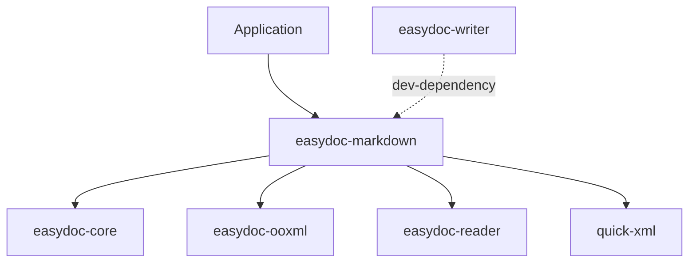

<a id="readme-top"></a>

<div align="center">

# easydoc-markdown

**Bidirectional DOCX-Markdown conversion with OMML-to-LaTeX support**

[](https://crates.io/crates/easydoc-markdown)
[](https://docs.rs/easydoc-markdown)
[](#rust-baseline)
[](LICENSE)

[English](README.md) | [简体中文](README_zh.md)

[Overview](#1-overview) · [Capabilities](#2-capabilities) · [Architecture](#3-architecture) ·
[Quick Start](#4-quick-start) · [API](#5-api-reference) ·
[OMML to LaTeX](#6-omml-to-latex) · [Upstream](#7-upstream-comparison) ·
[Quality](#8-quality--testing)

</div>

---

> **Current version**: `0.1.0-alpha.1`
> **MSRV**: Rust `1.88`
> **Edition**: `2024`
> **Resolver**: `3`
> **Maturity**: Alpha -- public API may change
> **Last verified**: 2026-08-11

## 1. Overview

**easydoc-markdown is a Rust crate for bidirectional conversion between DOCX documents and Markdown.** It is part of the [easydoc-rust](https://github.com/easy-4-rust/easydoc-rust) workspace.

| Dimension | Value |
|---|---|
| Crate | `easydoc-markdown` |
| Version | `0.1.0-alpha.1` |
| MSRV / Edition | `1.88` / `2024` |
| Unsafe policy | `forbid` (workspace lint) |
| License | `Apache-2.0` |

### 1.1 What It Is

- DOCX to Markdown converter with image extraction, front matter generation, and OMML-to-LaTeX math conversion.
- Markdown to DOCX importer (subset) with a hand-rolled state machine parser (no external Markdown library dependency).
- Builder API (`MarkdownBuilder` / `MarkdownImportBuilder`) for fluent configuration.

### 1.2 What It Is Not

- Not a Markdown parser library -- it only handles the subset needed for DOCX round-trip.
- Not a DOCX reader or writer -- use `easydoc-reader` / `easydoc-writer` for standalone reading/writing.
- Not a drop-in replacement for markitdown (Python) -- different scope and language.

## 2. Capabilities

### 2.1 DOCX to Markdown (Export)

| Element | Status | Notes |
|---|:---:|---|
| Paragraphs | Stable | Text with inline styles |
| Headings (H1-H6) | Stable | Markdown `#` syntax |
| Tables | Stable | Pipe-table format |
| Images (binary extraction) | Stable | Extracted to directory with `` |
| Lists (ordered / unordered, nested) | Stable | Markdown list syntax |
| Hyperlinks | Stable | `[text](url)` format |
| Code blocks | Stable | Fenced code blocks with language |
| OMML math formulas | Stable | Converted to LaTeX `$...$` / `$$...$$` |
| Footnotes / endnotes | Stable | `[^id]` syntax |
| Page / column breaks | Stable | HTML comments `<!-- page-break -->` |
| Thematic breaks | Stable | `---` |
| YAML front matter | Stable | Title, author, date from metadata |
| Text styles (bold / italic / strikethrough) | Stable | `**bold**`, `*italic*`, `~~strike~~` |
| TextBox | Stable | Content rendered inline |
| Sections | Stable | Content rendered inline |

### 2.2 Markdown to DOCX (Import)

| Element | Status | Notes |
|---|:---:|---|
| Headings (H1-H6) | Stable | `#` syntax |
| Paragraphs | Stable | Multi-line merge |
| Inline styles (bold / italic / code / links) | Stable | `**bold**`, `*italic*`, `` `code` ``, `[text](url)` |
| Lists (ordered / unordered, nested) | Stable | `-`, `*`, `1.` markers |
| Tables | Stable | Pipe-table with separator row |
| Code blocks | Stable | Fenced with language tag |
| Images | Stable | `` |
| Front matter | Stable | YAML `---` blocks |
| Blockquotes | Stable | `>` prefix |
| Task lists | Stable | `- [ ]` / `- [x]` |
| Thematic breaks | Stable | `---` / `***` |
| HTML tags | Not supported | Skipped with warning |
| Footnotes | Not supported | Skipped with warning |
| Strikethrough | Not supported | Skipped with warning |
| Math (`$...$`) | Not supported | Skipped with warning |

### 2.3 Status Definitions

| Status | Definition |
|---|---|
| Stable | Public API, tests, and documentation complete |
| Not supported | Explicitly out of scope or not yet implemented |

## 3. Architecture

### 3.1 DOCX to Markdown

```text
DOCX file
        │
        ▼
easydoc_reader::read_document()
        │
        ▼
DocumentContent (semantic model)
        │
        ▼
MarkdownRenderer::render()
        │
        ├──► Markdown text
        ├──► Extracted images (assets)
        └──► Conversion warnings
```

### 3.2 Markdown to DOCX

```text
Markdown text
        │
        ▼
MarkdownParser (hand-rolled state machine)
        │
        ▼
DocumentContent (semantic model)
        │
        ▼
easydoc_writer::render_document_content()
        │
        ▼
DOCX file
```

### 3.3 Crate Dependencies



## 4. Quick Start

### 4.1 Installation

```toml
[dependencies]
easydoc-markdown = "0.1.0-alpha.1"
```

### 4.2 DOCX to Markdown

```rust
use easydoc_markdown::MarkdownBuilder;

fn main() -> Result<(), Box<dyn std::error::Error>> {
    let result = MarkdownBuilder::new("report.docx")
        .image_directory("./images")
        .include_front_matter(true)
        .do_convert()?;

    println!("{}", result.markdown);
    println!("Extracted {} images", result.assets.len());
    println!("{} warnings", result.warnings.len());
    Ok(())
}
```

### 4.3 DOCX to Markdown File (Atomic Write)

```rust
use easydoc_markdown::MarkdownBuilder;

fn main() -> Result<(), Box<dyn std::error::Error>> {
    MarkdownBuilder::new("report.docx")
        .image_directory("./images")
        .write_to("report.md")?;
    Ok(())
}
```

### 4.4 Markdown to DOCX

```rust
use easydoc_markdown::MarkdownImportBuilder;

fn main() -> Result<(), Box<dyn std::error::Error>> {
    let markdown = r#"# Hello World

This is a **bold** paragraph.

| Name | Age |
|------|-----|
| Alice | 30 |
| Bob | 25 |
"#;

    let result = MarkdownImportBuilder::new(markdown).do_import()?;
    println!("Parsed {} blocks", result.content.blocks.len());
    println!("{} warnings", result.warnings.len());
    Ok(())
}
```

### 4.5 Render Document Model to Markdown

```rust
use easydoc_core::{DocumentContent, DocumentBlock, DocumentTextRun};
use easydoc_markdown::{render_document, MarkdownOptions};

fn main() -> Result<(), Box<dyn std::error::Error>> {
    let content = DocumentContent {
        blocks: vec![
            DocumentBlock::Heading {
                level: 1,
                runs: vec![DocumentTextRun {
                    text: "Title".into(),
                    ..Default::default()
                }],
            },
            DocumentBlock::Paragraph(vec![DocumentTextRun {
                text: "Body text.".into(),
                ..Default::default()
            }]),
        ],
        ..Default::default()
    };

    let result = render_document(&content, MarkdownOptions::default())?;
    println!("{}", result.markdown);
    Ok(())
}
```

## 5. API Reference

### 5.1 DOCX to Markdown

| Function / Type | Purpose |
|---|---|
| `MarkdownBuilder::new(source)` | Create converter from DOCX path |
| `builder.image_directory(dir)` | Set image extraction directory |
| `builder.image_reference_prefix(prefix)` | Set image URL prefix in Markdown |
| `builder.include_front_matter(enabled)` | Toggle YAML front matter output |
| `builder.do_convert()` | Execute conversion, return `MarkdownResult` |
| `builder.write_to(output)` | Convert and atomically write to file |
| `render_document(content, options)` | Render `DocumentContent` to Markdown |

### 5.2 Markdown to DOCX

| Function / Type | Purpose |
|---|---|
| `MarkdownImportBuilder::new(source)` | Create importer from Markdown text |
| `builder.on_parse_error(strategy)` | Set error handling strategy |
| `builder.do_import()` | Execute import, return `ImportResult` |

### 5.3 Result Types

| Type | Fields |
|---|---|
| `MarkdownResult` | `markdown: String`, `assets: Vec<ExtractedAsset>`, `warnings: Vec<ConversionWarning>` |
| `ImportResult` | `content: DocumentContent`, `warnings: Vec<ImportWarning>`, `metadata: DocumentMeta` |

### 5.4 Error Model

| Error Variant | Scenario | Source |
|---|---|---|
| `DocError::Format` | XML parse failure | `quick-xml` |
| `DocError::Io` | File I/O failure | `std::io::Error` |
| `DocError::Zip` | DOCX archive error | `zip` crate |

## 6. OMML to LaTeX

The `math` module converts Office Math Markup Language (OMML) fragments to LaTeX strings.

### 6.1 Supported OMML Structures (17 types)

| OMML Element | LaTeX Output | Example |
|---|---|---|
| `<m:r>` (text run) | Text with symbol mapping and escaping | `x + y` |
| `<m:f>` (fraction) | `\frac{num}{den}` | `\frac{a}{b}` |
| `<m:rad>` (radical) | `\sqrt{text}` / `\sqrt[n]{text}` | `\sqrt{x}` |
| `<m:sSub>` (subscript) | `base_{sub}` | `x_{i}` |
| `<m:sSup>` (superscript) | `base^{sup}` | `x^{2}` |
| `<m:sSubSup>` (sub-superscript) | `base_{sub}^{sup}` | `x_{i}^{2}` |
| `<m:nary>` (n-ary operator) | `\sum`, `\int`, etc. with limits | `\sum_{i=0}^{n}` |
| `<m:d>` (delimiter) | `\left( ... \right)` | `\left( x \right)` |
| `<m:acc>` (accent) | `\hat{}`, `\vec{}`, etc. | `\hat{x}` |
| `<m:bar>` (bar) | `\overline{}`, `\underline{}` | `\overline{x}` |
| `<m:m>` (matrix) | `\begin{matrix}...\end{matrix}` | `\begin{matrix} a & b \\ c & d \end{matrix}` |
| `<m:func>` (function) | `\sin()`, `\cos()`, etc. | `\sin(x)` |
| `<m:groupChr>` (group character) | `\underbrace{}`, `\overbrace{}` | `\underbrace{a+b}` |
| `<m:limLow>` (lower limit) | `\lim_{...}` | `\lim_{x \to 0}` |
| `<m:limUpp>` (upper limit) | `\overset{...}{...}` | `\overset{n}{\sum}` |
| `<m:eqArr>` (equation array) | `\begin{array}{c}...\end{array}` | `\begin{array}{c} a \\ b \end{array}` |
| `<m:oMathPara>` (math paragraph) | Block-level `$$...$$` | Display math |

### 6.2 Usage

```rust
use easydoc_markdown::math::omml_to_latex;

let omml_xml = r#"<m:oMath xmlns:m="http://schemas.openxmlformats.org/officeDocument/2006/math">
  <m:f><m:num><m:r><m:t>a</m:t></m:r></m:num><m:den><m:r><m:t>b</m:t></m:r></m:den></m:f>
</m:oMath>"#;

let latex = omml_to_latex::convert(omml_xml).unwrap();
assert_eq!(latex, "\\frac{a}{b}");
```

## 7. Upstream Comparison

### 7.1 Comparison with markitdown (Python)

| Feature | easydoc-markdown (Rust) | markitdown (Python) |
|---|---|---|
| DOCX to Markdown | Stable | Supported |
| Markdown to DOCX | Stable (subset) | Not supported |
| OMML to LaTeX | 17 structures | Not supported |
| Image extraction | Binary to directory | URL references |
| Front matter | YAML generation | Not supported |
| Math rendering | LaTeX in Markdown | Not supported |
| External parser dependency | None (hand-rolled) | pandoc / python-docx |
| Language | Rust | Python |

### 7.2 Bidirectional Round-trip

| Direction | Coverage | Notes |
|---|---|---|
| DOCX to Markdown | Full | All document elements supported |
| Markdown to DOCX | Subset | No HTML tags, footnotes, strikethrough, `$...$` math |
| DOCX to MD to DOCX | Lossy | Math formulas lose OMML structure; styles partially lost |

## 8. Quality & Testing

### 8.1 Unsafe Policy

This crate uses `#![deny(unsafe_code)]`. The workspace enforces `unsafe_code = "forbid"` via `[workspace.lints.rust]`.

### 8.2 Test Categories

| Category | Scope | Tool |
|---|---|---|
| Unit tests | Renderer, importer, OMML converter, front matter | `cargo test` |
| Integration tests | Full DOCX to Markdown and back | `cargo test` |

### 8.3 Building & Testing

```bash
cargo check -p easydoc-markdown
cargo test -p easydoc-markdown
cargo clippy -p easydoc-markdown -- -D warnings
cargo doc -p easydoc-markdown --no-deps
```

---

<div align="center">

[Back to top](#readme-top) · [docs.rs](https://docs.rs/easydoc-markdown) · [crates.io](https://crates.io/crates/easydoc-markdown) · [Issues](https://github.com/easy-4-rust/easydoc-rust/issues)

</div>
