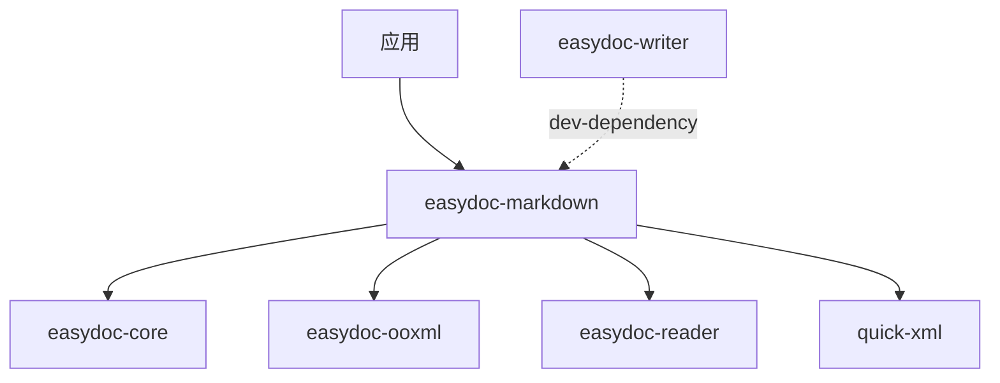

<a id="readme-top"></a>

<div align="center">

# easydoc-markdown

**DOCX 与 Markdown 双向转换，支持 OMML 到 LaTeX 公式转换**

[](https://crates.io/crates/easydoc-markdown)
[](https://docs.rs/easydoc-markdown)
[](#rust-基线)
[](LICENSE)

[English](README.md) | [简体中文](README_zh.md)

[概述](#1-概述) · [能力矩阵](#2-能力矩阵) · [架构](#3-架构) ·
[快速开始](#4-快速开始) · [API](#5-api-参考) ·
[OMML 到 LaTeX](#6-omml-到-latex) · [上游对比](#7-上游对比) ·
[质量](#8-质量与测试)

</div>

---

> **当前版本**：`0.1.0-alpha.1`
> **MSRV**：Rust `1.88`
> **Edition**：`2024`
> **Resolver**：`3`
> **成熟度**：Alpha -- 公共 API 可能变化
> **最后核验**：2026-08-11

## 1. 概述

**easydoc-markdown 是一个 Rust crate，用于 DOCX 文档与 Markdown 之间的双向转换。** 它是 [easydoc-rust](https://github.com/easy-4-rust/easydoc-rust) workspace 的组成部分。

| 维度 | 值 |
|---|---|
| Crate | `easydoc-markdown` |
| 版本 | `0.1.0-alpha.1` |
| MSRV / Edition | `1.88` / `2024` |
| unsafe 策略 | `forbid`（workspace lint） |
| 许可证 | `Apache-2.0` |

### 1.1 是什么

- DOCX 到 Markdown 的转换器，支持图片提取、front matter 生成和 OMML 到 LaTeX 的数学公式转换。
- Markdown 到 DOCX 的导入器（子集），使用手工状态机解析器（不依赖外部 Markdown 解析库）。
- 构建器 API（`MarkdownBuilder` / `MarkdownImportBuilder`）用于 Fluent 配置。

### 1.2 不是什么

- 不是 Markdown 解析库 -- 仅处理 DOCX 往返所需的 Markdown 子集。
- 不是 DOCX 读取器或写入器 -- 独立读写请使用 `easydoc-reader` / `easydoc-writer`。
- 不是 markitdown（Python）的直接替代 -- 范围和语言不同。

## 2. 能力矩阵

### 2.1 DOCX 到 Markdown（导出）

| 元素 | 状态 | 说明 |
|---|:---:|---|
| 段落 | 稳定 | 带内联样式的文本 |
| 标题（H1-H6） | 稳定 | Markdown `#` 语法 |
| 表格 | 稳定 | 管道表格格式 |
| 图片（二进制提取） | 稳定 | 提取到目录，`` |
| 列表（有序/无序，嵌套） | 稳定 | Markdown 列表语法 |
| 超链接 | 稳定 | `[text](url)` 格式 |
| 代码块 | 稳定 | 围栏代码块带语言标记 |
| OMML 数学公式 | 稳定 | 转换为 LaTeX `$...$` / `$$...$$` |
| 脚注/尾注 | 稳定 | `[^id]` 语法 |
| 分页/分栏符 | 稳定 | HTML 注释 `<!-- page-break -->` |
| 主题分隔线 | 稳定 | `---` |
| YAML front matter | 稳定 | 从元数据生成标题、作者、日期 |
| 文本样式（粗体/斜体/删除线） | 稳定 | `**bold**`、`*italic*`、`~~strike~~` |
| TextBox | 稳定 | 内容内联渲染 |
| 分节 | 稳定 | 内容内联渲染 |

### 2.2 Markdown 到 DOCX（导入）

| 元素 | 状态 | 说明 |
|---|:---:|---|
| 标题（H1-H6） | 稳定 | `#` 语法 |
| 段落 | 稳定 | 多行合并 |
| 内联样式（粗体/斜体/代码/链接） | 稳定 | `**bold**`、`*italic*`、`` `code` ``、`[text](url)` |
| 列表（有序/无序，嵌套） | 稳定 | `-`、`*`、`1.` 标记 |
| 表格 | 稳定 | 带分隔行的管道表格 |
| 代码块 | 稳定 | 带语言标记的围栏代码块 |
| 图片 | 稳定 | `` |
| front matter | 稳定 | YAML `---` 块 |
| 引用块 | 稳定 | `>` 前缀 |
| 任务列表 | 稳定 | `- [ ]` / `- [x]` |
| 主题分隔线 | 稳定 | `---` / `***` |
| HTML 标签 | 不支持 | 跳过并产生警告 |
| 脚注 | 不支持 | 跳过并产生警告 |
| 删除线 | 不支持 | 跳过并产生警告 |
| 数学公式（`$...$`） | 不支持 | 跳过并产生警告 |

### 2.3 状态定义

| 状态 | 定义 |
|---|---|
| 稳定 | 公共 API、测试和文档齐全 |
| 不支持 | 明确超出范围或尚未实现 |

## 3. 架构

### 3.1 DOCX 到 Markdown

```text
DOCX 文件
        │
        ▼
easydoc_reader::read_document()
        │
        ▼
DocumentContent（语义模型）
        │
        ▼
MarkdownRenderer::render()
        │
        ├──► Markdown 文本
        ├──► 提取的图片（assets）
        └──► 转换警告
```

### 3.2 Markdown 到 DOCX

```text
Markdown 文本
        │
        ▼
MarkdownParser（手工状态机）
        │
        ▼
DocumentContent（语义模型）
        │
        ▼
easydoc_writer::render_document_content()
        │
        ▼
DOCX 文件
```

### 3.3 Crate 依赖



## 4. 快速开始

### 4.1 安装

```toml
[dependencies]
easydoc-markdown = "0.1.0-alpha.1"
```

### 4.2 DOCX 到 Markdown

```rust
use easydoc_markdown::MarkdownBuilder;

fn main() -> Result<(), Box<dyn std::error::Error>> {
    let result = MarkdownBuilder::new("report.docx")
        .image_directory("./images")
        .include_front_matter(true)
        .do_convert()?;

    println!("{}", result.markdown);
    println!("提取了 {} 张图片", result.assets.len());
    println!("{} 条警告", result.warnings.len());
    Ok(())
}
```

### 4.3 DOCX 到 Markdown 文件（原子写入）

```rust
use easydoc_markdown::MarkdownBuilder;

fn main() -> Result<(), Box<dyn std::error::Error>> {
    MarkdownBuilder::new("report.docx")
        .image_directory("./images")
        .write_to("report.md")?;
    Ok(())
}
```

### 4.4 Markdown 到 DOCX

```rust
use easydoc_markdown::MarkdownImportBuilder;

fn main() -> Result<(), Box<dyn std::error::Error>> {
    let markdown = r#"# 你好世界

这是一个**粗体**段落。

| 姓名 | 年龄 |
|------|-----|
| Alice | 30 |
| Bob | 25 |
"#;

    let result = MarkdownImportBuilder::new(markdown).do_import()?;
    println!("解析了 {} 个块", result.content.blocks.len());
    println!("{} 条警告", result.warnings.len());
    Ok(())
}
```

### 4.5 从文档模型渲染 Markdown

```rust
use easydoc_core::{DocumentContent, DocumentBlock, DocumentTextRun};
use easydoc_markdown::{render_document, MarkdownOptions};

fn main() -> Result<(), Box<dyn std::error::Error>> {
    let content = DocumentContent {
        blocks: vec![
            DocumentBlock::Heading {
                level: 1,
                runs: vec![DocumentTextRun {
                    text: "标题".into(),
                    ..Default::default()
                }],
            },
            DocumentBlock::Paragraph(vec![DocumentTextRun {
                text: "正文内容。".into(),
                ..Default::default()
            }]),
        ],
        ..Default::default()
    };

    let result = render_document(&content, MarkdownOptions::default())?;
    println!("{}", result.markdown);
    Ok(())
}
```

## 5. API 参考

### 5.1 DOCX 到 Markdown

| 函数 / 类型 | 用途 |
|---|---|
| `MarkdownBuilder::new(source)` | 从 DOCX 路径创建转换器 |
| `builder.image_directory(dir)` | 设置图片提取目录 |
| `builder.image_reference_prefix(prefix)` | 设置 Markdown 中的图片 URL 前缀 |
| `builder.include_front_matter(enabled)` | 切换 YAML front matter 输出 |
| `builder.do_convert()` | 执行转换，返回 `MarkdownResult` |
| `builder.write_to(output)` | 转换并原子写入文件 |
| `render_document(content, options)` | 将 `DocumentContent` 渲染为 Markdown |

### 5.2 Markdown 到 DOCX

| 函数 / 类型 | 用途 |
|---|---|
| `MarkdownImportBuilder::new(source)` | 从 Markdown 文本创建导入器 |
| `builder.on_parse_error(strategy)` | 设置错误处理策略 |
| `builder.do_import()` | 执行导入，返回 `ImportResult` |

### 5.3 结果类型

| 类型 | 字段 |
|---|---|
| `MarkdownResult` | `markdown: String`、`assets: Vec<ExtractedAsset>`、`warnings: Vec<ConversionWarning>` |
| `ImportResult` | `content: DocumentContent`、`warnings: Vec<ImportWarning>`、`metadata: DocumentMeta` |

### 5.4 错误模型

| 错误变体 | 场景 | 来源 |
|---|---|---|
| `DocError::Format` | XML 解析失败 | `quick-xml` |
| `DocError::Io` | 文件 I/O 失败 | `std::io::Error` |
| `DocError::Zip` | DOCX 归档错误 | `zip` crate |

## 6. OMML 到 LaTeX

`math` 模块将 Office Math Markup Language（OMML）片段转换为 LaTeX 字符串。

### 6.1 支持的 OMML 结构（17 种）

| OMML 元素 | LaTeX 输出 | 示例 |
|---|---|---|
| `<m:r>`（文本 run） | 带符号映射和转义的文本 | `x + y` |
| `<m:f>`（分数） | `\frac{num}{den}` | `\frac{a}{b}` |
| `<m:rad>`（根号） | `\sqrt{text}` / `\sqrt[n]{text}` | `\sqrt{x}` |
| `<m:sSub>`（下标） | `base_{sub}` | `x_{i}` |
| `<m:sSup>`（上标） | `base^{sup}` | `x^{2}` |
| `<m:sSubSup>`（上下标） | `base_{sub}^{sup}` | `x_{i}^{2}` |
| `<m:nary>`（n 元运算符） | `\sum`、`\int` 等带限制 | `\sum_{i=0}^{n}` |
| `<m:d>`（分隔符） | `\left( ... \right)` | `\left( x \right)` |
| `<m:acc>`（重音） | `\hat{}`、`\vec{}` 等 | `\hat{x}` |
| `<m:bar>`（横线） | `\overline{}`、`\underline{}` | `\overline{x}` |
| `<m:m>`（矩阵） | `\begin{matrix}...\end{matrix}` | `\begin{matrix} a & b \\ c & d \end{matrix}` |
| `<m:func>`（函数） | `\sin()`、`\cos()` 等 | `\sin(x)` |
| `<m:groupChr>`（分组字符） | `\underbrace{}`、`\overbrace{}` | `\underbrace{a+b}` |
| `<m:limLow>`（下限制） | `\lim_{...}` | `\lim_{x \to 0}` |
| `<m:limUpp>`（上限制） | `\overset{...}{...}` | `\overset{n}{\sum}` |
| `<m:eqArr>`（方程组） | `\begin{array}{c}...\end{array}` | `\begin{array}{c} a \\ b \end{array}` |
| `<m:oMathPara>`（数学段落） | 块级 `$$...$$` | 展示数学 |

### 6.2 用法

```rust
use easydoc_markdown::math::omml_to_latex;

let omml_xml = r#"<m:oMath xmlns:m="http://schemas.openxmlformats.org/officeDocument/2006/math">
  <m:f><m:num><m:r><m:t>a</m:t></m:r></m:num><m:den><m:r><m:t>b</m:t></m:r></m:den></m:f>
</m:oMath>"#;

let latex = omml_to_latex::convert(omml_xml).unwrap();
assert_eq!(latex, "\\frac{a}{b}");
```

## 7. 上游对比

### 7.1 与 markitdown（Python）对比

| 特性 | easydoc-markdown（Rust） | markitdown（Python） |
|---|---|---|
| DOCX 到 Markdown | 稳定 | 支持 |
| Markdown 到 DOCX | 稳定（子集） | 不支持 |
| OMML 到 LaTeX | 17 种结构 | 不支持 |
| 图片提取 | 二进制到目录 | URL 引用 |
| front matter | YAML 生成 | 不支持 |
| 数学渲染 | Markdown 中的 LaTeX | 不支持 |
| 外部解析器依赖 | 无（手工实现） | pandoc / python-docx |
| 语言 | Rust | Python |

### 7.2 双向往返

| 方向 | 覆盖率 | 说明 |
|---|---|---|
| DOCX 到 Markdown | 完整 | 支持所有文档元素 |
| Markdown 到 DOCX | 子集 | 不支持 HTML 标签、脚注、删除线、`$...$` 数学公式 |
| DOCX 到 MD 到 DOCX | 有损 | 数学公式丢失 OMML 结构；样式部分丢失 |

## 8. 质量与测试

### 8.1 unsafe 策略

本 crate 使用 `#![deny(unsafe_code)]`。workspace 通过 `[workspace.lints.rust]` 强制执行 `unsafe_code = "forbid"`。

### 8.2 测试类别

| 类别 | 范围 | 工具 |
|---|---|---|
| 单元测试 | 渲染器、导入器、OMML 转换器、front matter | `cargo test` |
| 集成测试 | 完整 DOCX 到 Markdown 及反向 | `cargo test` |

### 8.3 构建与测试

```bash
cargo check -p easydoc-markdown
cargo test -p easydoc-markdown
cargo clippy -p easydoc-markdown -- -D warnings
cargo doc -p easydoc-markdown --no-deps
```

---

<div align="center">

[返回顶部](#readme-top) · [docs.rs](https://docs.rs/easydoc-markdown) · [crates.io](https://crates.io/crates/easydoc-markdown) · [Issues](https://github.com/easy-4-rust/easydoc-rust/issues)

</div>
