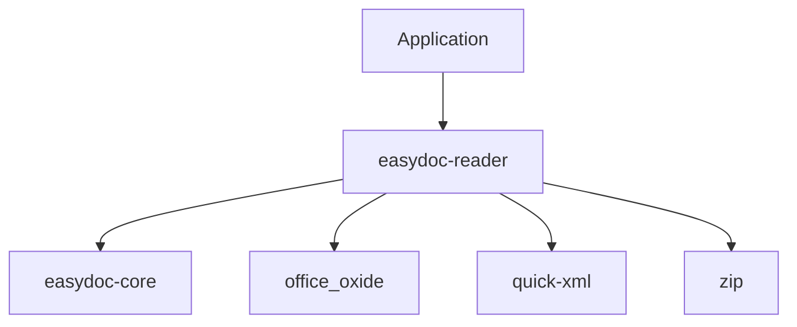

<a id="readme-top"></a>

<div align="center">

# easydoc-reader

**SAX-streaming DOCX/DOC reader with O(1) memory footprint**

[](https://crates.io/crates/easydoc-reader)
[](https://docs.rs/easydoc-reader)
[](#rust-baseline)
[](LICENSE)

[English](README.md) | [简体中文](README_zh.md)

[Overview](#1-overview) · [Capabilities](#2-capabilities) · [Architecture](#3-architecture) ·
[Quick Start](#4-quick-start) · [Security](#5-security) · [API](#6-api-reference) ·
[Upstream](#7-upstream-compatibility) · [Quality](#8-quality--testing)

</div>

---

> **Current version**: `0.1.0-alpha.1`
> **MSRV**: Rust `1.88`
> **Edition**: `2024`
> **Resolver**: `3`
> **Maturity**: Alpha -- public API may change
> **Last verified**: 2026-08-11

## 1. Overview

**easydoc-reader is a Rust crate for streaming DOCX (and legacy DOC) document reading, designed for O(1) memory usage regardless of document size.** It is part of the [easydoc-rust](https://github.com/easy-4-rust/easydoc-rust) workspace and corresponds to the read layer of Java EasyExcel (`com.alibaba.excel`).

| Dimension | Value |
|---|---|
| Crate | `easydoc-reader` |
| Version | `0.1.0-alpha.1` |
| MSRV / Edition | `1.88` / `2024` |
| Unsafe policy | `forbid` (workspace lint) |
| License | `Apache-2.0` |

### 1.1 What It Is

- A SAX-style streaming DOCX reader built on `quick-xml` for O(1) memory parsing.
- Extracts paragraphs, headings, tables (with merge), images (binary), multi-level lists, hyperlinks, nested tables, and OMML math formulas.
- Provides four view modes (Plain, Annotated, Outline, Stats) for LLM-friendly document analysis.
- Includes SSRF, ZIP bomb, and Zip Slip security guards.

### 1.2 What It Is Not

- Not a DOCX editor -- use `easydoc-writer` for writing.
- Not a Markdown converter -- use `easydoc-markdown` for conversion.
- Not a 1:1 port of any single Java class; it combines concepts from multiple EasyExcel reader components.
- Legacy DOC support depends on `office_oxide` boundaries and is not equivalent to DOCX coverage.

## 2. Capabilities

### 2.1 Document Format Support Matrix

| Element | DOCX Read | DOC Read | Evidence |
|---|:---:|:---:|---|
| Paragraphs | Stable | Partial | `sax.rs` tests |
| Headings (H1-H6) | Stable | Partial | `sax.rs` tests |
| Tables (with column/row merge) | Stable | Partial | `sax.rs` tests |
| Images (binary extraction) | Stable | N/A | `image.rs` tests |
| Lists (ordered / unordered, multi-level nesting) | Stable | N/A | `sax.rs` + `numbering.rs` tests |
| Hyperlinks (URL resolution + SSRF check) | Stable | N/A | `sax.rs` + `security.rs` tests |
| Nested tables | Stable | N/A | `sax.rs` tests |
| OMML math formulas | Stable | N/A | `sax.rs` tests |
| Page / column breaks | Stable | N/A | `sax.rs` tests |
| Text styles (bold / italic / strikethrough) | Stable | N/A | `sax.rs` tests |

### 2.2 Status Definitions

| Status | Definition |
|---|---|
| Stable | Public API, tests, and documentation complete |
| Partial | Only explicitly listed subset available |
| N/A | Not available for this format |

### 2.3 View Modes

| Mode | Purpose | Output |
|---|---|---|
| `Plain` | Bare text extraction | Paragraphs joined by newlines |
| `Annotated` | Structural markers | `[段落 3]`, `[表格 2: 3行x4列]` |
| `Outline` | Headings only | Markdown-style `#` / `##` |
| `Stats` | Aggregate counts | Paragraph / table / image / word counts |

## 3. Architecture

```text
DOCX file (ZIP archive)
        │
        ▼
ZIP validation (bomb / Zip Slip / entry limits)
        │
        ▼
word/document.xml extraction
        │
        ▼
quick-xml SAX parser (O(1) memory)
        │
        ├──► DocumentEvent stream (EventSink)
        └──► DocumentBlock tree (read_blocks)
        │
        ▼
ViewMode rendering (Plain / Annotated / Outline / Stats)
```

### 3.1 Crate Dependencies



### 3.2 Key Types

| Type | Role |
|---|---|
| `DocxSaxReader<R>` | Streaming SAX reader; generic over `Read` |
| `DocReadBuilder` | Fluent builder for table extraction (`do_read`) |
| `EventSink` | Trait for receiving `DocumentEvent` stream |
| `ViewMode` | Enum selecting output format |
| `SecurityPolicy` | Combined SSRF + ZIP limits guard |
| `Numbering` | Parsed `word/numbering.xml` for list detection |

## 4. Quick Start

### 4.1 Installation

```toml
[dependencies]
easydoc-reader = "0.1.0-alpha.1"
```

### 4.2 Streaming Read (Event-based)

```rust
use std::path::Path;
use easydoc_reader::DocxSaxReader;
use easydoc_core::ContentCollector;

fn main() -> Result<(), Box<dyn std::error::Error>> {
    let mut reader = DocxSaxReader::from_path(Path::new("report.docx"))?;
    let mut collector = ContentCollector::new();
    reader.read_events(&mut collector)?;
    let content = collector.into_content();

    for block in &content.blocks {
        println!("{:?}", block);
    }
    Ok(())
}
```

### 4.3 Block-based Read (with Math)

```rust
use std::path::Path;
use easydoc_reader::DocxSaxReader;

fn main() -> Result<(), Box<dyn std::error::Error>> {
    let mut reader = DocxSaxReader::from_path(Path::new("report.docx"))?;
    let blocks = reader.read_blocks()?;

    for block in &blocks {
        println!("{:?}", block);
    }
    Ok(())
}
```

### 4.4 View Mode Rendering

```rust
use std::path::Path;
use easydoc_reader::{DocxSaxReader, ViewMode, render_view};
use easydoc_core::ContentCollector;

fn main() -> Result<(), Box<dyn std::error::Error>> {
    let mut reader = DocxSaxReader::from_path(Path::new("report.docx"))?;
    let mut collector = ContentCollector::new();
    reader.read_events(&mut collector)?;
    let content = collector.into_content();

    let outline = render_view(&content, &ViewMode::Outline { max_level: 3 })?;
    println!("{}", outline);
    Ok(())
}
```

### 4.5 Typed Table Extraction

```rust
use easydoc_reader::DocReadBuilder;
use easydoc_core::DocxRow;

#[derive(Debug, DocxRow)]
struct Employee {
    #[easydoc(name = "Name")]
    name: String,
    #[easydoc(name = "Age")]
    age: u32,
}

fn main() -> Result<(), Box<dyn std::error::Error>> {
    let employees: Vec<Employee> = DocReadBuilder::new("staff.docx").do_read()?;
    for emp in &employees {
        println!("{}: {}", emp.name, emp.age);
    }
    Ok(())
}
```

## 5. Security

### 5.1 Security Guards

| Guard | Default | Protection |
|---|---|---|
| `SsrfGuard` | Conservative | Blocks private IPs, localhost, link-local; DNS resolution enabled |
| `PackageLimits` | 100 MB total, 50 MB/entry, 100x ratio, 10k entries | ZIP bomb and element explosion prevention |
| Zip Slip | Always | Rejects `..` and absolute paths in ZIP entries |

### 5.2 SSRF Protection Details

The `SsrfGuard` validates all hyperlinks extracted from DOCX documents:

- Allowed schemes: `http`, `https`, `mailto`
- Blocked hosts: `localhost`
- Blocked IPv4: `127.0.0.0/8`, `10.0.0.0/8`, `172.16.0.0/12`, `192.168.0.0/16`, `169.254.0.0/16`, `100.64.0.0/10`, `0.0.0.0/8`
- Blocked IPv6: loopback, unspecified, unique-local (`fc00::/7`), link-local (`fe80::/10`), multicast (`ff00::/8`)

```rust
use easydoc_reader::security::SsrfGuard;

let guard = SsrfGuard::new();
assert!(guard.check_url("https://example.com").is_ok());
assert!(guard.check_url("http://127.0.0.1/admin").is_err());
```

### 5.3 Custom Security Policy

```rust
use easydoc_reader::security::SecurityPolicy;
use easydoc_reader::DocxSaxReader;
use std::path::Path;

let policy = SecurityPolicy::permissive(); // trusted input only
let reader = DocxSaxReader::from_path_with_security(
    Path::new("trusted.docx"),
    policy,
)?;
```

## 6. API Reference

### 6.1 Core API

| Function / Type | Purpose |
|---|---|
| `DocxSaxReader::from_path(path)` | Open DOCX with default security |
| `DocxSaxReader::from_path_with_security(path, policy)` | Open with custom security |
| `DocxSaxReader::from_reader(reader)` | Wrap raw XML `Read` source |
| `reader.read_events(sink)` | Stream `DocumentEvent`s to `EventSink` |
| `reader.read_blocks()` | Collect all blocks including `Math` |
| `render_view(content, mode)` | Render `DocumentContent` as text |
| `read_document(path)` | Convenience: read entire document |
| `read_tables(path)` | Convenience: extract all tables |
| `read_text(path)` | Convenience: extract plain text |
| `DocReadBuilder::new(path).do_read::<T>()` | Typed table extraction |

### 6.2 Error Model

| Error Variant | Scenario | Source |
|---|---|---|
| `DocError::Format` | XML parse failure, security violation | `quick-xml`, security guards |
| `DocError::Zip` | ZIP entry not found or corrupt | `zip` crate |
| `DocError::Io` | File I/O failure | `std::io::Error` |

## 7. Upstream Compatibility

### 7.1 Java EasyExcel Mapping

This crate corresponds to the read layer of Java EasyExcel. The design draws from multiple upstream components:

| Upstream Component | Rust Equivalent | Notes |
|---|---|---|
| `XlsxSaxAnalyser` (concept) | `DocxSaxReader` | SAX streaming pattern adapted for DOCX |
| `ExcelReader` | `DocReadBuilder` | Fluent builder for typed reads |
| `ReadListener` | `EventSink` | Event callback interface |

| Upstream Capability | Rust Status | Evidence |
|---|---|---|
| Streaming read | Stable | `DocxSaxReader` tests |
| Typed row extraction | Stable | `DocReadBuilder.do_read()` |
| Event-based callbacks | Stable | `EventSink` trait |

### 7.2 Differences from Java

- No reflection: Rust uses derive macros (`DocxRow`) instead of Java reflection for typed extraction.
- No partial sheet read: DOCX has no sheet concept; full document is streamed.
- Math formulas: `read_blocks()` returns `DocumentBlock::Math` with raw OMML XML; `read_events()` drops math (no `DocumentEvent::Math` variant).

## 8. Quality & Testing

### 8.1 Unsafe Policy

This crate uses `#![deny(unsafe_code)]`. The workspace enforces `unsafe_code = "forbid"` via `[workspace.lints.rust]`.

### 8.2 Test Categories

| Category | Scope | Tool |
|---|---|---|
| Unit tests | SAX parser, image, numbering, security, view modes | `cargo test` |
| Security tests | SSRF guard, ZIP bomb, Zip Slip, compression ratio | `cargo test` |
| Property tests | Input boundary validation | `proptest` |

### 8.3 Building & Testing

```bash
cargo check -p easydoc-reader
cargo test -p easydoc-reader
cargo clippy -p easydoc-reader -- -D warnings
cargo doc -p easydoc-reader --no-deps
```

---

<div align="center">

[Back to top](#readme-top) · [docs.rs](https://docs.rs/easydoc-reader) · [crates.io](https://crates.io/crates/easydoc-reader) · [Issues](https://github.com/easy-4-rust/easydoc-rust/issues)

</div>
