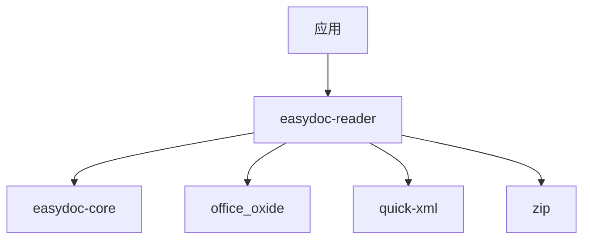

<a id="readme-top"></a>

<div align="center">

# easydoc-reader

**SAX 流式 DOCX/DOC 读取器，O(1) 内存开销**

[](https://crates.io/crates/easydoc-reader)
[](https://docs.rs/easydoc-reader)
[](#rust-基线)
[](LICENSE)

[English](README.md) | [简体中文](README_zh.md)

[概述](#1-概述) · [能力矩阵](#2-能力矩阵) · [架构](#3-架构) ·
[快速开始](#4-快速开始) · [安全](#5-安全) · [API](#6-api-参考) ·
[上游兼容](#7-上游兼容) · [质量](#8-质量与测试)

</div>

---

> **当前版本**：`0.1.0-alpha.1`
> **MSRV**：Rust `1.88`
> **Edition**：`2024`
> **Resolver**：`3`
> **成熟度**：Alpha -- 公共 API 可能变化
> **最后核验**：2026-08-11

## 1. 概述

**easydoc-reader 是一个 Rust crate，用于流式读取 DOCX（及旧版 DOC）文档，内存使用量与文档大小无关，始终为 O(1)。** 它是 [easydoc-rust](https://github.com/easy-4-rust/easydoc-rust) workspace 的组成部分，对应 Java EasyExcel（`com.alibaba.excel`）的读取层。

| 维度 | 值 |
|---|---|
| Crate | `easydoc-reader` |
| 版本 | `0.1.0-alpha.1` |
| MSRV / Edition | `1.88` / `2024` |
| unsafe 策略 | `forbid`（workspace lint） |
| 许可证 | `Apache-2.0` |

### 1.1 是什么

- 基于 `quick-xml` 的 SAX 风格流式 DOCX 读取器，O(1) 内存解析。
- 提取段落、标题、表格（含合并）、图片（二进制）、多级列表、超链接、嵌套表和 OMML 数学公式。
- 提供四种视图模式（Plain / Annotated / Outline / Stats），适用于 LLM 文档分析。
- 内置 SSRF、ZIP 炸弹和 Zip Slip 安全防护。

### 1.2 不是什么

- 不是 DOCX 编辑器 -- 写入请使用 `easydoc-writer`。
- 不是 Markdown 转换器 -- 转换请使用 `easydoc-markdown`。
- 不是某个单一 Java 类的 1:1 移植；它综合了多个 EasyExcel 读取组件的设计。
- 旧版 DOC 支持依赖 `office_oxide` 的能力边界，不等同于 DOCX 覆盖范围。

## 2. 能力矩阵

### 2.1 文档格式支持矩阵

| 元素 | DOCX 读取 | DOC 读取 | 证据 |
|---|:---:|:---:|---|
| 段落 | 稳定 | 部分 | `sax.rs` 测试 |
| 标题（H1-H6） | 稳定 | 部分 | `sax.rs` 测试 |
| 表格（含列/行合并） | 稳定 | 部分 | `sax.rs` 测试 |
| 图片（二进制提取） | 稳定 | N/A | `image.rs` 测试 |
| 列表（有序/无序，多级嵌套） | 稳定 | N/A | `sax.rs` + `numbering.rs` 测试 |
| 超链接（URL 解析 + SSRF 检查） | 稳定 | N/A | `sax.rs` + `security.rs` 测试 |
| 嵌套表格 | 稳定 | N/A | `sax.rs` 测试 |
| OMML 数学公式 | 稳定 | N/A | `sax.rs` 测试 |
| 分页/分栏符 | 稳定 | N/A | `sax.rs` 测试 |
| 文本样式（粗体/斜体/删除线） | 稳定 | N/A | `sax.rs` 测试 |

### 2.2 状态定义

| 状态 | 定义 |
|---|---|
| 稳定 | 公共 API、测试和文档齐全 |
| 部分 | 仅明确列出的子集可用 |
| N/A | 此格式不适用 |

### 2.3 视图模式

| 模式 | 用途 | 输出 |
|---|---|---|
| `Plain` | 纯文本提取 | 段落以换行分隔 |
| `Annotated` | 结构化标注 | `[段落 3]`、`[表格 2: 3行x4列]` |
| `Outline` | 仅标题 | Markdown 风格 `#` / `##` |
| `Stats` | 聚合统计 | 段落/表格/图片/字数计数 |

## 3. 架构

```text
DOCX 文件（ZIP 归档）
        │
        ▼
ZIP 安全验证（炸弹 / Zip Slip / 条目限制）
        │
        ▼
word/document.xml 提取
        │
        ▼
quick-xml SAX 解析器（O(1) 内存）
        │
        ├──► DocumentEvent 流（EventSink）
        └──► DocumentBlock 树（read_blocks）
        │
        ▼
ViewMode 渲染（Plain / Annotated / Outline / Stats）
```

### 3.1 Crate 依赖



### 3.2 关键类型

| 类型 | 职责 |
|---|---|
| `DocxSaxReader<R>` | 流式 SAX 读取器；泛型参数为 `Read` |
| `DocReadBuilder` | 表格提取的 Fluent 构建器（`do_read`） |
| `EventSink` | 接收 `DocumentEvent` 流的 trait |
| `ViewMode` | 选择输出格式的枚举 |
| `SecurityPolicy` | SSRF + ZIP 限制的组合守卫 |
| `Numbering` | 已解析的 `word/numbering.xml`，用于列表检测 |

## 4. 快速开始

### 4.1 安装

```toml
[dependencies]
easydoc-reader = "0.1.0-alpha.1"
```

### 4.2 流式读取（基于事件）

```rust
use std::path::Path;
use easydoc_reader::DocxSaxReader;
use easydoc_core::ContentCollector;

fn main() -> Result<(), Box<dyn std::error::Error>> {
    let mut reader = DocxSaxReader::from_path(Path::new("report.docx"))?;
    let mut collector = ContentCollector::new();
    reader.read_events(&mut collector)?;
    let content = collector.into_content();

    for block in &content.blocks {
        println!("{:?}", block);
    }
    Ok(())
}
```

### 4.3 块级读取（含数学公式）

```rust
use std::path::Path;
use easydoc_reader::DocxSaxReader;

fn main() -> Result<(), Box<dyn std::error::Error>> {
    let mut reader = DocxSaxReader::from_path(Path::new("report.docx"))?;
    let blocks = reader.read_blocks()?;

    for block in &blocks {
        println!("{:?}", block);
    }
    Ok(())
}
```

### 4.4 视图模式渲染

```rust
use std::path::Path;
use easydoc_reader::{DocxSaxReader, ViewMode, render_view};
use easydoc_core::ContentCollector;

fn main() -> Result<(), Box<dyn std::error::Error>> {
    let mut reader = DocxSaxReader::from_path(Path::new("report.docx"))?;
    let mut collector = ContentCollector::new();
    reader.read_events(&mut collector)?;
    let content = collector.into_content();

    let outline = render_view(&content, &ViewMode::Outline { max_level: 3 })?;
    println!("{}", outline);
    Ok(())
}
```

### 4.5 类型化表格提取

```rust
use easydoc_reader::DocReadBuilder;
use easydoc_core::DocxRow;

#[derive(Debug, DocxRow)]
struct Employee {
    #[easydoc(name = "Name")]
    name: String,
    #[easydoc(name = "Age")]
    age: u32,
}

fn main() -> Result<(), Box<dyn std::error::Error>> {
    let employees: Vec<Employee> = DocReadBuilder::new("staff.docx").do_read()?;
    for emp in &employees {
        println!("{}: {}", emp.name, emp.age);
    }
    Ok(())
}
```

## 5. 安全

### 5.1 安全守卫

| 守卫 | 默认值 | 防护 |
|---|---|---|
| `SsrfGuard` | 保守模式 | 阻止私有 IP、localhost、链路本地；启用 DNS 解析 |
| `PackageLimits` | 总计 100 MB、单条 50 MB、100 倍压缩比、10000 条目 | ZIP 炸弹和元素爆炸防护 |
| Zip Slip | 始终启用 | 拒绝 ZIP 条目中的 `..` 和绝对路径 |

### 5.2 SSRF 防护细节

`SsrfGuard` 验证从 DOCX 文档提取的所有超链接：

- 允许的协议：`http`、`https`、`mailto`
- 阻止的主机：`localhost`
- 阻止的 IPv4：`127.0.0.0/8`、`10.0.0.0/8`、`172.16.0.0/12`、`192.168.0.0/16`、`169.254.0.0/16`、`100.64.0.0/10`、`0.0.0.0/8`
- 阻止的 IPv6：回环、未指定、唯一本地（`fc00::/7`）、链路本地（`fe80::/10`）、组播（`ff00::/8`）

```rust
use easydoc_reader::security::SsrfGuard;

let guard = SsrfGuard::new();
assert!(guard.check_url("https://example.com").is_ok());
assert!(guard.check_url("http://127.0.0.1/admin").is_err());
```

### 5.3 自定义安全策略

```rust
use easydoc_reader::security::SecurityPolicy;
use easydoc_reader::DocxSaxReader;
use std::path::Path;

let policy = SecurityPolicy::permissive(); // 仅限受信输入
let reader = DocxSaxReader::from_path_with_security(
    Path::new("trusted.docx"),
    policy,
)?;
```

## 6. API 参考

### 6.1 核心 API

| 函数 / 类型 | 用途 |
|---|---|
| `DocxSaxReader::from_path(path)` | 使用默认安全策略打开 DOCX |
| `DocxSaxReader::from_path_with_security(path, policy)` | 使用自定义安全策略打开 |
| `DocxSaxReader::from_reader(reader)` | 包装原始 XML `Read` 源 |
| `reader.read_events(sink)` | 将 `DocumentEvent` 流式推送给 `EventSink` |
| `reader.read_blocks()` | 收集所有块（含 `Math`） |
| `render_view(content, mode)` | 将 `DocumentContent` 渲染为文本 |
| `read_document(path)` | 便捷函数：读取整个文档 |
| `read_tables(path)` | 便捷函数：提取所有表格 |
| `read_text(path)` | 便捷函数：提取纯文本 |
| `DocReadBuilder::new(path).do_read::<T>()` | 类型化表格提取 |

### 6.2 错误模型

| 错误变体 | 场景 | 来源 |
|---|---|---|
| `DocError::Format` | XML 解析失败、安全违规 | `quick-xml`、安全守卫 |
| `DocError::Zip` | ZIP 条目未找到或损坏 | `zip` crate |
| `DocError::Io` | 文件 I/O 失败 | `std::io::Error` |

## 7. 上游兼容

### 7.1 Java EasyExcel 映射

本 crate 对应 Java EasyExcel 的读取层。设计参考了多个上游组件：

| 上游组件 | Rust 对应 | 说明 |
|---|---|---|
| `XlsxSaxAnalyser`（概念） | `DocxSaxReader` | SAX 流式模式适配为 DOCX |
| `ExcelReader` | `DocReadBuilder` | 类型化读取的 Fluent 构建器 |
| `ReadListener` | `EventSink` | 事件回调接口 |

| 上游能力 | Rust 状态 | 证据 |
|---|---|---|
| 流式读取 | 稳定 | `DocxSaxReader` 测试 |
| 类型化行提取 | 稳定 | `DocReadBuilder.do_read()` |
| 基于事件的回调 | 稳定 | `EventSink` trait |

### 7.2 与 Java 的差异

- 无反射：Rust 使用 derive 宏（`DocxRow`）替代 Java 反射进行类型化提取。
- 无部分工作表读取：DOCX 没有工作表概念；完整文档被流式处理。
- 数学公式：`read_blocks()` 返回包含原始 OMML XML 的 `DocumentBlock::Math`；`read_events()` 丢弃数学公式（无 `DocumentEvent::Math` 变体）。

## 8. 质量与测试

### 8.1 unsafe 策略

本 crate 使用 `#![deny(unsafe_code)]`。workspace 通过 `[workspace.lints.rust]` 强制执行 `unsafe_code = "forbid"`。

### 8.2 测试类别

| 类别 | 范围 | 工具 |
|---|---|---|
| 单元测试 | SAX 解析器、图片、编号、安全、视图模式 | `cargo test` |
| 安全测试 | SSRF 守卫、ZIP 炸弹、Zip Slip、压缩比 | `cargo test` |
| 属性测试 | 输入边界验证 | `proptest` |

### 8.3 构建与测试

```bash
cargo check -p easydoc-reader
cargo test -p easydoc-reader
cargo clippy -p easydoc-reader -- -D warnings
cargo doc -p easydoc-reader --no-deps
```

---

<div align="center">

[返回顶部](#readme-top) · [docs.rs](https://docs.rs/easydoc-reader) · [crates.io](https://crates.io/crates/easydoc-reader) · [Issues](https://github.com/easy-4-rust/easydoc-rust/issues)

</div>
