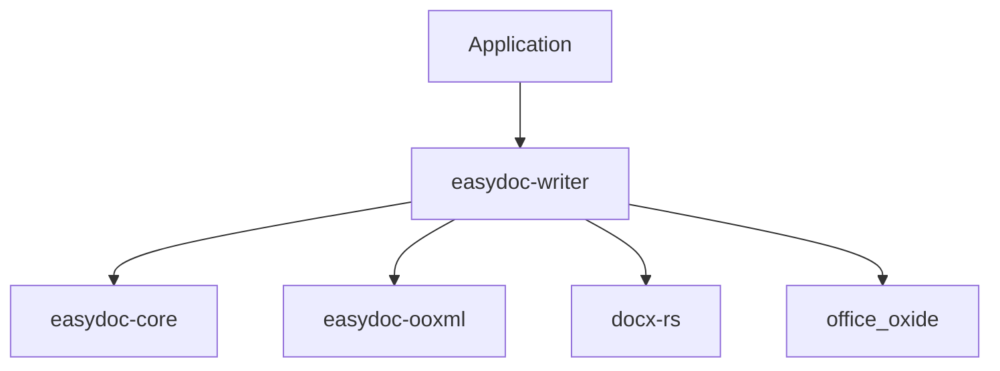

<a id="readme-top"></a>

<div align="center">

# easydoc-writer

**DOCX document writer with fluent builder API and atomic file output**

[](https://crates.io/crates/easydoc-writer)
[](https://docs.rs/easydoc-writer)
[](#rust-baseline)
[](LICENSE)

[English](README.md) | [简体中文](README_zh.md)

[Overview](#1-overview) · [Capabilities](#2-capabilities) · [Architecture](#3-architecture) ·
[Quick Start](#4-quick-start) · [API](#5-api-reference) ·
[Upstream](#6-upstream-compatibility) · [Quality](#7-quality--testing)

</div>

---

> **Status**: alpha pre-release (latest on [crates.io](https://crates.io/crates/easydoc-writer))
> **MSRV**: Rust `1.88`
> **Edition**: `2024`
> **Resolver**: `3`
> **Maturity**: Alpha -- public API may change
> **Last verified**: 2026-08-11

## 1. Overview

**easydoc-writer is a Rust crate for generating DOCX documents from a semantic document model (`DocumentContent`) or via a fluent builder API.** It is part of the [easydoc-rust](https://github.com/easy-4-rust/easydoc-rust) workspace and corresponds to the write layer of Java EasyExcel (`com.alibaba.excel`).

| Dimension | Value |
|---|---|
| Crate | `easydoc-writer` |
| Status | Alpha pre-release (latest on crates.io) |
| MSRV / Edition | `1.88` / `2024` |
| Unsafe policy | `forbid` (workspace lint) |
| License | `Apache-2.0` |

### 1.1 What It Is

- A DOCX generator built on `docx-rs` that renders the `DocumentContent` semantic model into OOXML.
- Provides a fluent `DocBuilder` API for programmatic document construction.
- Supports atomic file writes via temporary file + persist (no partial output on failure).
- Includes a `DocEditor` for text replacement in existing DOCX files.
- Lifecycle hooks (`DocWriteHandler`) for before/after document, paragraph, and table callbacks.

### 1.2 What It Is Not

- Not a DOCX reader -- use `easydoc-reader` for reading.
- Not a Markdown converter -- use `easydoc-markdown` for conversion.
- Not a full OOXML style engine -- advanced formatting (columns, watermarks, macros) is out of scope.
- Not a template engine -- use `easydoc-template` for placeholder-based template filling.

## 2. Capabilities

### 2.1 Write Capability Matrix

| Element | Write | Round-trip Fidelity | Evidence |
|---|:---:|:---:|---|
| Paragraphs | Stable | High | `content_renderer.rs` tests |
| Headings (H1-H6) | Stable | High | `content_renderer.rs` tests |
| Tables (column span) | Stable | High | `content_renderer.rs` tests |
| Images (binary embedding) | Stable | High | `content_renderer.rs` tests |
| Lists (ordered / unordered, multi-level) | Stable | High | `content_renderer.rs` tests |
| Hyperlinks (URL) | Stable | High | `content_renderer.rs` tests |
| Code blocks | Stable | Partial | Rendered as monospace paragraphs |
| Page / column breaks | Stable | High | `content_renderer.rs` tests |
| Text styles (bold / italic / strikethrough) | Stable | High | `content_renderer.rs` tests |
| Footnotes / endnotes | Stable | Partial | Rendered as indented paragraphs |
| TextBox | Stable | Partial | Content rendered as nested blocks |
| Sections | Stable | Partial | Content rendered as sub-blocks |
| Thematic breaks | Stable | Partial | Rendered as page breaks |
| Math formulas (OMML) | Not supported | N/A | Use `easydoc-markdown` for OMML to LaTeX |

### 2.2 Edit Capability Matrix

| Operation | Status | Notes |
|---|:---:|---|
| Open existing DOCX | Stable | `DocEditor::open()` |
| Text replacement (placeholder) | Stable | `replace_text(find, replace)` |
| Save (overwrite) | Stable | Atomic via `office_oxide` |

### 2.3 Status Definitions

| Status | Definition |
|---|---|
| Stable | Public API, tests, and documentation complete |
| Partial | Only explicitly listed subset available |
| N/A | Not available |

## 3. Architecture

```text
DocumentContent (semantic model from easydoc-core)
        │
        ▼
content_renderer::render_document_content()
        │
        ▼
docx-rs Docx builder (OOXML construction)
        │
        ▼
DocWriteExecutor::save()
        │
        ▼
AtomicFile (temp file + persist)
        │
        ▼
Output .docx file
```

### 3.1 Crate Dependencies



### 3.2 Key Types

| Type | Role |
|---|---|
| `DocBuilder` | Fluent builder for programmatic DOCX creation |
| `DocWriteExecutor` | Executes the build and saves to file |
| `DocEditor` | Opens existing DOCX for text replacement |
| `TableWriteBuilder` | Fluent builder for table construction |
| `DocWriteHandler` | Lifecycle callback trait (before/after hooks) |
| `render_document_content()` | Renders `DocumentContent` to `docx_rs::Docx` |
| `render_with_handler()` | Renders with lifecycle handler callbacks |

### 3.3 Handler Lifecycle

```text
before_document
    ├── before_paragraph / after_paragraph  (per paragraph)
    ├── before_table / after_table          (per table)
    │       ├── before_cell / after_cell    (per cell)
    └── (other blocks)
after_document
```

## 4. Quick Start

### 4.1 Installation

```toml
[dependencies]
easydoc-writer = "0.1.0-alpha"
```

### 4.2 Fluent Builder

```rust
use easydoc_writer::DocBuilder;
use easydoc_core::HeadingLevel;

fn main() -> Result<(), Box<dyn std::error::Error>> {
    DocBuilder::new("report.docx")
        .title("Quarterly Report")
        .author("Alice")
        .add_heading("Introduction", HeadingLevel::H1)
        .add_paragraph(
            easydoc_writer::Paragraph::new()
                .add_run(easydoc_writer::Run::new("This is the introduction."))
        )
        .add_heading("Results", HeadingLevel::H2)
        .add_table(easydoc_writer::Table::from_data(&vec![
            vec!["Metric", "Value"],
            vec!["Revenue", "$1.2M"],
        ]))
        .build()?
        .save()?;
    Ok(())
}
```

### 4.3 Render from Semantic Model

```rust
use easydoc_core::{DocumentContent, DocumentBlock, DocumentTextRun};
use easydoc_writer::content_renderer::render_document_content;

fn main() -> Result<(), Box<dyn std::error::Error>> {
    let content = DocumentContent {
        blocks: vec![
            DocumentBlock::Heading {
                level: 1,
                runs: vec![DocumentTextRun {
                    text: "Hello World".into(),
                    ..Default::default()
                }],
            },
            DocumentBlock::Paragraph(vec![DocumentTextRun {
                text: "Generated from semantic model.".into(),
                ..Default::default()
            }]),
        ],
        ..Default::default()
    };

    let docx = render_document_content(&content)?;
    // docx.pack() to write to file
    Ok(())
}
```

### 4.4 Edit Existing Document

```rust
use easydoc_writer::DocEditor;

fn main() -> Result<(), Box<dyn std::error::Error>> {
    DocEditor::open("template.docx".as_ref())?
        .replace_text("{name}", "Alice")
        .replace_text("{date}", "2026-08-11")
        .save()?;
    Ok(())
}
```

## 5. API Reference

### 5.1 Core API

| Function / Type | Purpose |
|---|---|
| `DocBuilder::new(path)` | Create builder targeting output path |
| `builder.title(t)` | Set document title |
| `builder.author(a)` | Set document author |
| `builder.add_heading(text, level)` | Add heading paragraph |
| `builder.add_paragraph(p)` | Add paragraph |
| `builder.add_table(t)` | Add table |
| `builder.add_image(img)` | Add image |
| `builder.add_page_break()` | Add page break |
| `builder.build()?.save()` | Build and save atomically |
| `DocEditor::open(path)` | Open existing DOCX for editing |
| `editor.replace_text(find, replace)` | Replace text placeholders |
| `editor.save()` | Save modified document |
| `render_document_content(content)` | Render `DocumentContent` to `Docx` |
| `render_with_handler(content, handler)` | Render with lifecycle hooks |

### 5.2 Error Model

| Error Variant | Scenario | Source |
|---|---|---|
| `DocError::Io` | File I/O failure | `std::io::Error` |
| `DocError::Document` | Document open/render failure | `office_oxide`, `docx-rs` |

## 6. Upstream Compatibility

### 6.1 Java EasyExcel Mapping

This crate corresponds to the write layer of Java EasyExcel:

| Upstream Component | Rust Equivalent | Notes |
|---|---|---|
| `ExcelBuilderImpl` | `DocBuilder` | Fluent builder pattern |
| `ExcelWriter` | `DocWriteExecutor` | Executes and saves |
| `WriteHandler` | `DocWriteHandler` | Lifecycle callbacks |
| Hutool `Word07Writer` (edit) | `DocEditor` | Text replacement in existing files |

| Upstream Capability | Rust Status | Evidence |
|---|---|---|
| Fluent document building | Stable | `DocBuilder` API |
| Semantic model rendering | Stable | `render_document_content()` |
| Atomic file output | Stable | `AtomicFile` in `easydoc-ooxml` |
| Lifecycle handler hooks | Stable | `DocWriteHandler` trait |
| Text replacement editing | Stable | `DocEditor::replace_text()` |

### 6.2 Differences from Java

- No reflection: Rust uses typed structs instead of Java reflection for data binding.
- Atomic writes: All file output uses temp-file + persist; Java EasyExcel does not guarantee this.
- Handler model: Rust handlers use trait methods with explicit contexts; Java uses interface implementations.
- Style system: Rust style configuration is struct-based (`ParagraphStyle`, `TableStyle`, `FontConfig`); Java uses builder chains.

## 7. Quality & Testing

### 7.1 Unsafe Policy

This crate uses `#![deny(unsafe_code)]`. The workspace enforces `unsafe_code = "forbid"` via `[workspace.lints.rust]`.

### 7.2 Test Categories

| Category | Scope | Tool |
|---|---|---|
| Unit tests | Renderer, builder, editor, handler lifecycle | `cargo test` |
| Integration tests | Full document generation + ZIP validation | `cargo test` |

### 7.3 Building & Testing

```bash
cargo check -p easydoc-writer
cargo test -p easydoc-writer
cargo clippy -p easydoc-writer -- -D warnings
cargo doc -p easydoc-writer --no-deps
```

---

<div align="center">

[Back to top](#readme-top) · [docs.rs](https://docs.rs/easydoc-writer) · [crates.io](https://crates.io/crates/easydoc-writer) · [Issues](https://github.com/easy-4-rust/easydoc-rust/issues)

</div>
