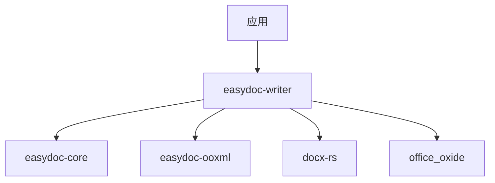

<a id="readme-top"></a>

<div align="center">

# easydoc-writer

**DOCX 文档写入器，Fluent 构建器 API + 原子文件输出**

[](https://crates.io/crates/easydoc-writer)
[](https://docs.rs/easydoc-writer)
[](#rust-基线)
[](LICENSE)

[English](README.md) | [简体中文](README_zh.md)

[概述](#1-概述) · [能力矩阵](#2-能力矩阵) · [架构](#3-架构) ·
[快速开始](#4-快速开始) · [API](#5-api-参考) ·
[上游兼容](#6-上游兼容) · [质量](#7-质量与测试)

</div>

---

> **状态**：alpha 预发布（最新版见 [crates.io](https://crates.io/crates/easydoc-writer)）
> **MSRV**：Rust `1.88`
> **Edition**：`2024`
> **Resolver**：`3`
> **成熟度**：Alpha -- 公共 API 可能变化
> **最后核验**：2026-08-11

## 1. 概述

**easydoc-writer 是一个 Rust crate，用于从语义文档模型（`DocumentContent`）或通过 Fluent 构建器 API 生成 DOCX 文档。** 它是 [easydoc-rust](https://github.com/easy-4-rust/easydoc-rust) workspace 的组成部分，对应 Java EasyExcel（`com.alibaba.excel`）的写入层。

| 维度 | 值 |
|---|---|
| Crate | `easydoc-writer` |
| 状态 | Alpha 预发布（最新版见 crates.io） |
| MSRV / Edition | `1.88` / `2024` |
| unsafe 策略 | `forbid`（workspace lint） |
| 许可证 | `Apache-2.0` |

### 1.1 是什么

- 基于 `docx-rs` 的 DOCX 生成器，将 `DocumentContent` 语义模型渲染为 OOXML。
- 提供 Fluent `DocBuilder` API，用于编程式文档构建。
- 通过临时文件 + persist 实现原子文件写入（失败时不产生部分输出）。
- 包含 `DocEditor`，支持对已有 DOCX 文件进行文本替换。
- 生命周期钩子（`DocWriteHandler`）：文档/段落/表格的 before/after 回调。

### 1.2 不是什么

- 不是 DOCX 读取器 -- 读取请使用 `easydoc-reader`。
- 不是 Markdown 转换器 -- 转换请使用 `easydoc-markdown`。
- 不是完整的 OOXML 样式引擎 -- 高级格式（分栏、水印、宏）不在范围内。
- 不是模板引擎 -- 基于占位符的模板填充请使用 `easydoc-template`。

## 2. 能力矩阵

### 2.1 写入能力矩阵

| 元素 | 写入 | 往返保真 | 证据 |
|---|:---:|:---:|---|
| 段落 | 稳定 | 高 | `content_renderer.rs` 测试 |
| 标题（H1-H6） | 稳定 | 高 | `content_renderer.rs` 测试 |
| 表格（列合并） | 稳定 | 高 | `content_renderer.rs` 测试 |
| 图片（二进制嵌入） | 稳定 | 高 | `content_renderer.rs` 测试 |
| 列表（有序/无序，多级） | 稳定 | 高 | `content_renderer.rs` 测试 |
| 超链接（URL） | 稳定 | 高 | `content_renderer.rs` 测试 |
| 代码块 | 稳定 | 部分 | 渲染为等宽字体段落 |
| 分页/分栏符 | 稳定 | 高 | `content_renderer.rs` 测试 |
| 文本样式（粗体/斜体/删除线） | 稳定 | 高 | `content_renderer.rs` 测试 |
| 脚注/尾注 | 稳定 | 部分 | 渲染为缩进段落 |
| TextBox | 稳定 | 部分 | 内容渲染为嵌套块 |
| 分节 | 稳定 | 部分 | 内容渲染为子块 |
| 主题分隔线 | 稳定 | 部分 | 渲染为分页符 |
| 数学公式（OMML） | 不支持 | N/A | 请使用 `easydoc-markdown` 进行 OMML 到 LaTeX 转换 |

### 2.2 编辑能力矩阵

| 操作 | 状态 | 说明 |
|---|:---:|---|
| 打开已有 DOCX | 稳定 | `DocEditor::open()` |
| 文本替换（占位符） | 稳定 | `replace_text(find, replace)` |
| 保存（覆盖） | 稳定 | 通过 `office_oxide` 原子写入 |

### 2.3 状态定义

| 状态 | 定义 |
|---|---|
| 稳定 | 公共 API、测试和文档齐全 |
| 部分 | 仅明确列出的子集可用 |
| N/A | 不可用 |

## 3. 架构

```text
DocumentContent（来自 easydoc-core 的语义模型）
        │
        ▼
content_renderer::render_document_content()
        │
        ▼
docx-rs Docx 构建器（OOXML 构造）
        │
        ▼
DocWriteExecutor::save()
        │
        ▼
AtomicFile（临时文件 + persist）
        │
        ▼
输出 .docx 文件
```

### 3.1 Crate 依赖



### 3.2 关键类型

| 类型 | 职责 |
|---|---|
| `DocBuilder` | 编程式 DOCX 创建的 Fluent 构建器 |
| `DocWriteExecutor` | 执行构建并保存到文件 |
| `DocEditor` | 打开已有 DOCX 进行文本替换 |
| `TableWriteBuilder` | 表格构建的 Fluent 构建器 |
| `DocWriteHandler` | 生命周期回调 trait（before/after 钩子） |
| `render_document_content()` | 将 `DocumentContent` 渲染为 `docx_rs::Docx` |
| `render_with_handler()` | 带生命周期处理器的渲染 |

### 3.3 处理器生命周期

```text
before_document
    ├── before_paragraph / after_paragraph  （每个段落）
    ├── before_table / after_table          （每个表格）
    │       ├── before_cell / after_cell    （每个单元格）
    └── （其他块）
after_document
```

## 4. 快速开始

### 4.1 安装

```toml
[dependencies]
easydoc-writer = "0.1.0-alpha"
```

### 4.2 Fluent 构建器

```rust
use easydoc_writer::DocBuilder;
use easydoc_core::HeadingLevel;

fn main() -> Result<(), Box<dyn std::error::Error>> {
    DocBuilder::new("report.docx")
        .title("季度报告")
        .author("Alice")
        .add_heading("引言", HeadingLevel::H1)
        .add_paragraph(
            easydoc_writer::Paragraph::new()
                .add_run(easydoc_writer::Run::new("这是引言部分。"))
        )
        .add_heading("结果", HeadingLevel::H2)
        .add_table(easydoc_writer::Table::from_data(&vec![
            vec!["指标", "数值"],
            vec!["营收", "120万"],
        ]))
        .build()?
        .save()?;
    Ok(())
}
```

### 4.3 从语义模型渲染

```rust
use easydoc_core::{DocumentContent, DocumentBlock, DocumentTextRun};
use easydoc_writer::content_renderer::render_document_content;

fn main() -> Result<(), Box<dyn std::error::Error>> {
    let content = DocumentContent {
        blocks: vec![
            DocumentBlock::Heading {
                level: 1,
                runs: vec![DocumentTextRun {
                    text: "你好世界".into(),
                    ..Default::default()
                }],
            },
            DocumentBlock::Paragraph(vec![DocumentTextRun {
                text: "从语义模型生成。".into(),
                ..Default::default()
            }]),
        ],
        ..Default::default()
    };

    let docx = render_document_content(&content)?;
    // docx.pack() 写入文件
    Ok(())
}
```

### 4.4 编辑已有文档

```rust
use easydoc_writer::DocEditor;

fn main() -> Result<(), Box<dyn std::error::Error>> {
    DocEditor::open("template.docx".as_ref())?
        .replace_text("{name}", "Alice")
        .replace_text("{date}", "2026-08-11")
        .save()?;
    Ok(())
}
```

## 5. API 参考

### 5.1 核心 API

| 函数 / 类型 | 用途 |
|---|---|
| `DocBuilder::new(path)` | 创建指向输出路径的构建器 |
| `builder.title(t)` | 设置文档标题 |
| `builder.author(a)` | 设置文档作者 |
| `builder.add_heading(text, level)` | 添加标题段落 |
| `builder.add_paragraph(p)` | 添加段落 |
| `builder.add_table(t)` | 添加表格 |
| `builder.add_image(img)` | 添加图片 |
| `builder.add_page_break()` | 添加分页符 |
| `builder.build()?.save()` | 构建并原子保存 |
| `DocEditor::open(path)` | 打开已有 DOCX 进行编辑 |
| `editor.replace_text(find, replace)` | 替换文本占位符 |
| `editor.save()` | 保存修改后的文档 |
| `render_document_content(content)` | 将 `DocumentContent` 渲染为 `Docx` |
| `render_with_handler(content, handler)` | 带生命周期钩子的渲染 |

### 5.2 错误模型

| 错误变体 | 场景 | 来源 |
|---|---|---|
| `DocError::Io` | 文件 I/O 失败 | `std::io::Error` |
| `DocError::Document` | 文档打开/渲染失败 | `office_oxide`、`docx-rs` |

## 6. 上游兼容

### 6.1 Java EasyExcel 映射

本 crate 对应 Java EasyExcel 的写入层：

| 上游组件 | Rust 对应 | 说明 |
|---|---|---|
| `ExcelBuilderImpl` | `DocBuilder` | Fluent 构建器模式 |
| `ExcelWriter` | `DocWriteExecutor` | 执行并保存 |
| `WriteHandler` | `DocWriteHandler` | 生命周期回调 |
| Hutool `Word07Writer`（编辑） | `DocEditor` | 已有文件的文本替换 |

| 上游能力 | Rust 状态 | 证据 |
|---|---|---|
| Fluent 文档构建 | 稳定 | `DocBuilder` API |
| 语义模型渲染 | 稳定 | `render_document_content()` |
| 原子文件输出 | 稳定 | `easydoc-ooxml` 中的 `AtomicFile` |
| 生命周期处理器钩子 | 稳定 | `DocWriteHandler` trait |
| 文本替换编辑 | 稳定 | `DocEditor::replace_text()` |

### 6.2 与 Java 的差异

- 无反射：Rust 使用类型化结构体替代 Java 反射进行数据绑定。
- 原子写入：所有文件输出使用临时文件 + persist；Java EasyExcel 不保证此行为。
- 处理器模型：Rust 处理器使用带显式上下文的 trait 方法；Java 使用接口实现。
- 样式系统：Rust 样式配置基于结构体（`ParagraphStyle`、`TableStyle`、`FontConfig`）；Java 使用构建器链。

## 7. 质量与测试

### 7.1 unsafe 策略

本 crate 使用 `#![deny(unsafe_code)]`。workspace 通过 `[workspace.lints.rust]` 强制执行 `unsafe_code = "forbid"`。

### 7.2 测试类别

| 类别 | 范围 | 工具 |
|---|---|---|
| 单元测试 | 渲染器、构建器、编辑器、处理器生命周期 | `cargo test` |
| 集成测试 | 完整文档生成 + ZIP 验证 | `cargo test` |

### 7.3 构建与测试

```bash
cargo check -p easydoc-writer
cargo test -p easydoc-writer
cargo clippy -p easydoc-writer -- -D warnings
cargo doc -p easydoc-writer --no-deps
```

---

<div align="center">

[返回顶部](#readme-top) · [docs.rs](https://docs.rs/easydoc-writer) · [crates.io](https://crates.io/crates/easydoc-writer) · [Issues](https://github.com/easy-4-rust/easydoc-rust/issues)

</div>
