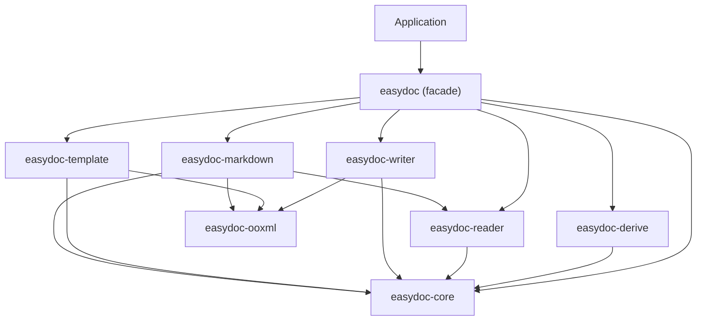

<a id="readme-top"></a>

<div align="center">

# easydoc

**Rust DOC/DOCX document operations library -- read, write, template fill, Markdown conversion, and streaming event processing with O(1) memory.**

[](https://crates.io/crates/easydoc)
[](https://docs.rs/easydoc)
[](#3-rust-baseline--platform-support)
[](https://github.com/easy-4-rust/easydoc-rust/actions)
[](LICENSE)

[English](README.md) | [简体中文](README_zh.md)

[Positioning](#1-project-positioning--status) · [Capabilities](#2-capabilities--maturity) ·
[Which Crate](#3-which-crate-to-depend-on) · [Quick Start](#5-quick-start) ·
[API](#6-easydoc-api-reference) · [Derive](#7-derive-macro) · [Quality](#10-build-test--quality-gates) ·
[Upstream](#11-upstream-compatibility) · [License](#13-license)

</div>

---

> **Status**: alpha pre-release (latest on [crates.io](https://crates.io/crates/easydoc))
> **MSRV**: Rust `1.88`
> **Edition**: `2024`
> **Workspace Resolver**: `3`
> **Maturity**: Alpha (public API may change)
> **Last verified**: 2026-08-11

## 1. Project Positioning & Status

### 1.1 What It Is

**`easydoc` is the facade crate for the `easydoc-rust` workspace -- a Rust library for DOC/DOCX document operations.** It provides a single `EasyDoc` static factory (18 methods) that delegates to 7 domain-specific sub-crates.

| Dimension | Value |
|---|---|
| Crate | `easydoc` |
| Status | Alpha pre-release (latest on crates.io) |
| MSRV / Edition | `1.88` / `2024` |
| Default features | none (all sub-crates are direct dependencies) |
| `unsafe` policy | `forbid` (workspace-wide) |
| Publish status | [crates.io](https://crates.io/crates/easydoc) / [docs.rs](https://docs.rs/easydoc) |
| License | `Apache-2.0` |

### 1.2 What It Is Not

- Not a DOCX parser by itself -- parsing is delegated to `easydoc-reader` (via `office_oxide`).
- Not a DOCX generator by itself -- generation is delegated to `easydoc-writer` (via `docx-rs`).
- Not an Excel library -- for XLSX operations, use [`easyexcel-rust`](https://github.com/easy-4-rust/easyexcel-rust).
- Not a PDF or ODT processor -- only DOCX (full) and DOC (read-only) are supported.

### 1.3 Status Evidence

| Claim | Value | Evidence |
|---|---|---|
| Workspace builds | Yes | `cargo check --workspace` |
| Tests | Unit + integration + doc tests | `cargo test --workspace` |
| MSRV | `1.88` | `rust-version` in `Cargo.toml` |
| `unsafe_code` | `forbid` | `[workspace.lints.rust]` |
| crates.io | Published | [crates.io](https://crates.io/crates/easydoc) / [docs.rs](https://docs.rs/easydoc) |

## 2. Capabilities & Maturity

### 2.1 Capability Matrix

| Capability | Status | Delegated Crate | Notes |
|---|---|---|---|
| Document write (headings, paragraphs, tables, images) | Stable | `easydoc-writer` | Fluent builder API |
| Table write from structs | Stable | `easydoc-writer` + `easydoc-derive` | `#[derive(DocxRow)]` one-liner |
| Document read (text, tables) | Stable | `easydoc-reader` | DOC/DOCX auto-detection |
| SAX streaming read (O(1) memory) | Stable | `easydoc-reader` | `EventSink` trait |
| ViewMode rendering (Plain/Annotated/Outline/Stats) | Stable | `easydoc-reader` | LLM-friendly modes |
| Semantic model read-modify-write | Stable | `easydoc-reader` + `easydoc-writer` | `DocumentContent` round-trip |
| Template fill (`{key}`, `{.field}`) | Stable | `easydoc-template` | Scalar + collection expansion |
| Markdown conversion | Stable | `easydoc-markdown` | GFM tables, images, front matter |
| Edit existing DOCX | Stable | `easydoc-writer` | Text replacement |
| In-memory output | Stable | `easydoc-writer` | `*_to_bytes()` variants |
| Custom type converters | Stable | `easydoc-core` | `DocConverter<T>` trait |
| Write lifecycle hooks | Stable | `easydoc-core` | `DocWriteHandler` trait |

### 2.2 Status Definitions

| Status | Definition |
|---|---|
| Stable | Public API, tests, and documentation present; behaviour may still change at alpha stage |
| Preview | Usable but API or behaviour likely to change |
| Partial | Only explicitly listed subset works |
| Planned | No callable implementation yet |

### 2.3 Format Support Matrix

| Format | Read | Write | Edit | Template | Markdown | Notes |
|---|:---:|:---:|:---:|:---:|:---:|---|
| DOCX (.docx) | Full | Full | Full | Full | Full | SAX streaming, semantic model, image extraction |
| DOC (.doc) | Full | -- | -- | -- | Full | Read-only via `office_oxide`; auto-detection |

## 3. Which Crate to Depend On

The `easydoc-rust` workspace contains 9 crates. Most users should depend on `easydoc` (this crate).

| Need | Recommended Crate | Features | Trade-off |
|---|---|---|---|
| General document operations | `easydoc` | default | Simplest entry point; pulls all sub-crates |
| Core types and traits only | `easydoc-core` | `serde` (optional) | Minimal dependencies; no I/O |
| MCP server for LLM agents | `easydoc-mcp` | -- | Separate binary crate |
| Reading only | `easydoc-reader` | -- | No write/template/markdown |
| Writing only | `easydoc-writer` | -- | No read/template/markdown |
| Markdown conversion only | `easydoc-markdown` | -- | No write/template |
| Template fill only | `easydoc-template` | -- | No read/write/markdown |
| OOXML low-level operations | `easydoc-ooxml` | -- | Internal; not recommended for direct use |
| Derive macro only | `easydoc-derive` | -- | `#[derive(DocxRow)]` |

```toml
# Most users: depend on the facade
[dependencies]
easydoc = "0.1.0-alpha"

# Advanced: depend on a single domain crate
easydoc-core = "0.1.0-alpha"
```

## 4. Workspace Architecture

```text
Application / downstream crate
        │ cargo add easydoc
        ▼
┌───────────────────────────────────────────────────────┐
│ easydoc-rust Cargo Workspace (9 crates)               │
│                                                       │
│ easydoc               Facade -- EasyDoc static factory│
│ easydoc-core          Traits, data model, errors      │
│ easydoc-derive        #[derive(DocxRow)] proc-macro   │
│ easydoc-ooxml         Safe OOXML rewrite, atomic I/O  │
│ easydoc-reader        DOC/DOCX reading (office_oxide) │
│ easydoc-writer        DOCX creation (docx-rs)         │
│ easydoc-template      Template placeholder fill       │
│ easydoc-markdown      DOC/DOCX → Markdown             │
│ easydoc-mcp           MCP server for LLM agents       │
└───────────────────────────────────────────────────────┘
        │
        ▼
[DOCX files / DOC files / in-memory bytes]
```



### 4.1 Facade Re-export Map

| `easydoc` module | Source crate | Key types |
|---|---|---|
| `EasyDoc` | `easydoc` | Static factory (18 methods) |
| `DocxRow`, `DocConverter`, `DocWriteHandler`, `EventSink` | `easydoc-core` | Extension traits |
| `DocumentContent`, `DocumentBlock`, `DocumentTextRun` | `easydoc-core` | Semantic model |
| `DocValue`, `CellData`, `RowData`, `TableData` | `easydoc-core` | Data types |
| `DocError`, `Result` | `easydoc-core` | Error types |
| `#[derive(DocxRow)]` | `easydoc-derive` | Derive macro |
| `DocBuilder`, `Paragraph`, `Run`, `Table` | `easydoc-writer` | Write builders |
| `DocReadBuilder`, `ViewMode`, `DocxSaxReader` | `easydoc-reader` | Read builders |
| `MarkdownBuilder`, `MarkdownResult` | `easydoc-markdown` | Markdown conversion |
| `TemplateFillBuilder`, `Placeholder` | `easydoc-template` | Template fill |
| `AtomicFile`, `PackageLimits` | `easydoc-ooxml` | OOXML internals |

## 5. Quick Start

### 5.1 Installation

```toml
[dependencies]
easydoc = "0.1.0-alpha"
```

### 5.2 Write a Table from Struct Data

```rust
use easydoc::prelude::*;

#[derive(DocxRow)]
#[docx(banded_rows = true)]
struct User {
    #[docx(name = "Name", order = 0, width = "30%")]
    name: String,
    #[docx(name = "Age", order = 1, width = "15%")]
    age: u32,
    #[docx(name = "Email", order = 2, width = "55%")]
    email: String,
}

let users = vec![
    User { name: "Alice".into(), age: 30, email: "alice@example.com".into() },
    User { name: "Bob".into(), age: 25, email: "bob@example.com".into() },
];

EasyDoc::write_table("users.docx", &users)
    .title("User Report")
    .banded_rows(true)
    .do_write()?;
# Ok::<(), easydoc::DocError>(())
```

### 5.3 Read a Document (Streaming, O(1) Memory)

```rust
use easydoc::prelude::*;

// Quick text extraction
let text = EasyDoc::read_text("document.docx")?;

// Typed table extraction
let tables: Vec<Vec<User>> = EasyDoc::read_tables::<User>("document.docx")?;

// SAX event streaming -- O(1) memory
struct MySink;
impl EventSink for MySink {
    fn on_event(&mut self, event: &DocumentEvent) -> easydoc::Result<()> {
        match event {
            DocumentEvent::Heading { level, runs } => {
                let text: String = runs.iter().map(|r| r.text.as_str()).collect();
                println!("H{level}: {text}");
            }
            _ => {}
        }
        Ok(())
    }
}

EasyDoc::read_events("large.docx", &mut MySink)?;
# Ok::<(), easydoc::DocError>(())
```

### 5.4 Convert to Markdown

```rust
use easydoc::prelude::*;

// Quick conversion
let markdown = EasyDoc::to_markdown("document.docx")?;

// Full control
let result = EasyDoc::markdown("document.docx")
    .image_directory("output/assets")
    .include_front_matter(true)
    .write_to("output/document.md")?;
# Ok::<(), easydoc::DocError>(())
```

### 5.5 Build a Full Document

```rust
use easydoc::prelude::*;

EasyDoc::document("report.docx")
    .title("Annual Report")
    .author("Zhang San")
    .add_heading("Chapter 1", HeadingLevel::H1)
    .add_paragraph(
        Paragraph::new()
            .add_text("Body text with ")
            .add_run(Run::new("bold").bold())
            .add_text(" content.")
    )
    .add_page_break()
    .build()?
    .save()?;
# Ok::<(), easydoc::DocError>(())
```

### 5.6 Template Fill

```rust
use easydoc::EasyDoc;
use std::collections::HashMap;

let mut data = HashMap::new();
data.insert("name".into(), "Alice".into());
data.insert("date".into(), "2026-08-11".into());

EasyDoc::fill_template("template.docx", "output.docx", &data)?;
# Ok::<(), easydoc::DocError>(())
```

### 5.7 Semantic Model Round-Trip

```rust
use easydoc::EasyDoc;

// Read -> Modify -> Write
let mut content = EasyDoc::load("input.docx")?;
// ... modify content.blocks ...
EasyDoc::write_content(&content, "output.docx")?;

// In-memory
let bytes = EasyDoc::write_content_to_bytes(&content)?;
# Ok::<(), easydoc::DocError>(())
```

## 6. EasyDoc API Reference

### 6.1 Write APIs

| Method | Returns | Description |
|---|---|---|
| `EasyDoc::document(path)` | `DocBuilder` | Build a full document (headings, paragraphs, tables, images) |
| `EasyDoc::write_table(path, &data)` | `TableWriteBuilder` | Write `Vec<Struct>` as a DOCX table (`T: DocxRow`) |
| `EasyDoc::document_to_bytes(f)` | `Result<Vec<u8>>` | Build document to in-memory bytes |
| `EasyDoc::write_table_to_bytes(data)` | `Result<Vec<u8>>` | Write table to in-memory bytes |
| `EasyDoc::edit(path)` | `Result<DocEditor>` | Open existing DOCX for text replacement |
| `EasyDoc::fill_template(tpl, out, &data)` | `Result<()>` | Fill scalar `{key}` placeholders |
| `EasyDoc::fill_template_list(tpl, out, &[T], field)` | `Result<()>` | Fill collection `{.field}` placeholders |

### 6.2 Read APIs

| Method | Returns | Description |
|---|---|---|
| `EasyDoc::read(path)` | `DocReadBuilder` | Streaming reader builder |
| `EasyDoc::read_text(path)` | `Result<String>` | Quick plain text extraction |
| `EasyDoc::read_tables::<T>(path)` | `Result<Vec<Vec<T>>>` | Typed table extraction (`T: DocxRow`) |
| `EasyDoc::read_events(path, &mut sink)` | `Result<()>` | SAX event streaming (O(1) memory) |
| `EasyDoc::view_as(path, &ViewMode)` | `Result<String>` | Multi-mode view rendering |

### 6.3 Markdown APIs

| Method | Returns | Description |
|---|---|---|
| `EasyDoc::markdown(path)` | `MarkdownBuilder` | Markdown conversion builder |
| `EasyDoc::to_markdown(path)` | `Result<String>` | Quick Markdown conversion |
| `EasyDoc::write_markdown(src, out)` | `Result<MarkdownResult>` | Convert and write to file |

### 6.4 Semantic Model APIs

| Method | Returns | Description |
|---|---|---|
| `EasyDoc::load(path)` | `Result<DocumentContent>` | Read into semantic document model |
| `EasyDoc::write_content(content, path)` | `Result<()>` | Write semantic model to file |
| `EasyDoc::write_content_to_bytes(content)` | `Result<Vec<u8>>` | Write semantic model to memory |

### 6.5 ViewMode (4 Modes)

| Mode | Constructor | Output Example |
|---|---|---|
| **Plain** | `ViewMode::Plain` | `Hello world\nNext paragraph` |
| **Annotated** | `ViewMode::Annotated` | `[Heading1] Title\n[Paragraph 1] Hello\n[Table 1: 3x4]` |
| **Outline** | `ViewMode::Outline { max_level: 3 }` | `# H1 Title\n## H2 Subtitle` |
| **Stats** | `ViewMode::Stats` | `Paragraphs: 12\nTables: 3\nWords: 1500` |

## 7. Derive Macro

`#[derive(DocxRow)]` generates `schema()`, `from_row()`, `to_row()`, and their converter-aware variants automatically.

### 7.1 Struct-Level Attributes

| Attribute | Type | Example | Effect |
|---|---|---|---|
| `banded_rows` | bool | `#[docx(banded_rows = true)]` | Zebra striping |
| `table_width` / `auto_width` | bool | `#[docx(table_width = Auto)]` | Auto-fit table width |

### 7.2 Field-Level Attributes

| Attribute | Type | Example | Effect |
|---|---|---|---|
| `name` | string | `#[docx(name = "Full Name")]` | Column header text |
| `index` | usize | `#[docx(index = 0)]` | Zero-based column index |
| `order` | u32 | `#[docx(order = 1)]` | Column sort order (lower = leftmost) |
| `width` | string | `#[docx(width = "2cm")]` | Column width: `"2cm"`, `"80px"`, `"50%"`, `"auto"` |
| `format` | string | `#[docx(format = "#,##0.00")]` | Number/date format string |
| `align` | string | `#[docx(align = "right")]` | `"left"`, `"center"`, `"right"`, `"both"` |
| `wrap` | bool | `#[docx(wrap = true)]` | Text wrapping in cells |
| `converter` | type path | `#[docx(converter = MyConverter)]` | Custom `DocConverter<T>` |
| `ignore` | flag | `#[docx(ignore)]` | Skip field during read/write |

### 7.3 Annotation to OOXML Mapping

| Annotation | OOXML Output |
|---|---|
| `width="2cm"` | `<w:tcW w:w="..." w:type="dxa"/>` |
| `format="#,##0.00"` | `<w:numFmt w:val="..."/>` |
| `align="right"` | `<w:jc w:val="right"/>` |
| `wrap=false` | `<w:noWrap/>` |

## 8. Error Model

All operations return `easydoc::Result<T>` (alias for `Result<T, DocError>`).

| Variant | Scenario | Retry? | Source |
|---|---|:---:|---|
| `DocError::Io` | File or network I/O | Depends | `std::io::Error` |
| `DocError::Zip` | ZIP archive corruption | No | `zip::ZipError` |
| `DocError::Format` | Invalid or unsupported format | No | -- |
| `DocError::Template` | Placeholder parse/process error | No | -- |
| `DocError::Conversion` | Cell/field value conversion failure | No | -- |
| `DocError::Unsupported` | Operation not supported by format | No | -- |
| `DocError::Document` | General document-level error | No | -- |

## 9. Security & Resource Limits

| Limit | Default |
|---|---|
| Max ZIP entries | 10,000 |
| Max single entry size | 256 MB |
| Max total expanded size | 1 GB |
| Max compression ratio | 1,000:1 |
| Output strategy | atomic (temp file + persist) |
| `unsafe_code` | `forbid` (workspace-wide) |

## 10. Build, Test & Quality Gates

### 10.1 Basic Gates

```bash
cargo fmt --all -- --check
cargo clippy --workspace --all-targets --all-features -- -D warnings
cargo test --workspace
cargo doc --workspace --all-features --no-deps
```

### 10.2 Test Matrix

| Type | Purpose | Command |
|---|---|---|
| Unit tests | Core logic | `cargo test` |
| Doc tests | API examples | `cargo test --doc` |
| Integration tests | Cross-crate collaboration | `cargo test --workspace` |
| Clippy | Lint gate | `cargo clippy -- -D warnings` |

## 11. Upstream Compatibility

`easydoc-rust` is the DOC/DOCX counterpart of [`easyexcel-rust`](https://github.com/easy-4-rust/easyexcel-rust), sharing the same architecture: fluent builder + derive macro + converter registry.

### 11.1 Compatibility Target

| Dimension | Value |
|---|---|
| Upstream project | Java [EasyExcel](https://github.com/alibaba/easyexcel) / Hutool |
| Authoritative version | EasyExcel 4.0.3 |
| Rust goal | Idiomatic API mapping (not ABI or bytecode compatibility) |
| Non-goal | JVM reflection, dynamic proxy, platform GUI |

### 11.2 Object & Method Mapping

| Java EasyExcel | Rust easydoc | Status |
|---|---|---|
| `EasyExcel` factory | `EasyDoc` static factory | Stable |
| `ExcelReader` / `ReadListener<T>` | `DocReadBuilder` / `EventSink` / `DocReadListener<T>` | Stable |
| `ExcelWriter` / `WriteHandler` | `DocBuilder` / `DocWriteHandler` | Stable |
| `@ExcelProperty` annotation | `#[docx(...)]` derive attributes | Stable |
| `Converter<T>` interface | `DocConverter<T>` trait + `ConverterRegistry` | Stable |
| `ExcelDataConvertException` | `DocError::Conversion` | Stable |
| `ByteArrayOutputStream` | `document_to_bytes()` / `write_table_to_bytes()` | Stable |
| `fill()` template | `EasyDoc::fill_template()` | Stable |

### 11.3 Language Semantic Mapping

| Java Mechanism | Rust Design | Reason |
|---|---|---|
| Exceptions | `Result<T, DocError>` | Explicit error propagation |
| `null` | `Option<T>` | Null-safety |
| Annotations | `#[derive(DocxRow)]` + attributes | Compile-time metadata |
| Reflection | Trait + `ConverterRegistry` | No runtime reflection |
| Inheritance | Trait + composition | Explicit capability boundaries |

## 12. Related Projects

- [`easyexcel-rust`](https://github.com/easy-4-rust/easyexcel-rust) -- Excel counterpart (same architecture)
- Java: [easy4j-easydoc](https://github.com/easy-4-rust/easy4j-easydoc) (Apache POI + docx4j baseline)

## 13. License

Apache-2.0 -- see [LICENSE](../../LICENSE) for details.

---

<div align="center">

[Back to top](#readme-top) · [docs.rs](https://docs.rs/easydoc) · [crates.io](https://crates.io/crates/easydoc) · [Issues](https://github.com/easy-4-rust/easydoc-rust/issues)

</div>
