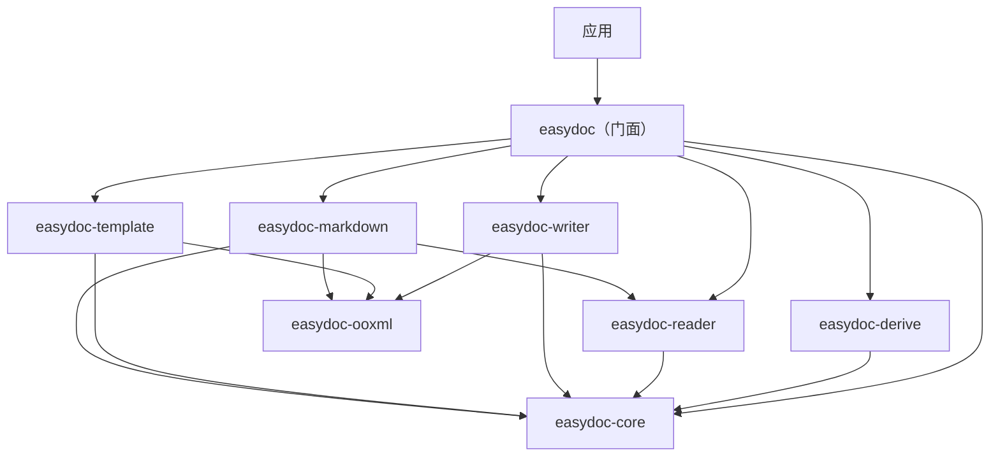

<a id="readme-top"></a>

<div align="center">

# easydoc

**Rust DOC/DOCX 文档操作库 -- 读取、写入、模板填充、Markdown 转换和 O(1) 内存的流式事件处理。**

[](https://crates.io/crates/easydoc)
[](https://docs.rs/easydoc)
[](#3-rust-基线与平台支持)
[](https://github.com/easy-4-rust/easydoc-rust/actions)
[](LICENSE)

[English](README.md) | [简体中文](README_zh.md)

[定位](#1-项目定位与状态) · [功能](#2-功能与成熟度) ·
[应该依赖哪个 crate](#3-应该依赖哪个-crate) · [快速开始](#5-快速开始) ·
[API](#6-easydoc-api-速查) · [Derive](#7-derive-宏) · [质量](#10-构建测试与质量门禁) ·
[上游兼容](#11-上游兼容) · [许可证](#13-许可证)

</div>

---

> **状态**：alpha 预发布（最新版见 [crates.io](https://crates.io/crates/easydoc)）
> **MSRV**：Rust `1.88`
> **Edition**：`2024`
> **Workspace Resolver**：`3`
> **成熟度**：Alpha（公共 API 可能变化）
> **最后核验**：2026-08-11

## 1. 项目定位与状态

### 1.1 是什么

**`easydoc` 是 `easydoc-rust` workspace 的聚合门面 crate -- 一个用于 DOC/DOCX 文档操作的 Rust 库。** 它提供唯一的 `EasyDoc` 静态工厂（18 个方法），将调用委托给 7 个领域子 crate。

| 维度 | 内容 |
|---|---|
| crate | `easydoc` |
| 状态 | Alpha 预发布（最新版见 crates.io） |
| MSRV / Edition | `1.88` / `2024` |
| 默认 features | 无（所有子 crate 为直接依赖） |
| `unsafe` 策略 | `forbid`（workspace 级别） |
| 发布状态 | [crates.io](https://crates.io/crates/easydoc) / [docs.rs](https://docs.rs/easydoc) |
| 许可证 | `Apache-2.0` |

### 1.2 不是什么

- 不是 DOCX 解析器本身 -- 解析委托给 `easydoc-reader`（基于 `office_oxide`）。
- 不是 DOCX 生成器本身 -- 生成委托给 `easydoc-writer`（基于 `docx-rs`）。
- 不是 Excel 库 -- XLSX 操作请使用 [`easyexcel-rust`](https://github.com/easy-4-rust/easyexcel-rust)。
- 不是 PDF 或 ODT 处理器 -- 仅支持 DOCX（完整）和 DOC（只读）。

### 1.3 状态证据

| 声明 | 当前值 | 证据 |
|---|---|---|
| Workspace 可构建 | 是 | `cargo check --workspace` |
| 测试 | 单元 + 集成 + 文档测试 | `cargo test --workspace` |
| MSRV | `1.88` | `Cargo.toml` 中 `rust-version` |
| `unsafe_code` | `forbid` | `[workspace.lints.rust]` |
| crates.io | 已发布 | [crates.io](https://crates.io/crates/easydoc) / [docs.rs](https://docs.rs/easydoc) |

## 2. 功能与成熟度

### 2.1 功能矩阵

| 功能 | 状态 | 委托 crate | 说明 |
|---|---|---|---|
| 文档写入（标题、段落、表格、图片） | 稳定 | `easydoc-writer` | 流式构建器 API |
| 从结构体写表格 | 稳定 | `easydoc-writer` + `easydoc-derive` | `#[derive(DocxRow)]` 一行代码 |
| 文档读取（文本、表格） | 稳定 | `easydoc-reader` | DOC/DOCX 自动检测 |
| SAX 流式读取（O(1) 内存） | 稳定 | `easydoc-reader` | `EventSink` trait |
| ViewMode 渲染（Plain/Annotated/Outline/Stats） | 稳定 | `easydoc-reader` | LLM 友好模式 |
| 语义模型读-改-写 | 稳定 | `easydoc-reader` + `easydoc-writer` | `DocumentContent` 往返 |
| 模板填充（`{key}`、`{.field}`） | 稳定 | `easydoc-template` | 标量 + 集合展开 |
| Markdown 转换 | 稳定 | `easydoc-markdown` | GFM 表格、图片、front matter |
| 编辑现有 DOCX | 稳定 | `easydoc-writer` | 文本替换 |
| 内存输出 | 稳定 | `easydoc-writer` | `*_to_bytes()` 变体 |
| 自定义类型转换器 | 稳定 | `easydoc-core` | `DocConverter<T>` trait |
| 写入生命周期钩子 | 稳定 | `easydoc-core` | `DocWriteHandler` trait |

### 2.2 状态定义

| 状态 | 定义 |
|---|---|
| 稳定 | 公共 API、测试和文档齐全；Alpha 阶段行为仍可能变化 |
| 预览 | 可用但 API 或行为可能变化 |
| 部分 | 仅明确列出的子集可用 |
| 计划 | 尚无可调用实现 |

### 2.3 格式支持矩阵

| 格式 | 读取 | 写入 | 编辑 | 模板 | Markdown | 说明 |
|---|:---:|:---:|:---:|:---:|:---:|---|
| DOCX (.docx) | 完整 | 完整 | 完整 | 完整 | 完整 | SAX 流式、语义模型、图片提取 |
| DOC (.doc) | 完整 | -- | -- | -- | 完整 | 通过 `office_oxide` 只读；自动检测 |

## 3. 应该依赖哪个 crate

`easydoc-rust` workspace 包含 9 个 crate。大多数用户应依赖 `easydoc`（本 crate）。

| 需求 | 推荐 crate | Features | 权衡 |
|---|---|---|---|
| 通用文档操作 | `easydoc` | 默认 | 最简单入口；拉取所有子 crate |
| 仅核心类型和 trait | `easydoc-core` | `serde`（可选） | 最小依赖；无 I/O |
| MCP 服务器供 LLM 代理使用 | `easydoc-mcp` | -- | 独立二进制 crate |
| 仅读取 | `easydoc-reader` | -- | 无写入/模板/markdown |
| 仅写入 | `easydoc-writer` | -- | 无读取/模板/markdown |
| 仅 Markdown 转换 | `easydoc-markdown` | -- | 无写入/模板 |
| 仅模板填充 | `easydoc-template` | -- | 无读取/写入/markdown |
| OOXML 底层操作 | `easydoc-ooxml` | -- | 内部使用；不推荐直接依赖 |
| 仅 Derive 宏 | `easydoc-derive` | -- | `#[derive(DocxRow)]` |

```toml
# 大多数用户：依赖门面
[dependencies]
easydoc = "0.1.0-alpha"

# 高级用法：仅依赖单个领域 crate
easydoc-core = "0.1.0-alpha"
```

## 4. Workspace 架构

```text
应用 / 下游 crate
        │ cargo add easydoc
        ▼
┌───────────────────────────────────────────────────────┐
│ easydoc-rust Cargo Workspace（9 个 crate）             │
│                                                       │
│ easydoc               门面 -- EasyDoc 静态工厂         │
│ easydoc-core          trait、数据模型、错误体系         │
│ easydoc-derive        #[derive(DocxRow)] 过程宏        │
│ easydoc-ooxml         安全 OOXML 重写、原子输出        │
│ easydoc-reader        DOC/DOCX 读取（office_oxide）    │
│ easydoc-writer        DOCX 创建（docx-rs）             │
│ easydoc-template      模板占位符填充                    │
│ easydoc-markdown      DOC/DOCX → Markdown              │
│ easydoc-mcp           MCP 服务器供 LLM 代理            │
└───────────────────────────────────────────────────────┘
        │
        ▼
[DOCX 文件 / DOC 文件 / 内存字节]
```



### 4.1 门面重导出表

| `easydoc` 模块 | 来源 crate | 关键类型 |
|---|---|---|
| `EasyDoc` | `easydoc` | 静态工厂（18 个方法） |
| `DocxRow`、`DocConverter`、`DocWriteHandler`、`EventSink` | `easydoc-core` | 扩展 trait |
| `DocumentContent`、`DocumentBlock`、`DocumentTextRun` | `easydoc-core` | 语义模型 |
| `DocValue`、`CellData`、`RowData`、`TableData` | `easydoc-core` | 数据类型 |
| `DocError`、`Result` | `easydoc-core` | 错误类型 |
| `#[derive(DocxRow)]` | `easydoc-derive` | Derive 宏 |
| `DocBuilder`、`Paragraph`、`Run`、`Table` | `easydoc-writer` | 写入构建器 |
| `DocReadBuilder`、`ViewMode`、`DocxSaxReader` | `easydoc-reader` | 读取构建器 |
| `MarkdownBuilder`、`MarkdownResult` | `easydoc-markdown` | Markdown 转换 |
| `TemplateFillBuilder`、`Placeholder` | `easydoc-template` | 模板填充 |
| `AtomicFile`、`PackageLimits` | `easydoc-ooxml` | OOXML 内部 |

## 5. 快速开始

### 5.1 安装

```toml
[dependencies]
easydoc = "0.1.0-alpha"
```

### 5.2 从结构体数据写表格

```rust
use easydoc::prelude::*;

#[derive(DocxRow)]
#[docx(banded_rows = true)]
struct User {
    #[docx(name = "姓名", order = 0, width = "30%")]
    name: String,
    #[docx(name = "年龄", order = 1, width = "15%")]
    age: u32,
    #[docx(name = "邮箱", order = 2, width = "55%")]
    email: String,
}

let users = vec![
    User { name: "张三".into(), age: 30, email: "zhangsan@example.com".into() },
    User { name: "李四".into(), age: 25, email: "lisi@example.com".into() },
];

EasyDoc::write_table("users.docx", &users)
    .title("用户报告")
    .banded_rows(true)
    .do_write()?;
# Ok::<(), easydoc::DocError>(())
```

### 5.3 读取文档（流式，O(1) 内存）

```rust
use easydoc::prelude::*;

// 快速文本提取
let text = EasyDoc::read_text("document.docx")?;

// 类型化表格提取
let tables: Vec<Vec<User>> = EasyDoc::read_tables::<User>("document.docx")?;

// SAX 事件流式 -- O(1) 内存
struct MySink;
impl EventSink for MySink {
    fn on_event(&mut self, event: &DocumentEvent) -> easydoc::Result<()> {
        match event {
            DocumentEvent::Heading { level, runs } => {
                let text: String = runs.iter().map(|r| r.text.as_str()).collect();
                println!("H{level}: {text}");
            }
            _ => {}
        }
        Ok(())
    }
}

EasyDoc::read_events("large.docx", &mut MySink)?;
# Ok::<(), easydoc::DocError>(())
```

### 5.4 转换为 Markdown

```rust
use easydoc::prelude::*;

// 快速转换
let markdown = EasyDoc::to_markdown("document.docx")?;

// 完整控制
let result = EasyDoc::markdown("document.docx")
    .image_directory("output/assets")
    .include_front_matter(true)
    .write_to("output/document.md")?;
# Ok::<(), easydoc::DocError>(())
```

### 5.5 构建完整文档

```rust
use easydoc::prelude::*;

EasyDoc::document("report.docx")
    .title("年度报告")
    .author("张三")
    .add_heading("第一章 概述", HeadingLevel::H1)
    .add_paragraph(
        Paragraph::new()
            .add_text("正文内容，包含")
            .add_run(Run::new("加粗").bold())
            .add_text("部分。")
    )
    .add_page_break()
    .build()?
    .save()?;
# Ok::<(), easydoc::DocError>(())
```

### 5.6 模板填充

```rust
use easydoc::EasyDoc;
use std::collections::HashMap;

let mut data = HashMap::new();
data.insert("name".into(), "张三".into());
data.insert("date".into(), "2026-08-11".into());

EasyDoc::fill_template("template.docx", "output.docx", &data)?;
# Ok::<(), easydoc::DocError>(())
```

### 5.7 语义模型往返

```rust
use easydoc::EasyDoc;

// 读取 -> 修改 -> 写入
let mut content = EasyDoc::load("input.docx")?;
// ... 修改 content.blocks ...
EasyDoc::write_content(&content, "output.docx")?;

// 内存中
let bytes = EasyDoc::write_content_to_bytes(&content)?;
# Ok::<(), easydoc::DocError>(())
```

## 6. EasyDoc API 速查

### 6.1 写入 API

| 方法 | 返回值 | 说明 |
|---|---|---|
| `EasyDoc::document(path)` | `DocBuilder` | 构建完整文档（标题、段落、表格、图片） |
| `EasyDoc::write_table(path, &data)` | `TableWriteBuilder` | 将 `Vec<Struct>` 写为 DOCX 表格（`T: DocxRow`） |
| `EasyDoc::document_to_bytes(f)` | `Result<Vec<u8>>` | 将文档构建到内存字节 |
| `EasyDoc::write_table_to_bytes(data)` | `Result<Vec<u8>>` | 将表格写到内存字节 |
| `EasyDoc::edit(path)` | `Result<DocEditor>` | 打开现有 DOCX 进行文本替换 |
| `EasyDoc::fill_template(tpl, out, &data)` | `Result<()>` | 填充标量 `{key}` 占位符 |
| `EasyDoc::fill_template_list(tpl, out, &[T], field)` | `Result<()>` | 填充集合 `{.field}` 占位符 |

### 6.2 读取 API

| 方法 | 返回值 | 说明 |
|---|---|---|
| `EasyDoc::read(path)` | `DocReadBuilder` | 流式读取构建器 |
| `EasyDoc::read_text(path)` | `Result<String>` | 快速纯文本提取 |
| `EasyDoc::read_tables::<T>(path)` | `Result<Vec<Vec<T>>>` | 类型化表格提取（`T: DocxRow`） |
| `EasyDoc::read_events(path, &mut sink)` | `Result<()>` | SAX 事件流式（O(1) 内存） |
| `EasyDoc::view_as(path, &ViewMode)` | `Result<String>` | 多模式视图渲染 |

### 6.3 Markdown API

| 方法 | 返回值 | 说明 |
|---|---|---|
| `EasyDoc::markdown(path)` | `MarkdownBuilder` | Markdown 转换构建器 |
| `EasyDoc::to_markdown(path)` | `Result<String>` | 快速 Markdown 转换 |
| `EasyDoc::write_markdown(src, out)` | `Result<MarkdownResult>` | 转换并写入文件 |

### 6.4 语义模型 API

| 方法 | 返回值 | 说明 |
|---|---|---|
| `EasyDoc::load(path)` | `Result<DocumentContent>` | 读取为语义文档模型 |
| `EasyDoc::write_content(content, path)` | `Result<()>` | 将语义模型写入文件 |
| `EasyDoc::write_content_to_bytes(content)` | `Result<Vec<u8>>` | 将语义模型写入内存 |

### 6.5 ViewMode（4 种模式）

| 模式 | 构造器 | 输出示例 |
|---|---|---|
| **Plain** | `ViewMode::Plain` | `Hello world\n下一段` |
| **Annotated** | `ViewMode::Annotated` | `[Heading1] 标题\n[Paragraph 1] 你好\n[Table 1: 3x4]` |
| **Outline** | `ViewMode::Outline { max_level: 3 }` | `# H1 标题\n## H2 副标题` |
| **Stats** | `ViewMode::Stats` | `Paragraphs: 12\nTables: 3\nWords: 1500` |

## 7. Derive 宏

`#[derive(DocxRow)]` 自动生成 `schema()`、`from_row()`、`to_row()` 及其转换器感知变体。

### 7.1 结构体级属性

| 属性 | 类型 | 示例 | 效果 |
|---|---|---|---|
| `banded_rows` | bool | `#[docx(banded_rows = true)]` | 斑马条纹 |
| `table_width` / `auto_width` | bool | `#[docx(table_width = Auto)]` | 自动适应表格宽度 |

### 7.2 字段级属性

| 属性 | 类型 | 示例 | 效果 |
|---|---|---|---|
| `name` | string | `#[docx(name = "姓名")]` | 列标题文本 |
| `index` | usize | `#[docx(index = 0)]` | 从零开始的列索引 |
| `order` | u32 | `#[docx(order = 1)]` | 列排序顺序（值越小越靠左） |
| `width` | string | `#[docx(width = "2cm")]` | 列宽：`"2cm"`、`"80px"`、`"50%"`、`"auto"` |
| `format` | string | `#[docx(format = "#,##0.00")]` | 数字/日期格式字符串 |
| `align` | string | `#[docx(align = "right")]` | `"left"`、`"center"`、`"right"`、`"both"` |
| `wrap` | bool | `#[docx(wrap = true)]` | 单元格内文本换行 |
| `converter` | type path | `#[docx(converter = MyConverter)]` | 自定义 `DocConverter<T>` |
| `ignore` | flag | `#[docx(ignore)]` | 读写时跳过此字段 |

### 7.3 注解到 OOXML 的映射

| 注解 | OOXML 输出 |
|---|---|
| `width="2cm"` | `<w:tcW w:w="..." w:type="dxa"/>` |
| `format="#,##0.00"` | `<w:numFmt w:val="..."/>` |
| `align="right"` | `<w:jc w:val="right"/>` |
| `wrap=false` | `<w:noWrap/>` |

## 8. 错误模型

所有操作返回 `easydoc::Result<T>`（`Result<T, DocError>` 的别名）。

| 变体 | 场景 | 是否重试 | 来源 |
|---|---|:---:|---|
| `DocError::Io` | 文件或网络 I/O | 视情况 | `std::io::Error` |
| `DocError::Zip` | ZIP 归档损坏 | 否 | `zip::ZipError` |
| `DocError::Format` | 无效或不支持的格式 | 否 | -- |
| `DocError::Template` | 占位符解析/处理错误 | 否 | -- |
| `DocError::Conversion` | 单元格/字段值转换失败 | 否 | -- |
| `DocError::Unsupported` | 格式不支持的操作 | 否 | -- |
| `DocError::Document` | 通用文档级错误 | 否 | -- |

## 9. 安全与资源限制

| 限制 | 默认值 |
|---|---|
| 最大 ZIP 条目数 | 10,000 |
| 单条目最大大小 | 256 MB |
| 最大总展开大小 | 1 GB |
| 最大压缩比 | 1,000:1 |
| 输出策略 | 原子（临时文件 + 持久化） |
| `unsafe_code` | `forbid`（workspace 级别） |

## 10. 构建、测试与质量门禁

### 10.1 基础门禁

```bash
cargo fmt --all -- --check
cargo clippy --workspace --all-targets --all-features -- -D warnings
cargo test --workspace
cargo doc --workspace --all-features --no-deps
```

### 10.2 测试矩阵

| 类型 | 目的 | 命令 |
|---|---|---|
| 单元测试 | 核心逻辑 | `cargo test` |
| 文档测试 | API 示例 | `cargo test --doc` |
| 集成测试 | 跨 crate 协作 | `cargo test --workspace` |
| Clippy | lint 门禁 | `cargo clippy -- -D warnings` |

## 11. 上游兼容

`easydoc-rust` 是 [`easyexcel-rust`](https://github.com/easy-4-rust/easyexcel-rust) 的 DOC/DOCX 对应物，共享相同架构：流式构建器 + derive 宏 + 转换器注册表。

### 11.1 兼容目标

| 维度 | 内容 |
|---|---|
| 上游项目 | Java [EasyExcel](https://github.com/alibaba/easyexcel) / Hutool |
| 权威版本 | EasyExcel 4.0.3 |
| Rust 目标 | 惯用 API 映射（非 ABI 或字节码兼容） |
| 非目标 | JVM 反射、动态代理、平台 GUI |

### 11.2 对象与方法映射

| Java EasyExcel | Rust easydoc | 状态 |
|---|---|---|
| `EasyExcel` 工厂 | `EasyDoc` 静态工厂 | 稳定 |
| `ExcelReader` / `ReadListener<T>` | `DocReadBuilder` / `EventSink` / `DocReadListener<T>` | 稳定 |
| `ExcelWriter` / `WriteHandler` | `DocBuilder` / `DocWriteHandler` | 稳定 |
| `@ExcelProperty` 注解 | `#[docx(...)]` derive 属性 | 稳定 |
| `Converter<T>` 接口 | `DocConverter<T>` trait + `ConverterRegistry` | 稳定 |
| `ExcelDataConvertException` | `DocError::Conversion` | 稳定 |
| `ByteArrayOutputStream` | `document_to_bytes()` / `write_table_to_bytes()` | 稳定 |
| `fill()` 模板 | `EasyDoc::fill_template()` | 稳定 |

### 11.3 语言语义映射

| Java 机制 | Rust 设计 | 原因 |
|---|---|---|
| 异常 | `Result<T, DocError>` | 显式错误传播 |
| `null` | `Option<T>` | 空值安全 |
| 注解 | `#[derive(DocxRow)]` + 属性 | 编译期元数据 |
| 反射 | trait + `ConverterRegistry` | 无运行时反射 |
| 继承 | trait + 组合 | 显式能力边界 |

## 12. 相关项目

- [`easyexcel-rust`](https://github.com/easy-4-rust/easyexcel-rust) -- Excel 对应物（相同架构）
- Java: [easy4j-easydoc](https://github.com/easy-4-rust/easy4j-easydoc)（Apache POI + docx4j 基线）

## 13. 许可证

Apache-2.0 -- 详见 [LICENSE](../../LICENSE)。

---

<div align="center">

[返回顶部](#readme-top) · [docs.rs](https://docs.rs/easydoc) · [crates.io](https://crates.io/crates/easydoc) · [Issues](https://github.com/easy-4-rust/easydoc-rust/issues)

</div>
