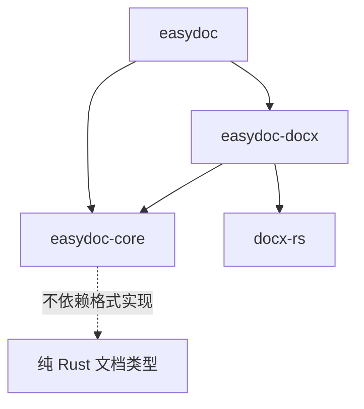
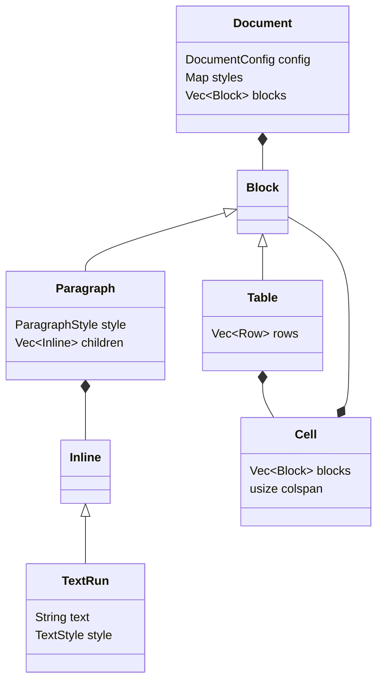
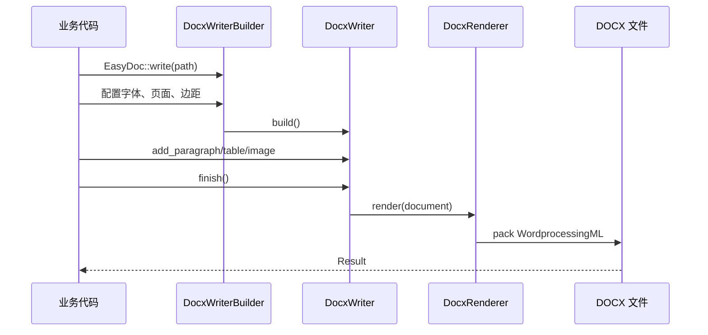

# easydoc-rs 技术架构

## 设计来源

Hutool `Word07Writer` 提供了非常短的业务调用链：创建 Writer、追加文本/表格/图片、
最后刷新或关闭。EasyExcel 则把 Builder、元数据、上下文、转换和输出生命周期分离。
`easydoc-rs` 组合两者的优势，但不复制 Apache POI 类型，也不把 Excel 的 Sheet/Row
流模型套到 DOCX。

## 总体结构

依赖方向始终由门面指向模型和后端：

## 文档模型

段落样式与文字样式分离，因为 WordprocessingML 中 `w:pPr` 和 `w:rPr` 是不同层级。
单元格保存块级内容而不是裸字符串，以便自然扩展到多段落、嵌套表格和图片。

## 样式解析

样式采用三级覆盖，越靠后优先级越高：

中文字体不会只设置 ASCII 字体。`FontFamily::all("宋体")` 会同时写入 ASCII、East
Asia、High ANSI 和 Complex Script 四个槽位。

## Writer 生命周期

`Drop` 仅释放内存，不写文件。所有打包和 I/O 错误都由 `finish()` 返回。

## 后续扩展边界

- `WriteHandler` 只操作 `easydoc-core` 模型，普通扩展不接触 `docx-rs`。
- 模板引擎直接变换 DOCX ZIP 中的相关 XML，保留未知部件、关系、媒体和样式。
- 读取已有文档只承诺映射本项目支持的结构；“无损编辑”需要独立的包级变换能力。
- 当第二种文档后端真正复用同一抽象时，再考虑提取通用 backend trait。
