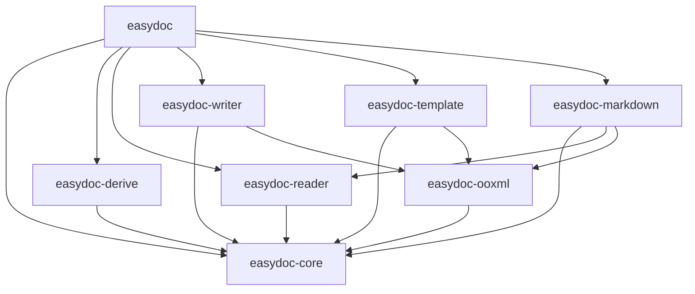
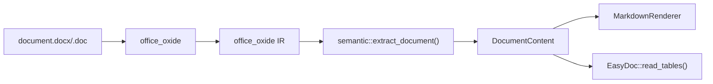
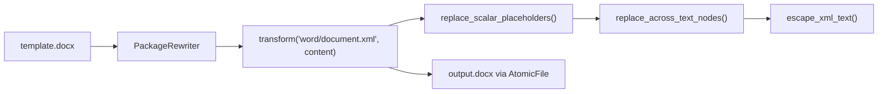
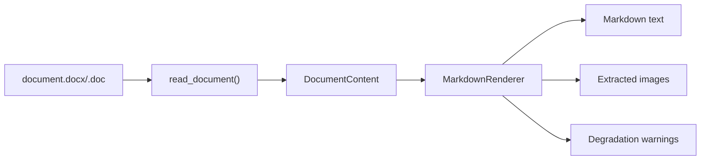

# easydoc-rust Architecture Design Document

> **Purpose**: Define easydoc-rust's architecture goals, boundaries, component responsibilities, data flows, security constraints, and evolution roadmap — providing a single verifiable architecture contract for design, development, testing, and release.
>
> **Architecture Version**: 0.1.0
> **Document Status**: Draft
> **Last Updated**: 2026-08-10
> **Fact-verification Date**: 2026-08-10

---

## 1. Document Control

### 1.1 Document Info

| Field | Content |
|---|---|
| System/Project | easydoc-rust |
| Architecture Version | 0.1.0 |
| Applicable Code Version | Current HEAD (no tag yet) |
| Deployment Form | Local library |
| License | Apache-2.0 |
| MSRV | 1.88 |
| Edition | 2024 |
| Resolver | 3 |

### 1.2 Reader Guide

| Reader | Priority Sections | Expected Outcome |
|---|---|---|
| Users | 2, 5, 7, 10 | Quick start, API entry, format support, examples |
| Developers | 3, 4, 6, 8, 9 | Module boundaries, dependency direction, core model, design constraints |
| Security | 4, 8 | ZIP/OOXML limits, atomic output, failure safety |
| Architecture Review | All | Target vs current gap, evolution roadmap |

### 1.3 Implementation Status Labels

| Label | Definition | Required Evidence |
|---|---|---|
| `[Implemented]` | Current code exists, verifiable via tests | Source code, tests |
| `[Partially Implemented]` | Skeleton or partial loop exists | Completed vs missing list |
| `[Design Goal]` | Target architecture, not yet landed | ADR, plan |
| `[Not a Goal]` | Explicitly not in scope | Alternative or ownership |

---

## 2. Executive Summary

### 2.1 One-line Architecture

**easydoc-rust is a Rust DOC/DOCX document operations library that unifies document read/write, template fill, and Markdown conversion into a single type-safe API through `EasyDoc` static factory + fluent builder + trait extensions.**

### 2.2 Core Architecture Decisions

| # | Decision | Status | Evidence |
|---|---|---|---|
| 1 | `easydoc-core` is the sole semantic model | `[Implemented]` | `document/` module established; old `model.rs` still coexists |
| 2 | `easydoc-ooxml` is the sole DOCX package layer | `[Partially Implemented]` | atomic rewrite + limits done; XML namespace/validation not done |
| 3 | `easydoc-markdown` is a Renderer, not a second Parser | `[Implemented]` | Consumes `DocumentContent`, does not parse ZIP directly |

### 2.3 Core Conclusions

| Dimension | Architecture Conclusion | Status |
|---|---|---|
| Workspace structure | 8 core crates | `[Implemented]` |
| Unified semantic model | `DocumentContent` → blocks | `[Partially Implemented]` |
| Backend-agnostic read | `reader::read_document()` → `DocumentContent` | `[Partially Implemented]` |
| Writer uses core model | `content_renderer` converts `DocumentContent` to DOCX | `[Implemented]` |
| Cross-run placeholders | `replace_across_text_nodes()` | `[Implemented]` |
| XML escaping | `escape_xml_text()` | `[Implemented]` |
| Atomic output | `AtomicFile` + temp + persist | `[Implemented]` |
| Markdown conversion | headings/lists/tables/images/notes/code | `[Implemented]` |
| Integrations (CLI/MCP/Web) | Deferred | `[Design Goal]` |

---

## 3. Workspace & Crate Architecture

### 3.1 Current Workspace Structure

```
easydoc-rust/
├── Cargo.toml                        workspace manifest
├── crates/
│   ├── easydoc/                      facade — EasyDoc static factory
│   ├── easydoc-core/                 backend-agnostic model, traits, errors, styles
│   ├── easydoc-derive/               #[derive(DocxRow)] proc-macro
│   ├── easydoc-ooxml/                safe package rewrite, resource limits, atomic output
│   ├── easydoc-reader/               DOC/DOCX reading via office_oxide
│   ├── easydoc-writer/               DOCX creation via docx-rs
│   ├── easydoc-template/             template placeholder fill
│   └── easydoc-markdown/             DOC/DOCX → Markdown conversion
├── docs/
│   ├── easydoc-rust-Architecture.md           this file (English)
│   ├── easydoc-rust-Architecture.zh_CN.md     Chinese version
│   ├── usage-guide.md                usage guide
│   └── roadmap.md                    roadmap
├── README.md
└── README_zh.md
```

### 3.2 Responsibility Matrix

| Crate | External Deps | Depends On | Role |
|---|---|---|---|
| **easydoc** | serde | all sub-crates | User entry + re-exports |
| **easydoc-core** | thiserror, chrono | — | Shared types, traits, errors |
| **easydoc-derive** | syn, quote | — | Proc-macro |
| **easydoc-ooxml** | zip, tempfile | easydoc-core | Safe ZIP rewrite + atomic write |
| **easydoc-writer** | docx-rs | easydoc-core, easydoc-ooxml | DOCX creation |
| **easydoc-reader** | office_oxide | easydoc-core | DOC/DOCX reading |
| **easydoc-template** | serde, serde_json | easydoc-core, easydoc-ooxml | Template placeholder fill |
| **easydoc-markdown** | — | easydoc-core, easydoc-ooxml, easydoc-reader | Markdown conversion |

### 3.3 Dependency Direction



---

## 4. Security & Resource Constraints `[Implemented]`

### 4.1 OOXML Resource Limits

`easydoc-ooxml::PackageLimits` defines the following defaults:

| Limit | Default |
|---|---|
| Max ZIP entries | 10,000 |
| Max single entry decompressed size | 256 MB |
| Max total decompressed size | 1 GB |
| Max compression ratio | 1,000:1 |

Verification: `easydoc-ooxml/tests/package_rewriter_test.rs` → `rejects_packages_over_entry_limit`.

### 4.2 Atomic Output

All write operations go through `AtomicFile`:

1. Create temporary file in target directory
2. Write complete content
3. `flush()` + `sync_all()`
4. `persist()` atomic replacement of target file

On failure, the original target file remains unchanged. Verification: `keeps_existing_target_when_transform_fails` test.

### 4.3 Binary Fidelity

`PackageRewriter` preserves unmodified ZIP entries byte-for-byte (images, styles, relationships, etc.). Verification: `preserves_binary_entries_byte_for_byte` test.

---

## 5. Core Data Flows

### 5.1 Write Flow `[Implemented]`


Key path:
- `DocBuilder` collects heading/paragraph/table/image/pagebreak
- `DocWriteExecutor` converts to `docx_rs::Docx`
- `docx.build().pack()` generates OOXML
- `AtomicFile` writes to disk

### 5.2 Read Flow `[Partially Implemented]`



Current state:
- `read_text()` / `read_tables()` use `office_oxide` IR directly
- `read_document()` converts to `DocumentContent` (backend-agnostic semantic model)
- `EasyDoc::to_markdown()` consumes `DocumentContent`

### 5.3 Template Fill Flow `[Implemented]`



Key capabilities:
- Cross `<w:r>/<w:t>` placeholder identification and replacement
- XML special character escaping
- Binary ZIP entries preserved byte-for-byte
- Atomic output

### 5.4 Markdown Conversion Flow `[Implemented]`



---

## 6. easydoc-core Model Design

### 6.1 Current Semantic Model `[Partially Implemented]`

```text
easydoc-core/src/
├── lib.rs
├── error.rs                    DocError (7 variants) + Result<T>
├── types.rs                    DocValue, CellData, RowData, HeadingLevel, etc.
├── traits.rs                   DocxRow, DocConverter, DocReadListener, DocWriteHandler
├── converter/                  ConverterRegistry
├── style/                      Color, FontConfig, ParagraphStyle, TableStyle
├── metadata/                   TableColumn, DocumentMeta
├── model.rs                    (legacy model, pending integration)
└── document/                   [new] backend-agnostic semantic model
    ├── document_content.rs     DocumentContent { metadata, blocks }
    ├── document_block.rs       DocumentBlock enum (Heading/Paragraph/Table/List/Image/...)
    ├── document_text_run.rs    DocumentTextRun { text, bold, italic, strikethrough, hyperlink }
    ├── document_table.rs       DocumentTable { rows }
    ├── document_table_row.rs   DocumentTableRow { cells, is_header }
    ├── document_table_cell.rs  DocumentTableCell { blocks, column_span, row_span }
    ├── document_list.rs        DocumentList { ordered, start_number, items }
    ├── document_list_item.rs   DocumentListItem { blocks, nested }
    └── document_image.rs       DocumentImage { alt_text, data, extension }
```

### 6.2 Model Coverage vs Plan

| Planned model/ | Status | Notes |
|---|---|---|
| `section.rs` | `[Design Goal]` | Section breaks, page layout |
| `heading.rs` | `[Implemented]` | `DocumentBlock::Heading { level, runs }` |
| `paragraph.rs` | `[Implemented]` | `DocumentBlock::Paragraph(runs)` |
| `table.rs` | `[Implemented]` | `DocumentTable` / `DocumentTableRow` / `DocumentTableCell` |
| `list.rs` | `[Implemented]` | `DocumentList` / `DocumentListItem` |
| `image.rs` | `[Implemented]` | `DocumentImage` |
| `text_run.rs` | `[Implemented]` | `DocumentTextRun` |
| `hyperlink.rs` | `[Partially Implemented]` | As `DocumentTextRun.hyperlink` field |
| `equation.rs` | `[Design Goal]` | OMML equations |
| `footnote.rs` | `[Implemented]` | `DocumentBlock::Footnote { id, blocks }` |
| `comment.rs` | `[Design Goal]` | Comments |
| `revision.rs` | `[Design Goal]` | Revision tracking |

### 6.3 Event Model Gap vs Plan

| Planned event/ | Status | Notes |
|---|---|---|
| `DocumentEvent` | `[Design Goal]` | Event-driven document consumption |
| `EventSink` | `[Design Goal]` | Streaming read interface |
| `DocumentReader` trait | `[Design Goal]` | Unified read entry |
| `DocumentRenderer` trait | `[Design Goal]` | Unified render entry |
| `AssetSink` trait | `[Design Goal]` | Resource extraction interface |

---

## 7. easydoc-ooxml Design `[Partially Implemented]`

### 7.1 Current Implementation

```text
easydoc-ooxml/src/
├── lib.rs
├── atomic_file.rs              AtomicFile — temp file + atomic replace
├── package_limits.rs           PackageLimits — ZIP resource limits
└── package_rewriter.rs         PackageRewriter — safe ZIP rewrite
```

### 7.2 Gap vs Plan

| Planned Submodule | Status | Notes |
|---|---|---|
| `package/` (reader, writer, part, relationship, content_types) | `[Design Goal]` | Package-level abstractions |
| `xml/` (namespaces, stream_reader, stream_writer, xml_escape) | `[Design Goal]` | XML namespace and streaming |
| `security/` (package_guard, compression_guard) | `[Implemented]` | `PackageLimits` + `PackageRewriter` |
| `validation/` | `[Design Goal]` | Package validation |
| `repair/` | `[Design Goal]` | Corruption repair |
| `raw/` (element model) | `[Design Goal]` | Raw OOXML element model |

---

## 8. easydoc-template Design `[Implemented]`

### 8.1 Current Implementation

```text
easydoc-template/src/
├── lib.rs                      fill_template(), fill_template_list()
├── placeholder.rs              Placeholder detection ({key}, {.field}, {prefix.field})
├── fill_executor.rs            PackageRewriter-based fill + cross-run placeholders + XML escape
└── fill_config.rs              FillConfig (direction, force_new_row, auto_style)
```

### 8.2 Implemented Capabilities

| Capability | Status | Test Evidence |
|---|---|---|
| `{key}` scalar replacement | `[Implemented]` | `test_template_scalar_fill` |
| `{.field}` list expansion | `[Implemented]` | `test_template_list_fill_basic` |
| Cross `<w:r>/<w:t>` placeholders | `[Implemented]` | `binary_fidelity_test` (split runs) |
| XML special character escaping | `[Implemented]` | `binary_fidelity_test` (`A&B <team>`) |
| Binary ZIP entry fidelity | `[Implemented]` | `binary_fidelity_test` (image bytes) |
| Atomic output | `[Implemented]` | `keeps_existing_target_when_transform_fails` |
| `{prefix.field}` named collection | `[Implemented]` | `test_named_collection_placeholder` |
| Conditional engine / image engine / AST | `[Design Goal]` | — |

---

## 9. easydoc-writer Design

### 9.1 Current Implementation `[Implemented]`

```text
easydoc-writer/src/
├── lib.rs                      Paragraph, Run, Table, DocImage
├── builder/doc_builder.rs      DocBuilder (fluent API)
├── builder/table_builder.rs    TableWriteBuilder<T: DocxRow>
├── doc_editor.rs               DocEditor (in-place editing)
├── executor/write_executor.rs  DocWriteExecutor (→ docx-rs)
├── executor/table_executor.rs  TableWriteExecutor<T>
├── handler/mod.rs              DocWriteHandler trait
└── style/                      AutoWidthStrategy, BandedRowsStrategy
```

### 9.2 Key Design Points

- H1–H6 headings written with `Heading{N}` style + outline level
- `AtomicFile` atomic write
- `docx-rs` as backend

### 9.3 Gap vs Plan

| Planned | Status | Notes |
|---|---|---|
| Writer uses `easydoc-core::model::*` | `[Design Goal]` | Writer has own Paragraph/Table/Run |
| `DocxRenderer` abstraction | `[Design Goal]` | Direct docx-rs calls |
| `editor/` (document_editor, text_editor, node_editor) | `[Partially Implemented]` | Only `DocEditor` exists |

---

## 10. easydoc-reader Design

### 10.1 Current Implementation `[Partially Implemented]`

```text
easydoc-reader/src/
├── lib.rs                      read_text(), read_tables<T>(), read_document(), detect_format()
├── builder/read_builder.rs     DocReadBuilder
├── extractor/
│   ├── mod.rs                  DocumentFormat enum, detect_format()
│   ├── text.rs                 extract_text() via office_oxide
│   ├── table.rs                extract_tables<T>() via office_oxide IR
│   └── semantic.rs             [new] extract_document() → DocumentContent
└── listener/collect.rs         CollectListener<T>
```

### 10.2 Key Capabilities

| Capability | Status | Notes |
|---|---|---|
| Plain text extraction | `[Implemented]` | `office_oxide::Document::plain_text()` |
| Table extraction + deserialization | `[Implemented]` | `DocxRow` trait |
| Semantic document extraction | `[Implemented]` | `read_document()` → `DocumentContent` |
| Format auto-detection | `[Implemented]` | ZIP magic (DOCX) / OLE2 magic (DOC) |
| `DocumentReader` trait | `[Design Goal]` | Unified read abstraction |
| Event stream reading | `[Design Goal]` | `read_events(sink)` |

---

## 11. easydoc-markdown Design `[Implemented]`

### 11.1 Current Implementation

```text
easydoc-markdown/src/
├── lib.rs                      render_document()
├── markdown_builder.rs         MarkdownBuilder (fluent API)
├── markdown_options.rs         MarkdownOptions { image_directory, ... }
├── markdown_renderer.rs        MarkdownRenderer — consumes DocumentContent
├── markdown_result.rs          MarkdownResult { markdown, assets, warnings }
├── conversion_warning.rs       ConversionWarning
└── extracted_asset.rs          ExtractedAsset
```

### 11.2 Implemented Capabilities

| Markdown Element | Status | Notes |
|---|---|---|
| Headings H1–H6 | `[Implemented]` | `## **text**` format |
| Bold/italic/strikethrough | `[Implemented]` | `**bold**` / `*italic*` / `~~strike~~` |
| Hyperlinks | `[Implemented]` | `[text](url)` |
| GFM tables | `[Implemented]` | Auto column width, pipe escaping |
| Merged cells | `[Implemented]` | Falls back to HTML `<table>` + warning |
| Ordered/unordered lists | `[Implemented]` | Nested, with start number |
| Image extraction | `[Implemented]` | Configurable output dir and reference prefix |
| Code blocks | `[Implemented]` | ` ```language ``` ` |
| Footnotes/endnotes | `[Implemented]` | `[^id]: text` |
| Thematic/page/column breaks | `[Implemented]` | `---` / `<!-- page-break -->` |
| YAML front matter | `[Implemented]` | Optional title/author/subject/keywords |
| Atomic file output | `[Implemented]` | `write_to()` via `AtomicFile` |
| Equations (OMML/LaTeX) | `[Design Goal]` | `office_oxide` IR does not expose OMML |
| Table mode selection | `[Design Goal]` | Currently auto-selects |
| Source map (Markdown ↔ source position) | `[Design Goal]` | — |
| OCR/LLM image description | `[Design Goal]` | — |

---

## 12. easydoc Facade Design `[Implemented]`

### 12.1 Current API

```rust
// Write
EasyDoc::document("out.docx").add_heading(...).add_paragraph(...).save()?;
EasyDoc::write_table("out.docx", &users).do_write()?;

// Read
let text = EasyDoc::read_text("doc.docx")?;
let tables: Vec<Vec<User>> = EasyDoc::read_tables::<User>("doc.docx")?;

// Read-Modify-Write semantic model round-trip
let mut content = EasyDoc::load("input.docx")?;
// ... modify content.blocks ...
EasyDoc::write_content(&content, "output.docx")?;

// Template
EasyDoc::fill_template("tpl.docx", "out.docx", &data)?;
EasyDoc::fill_template_list("tpl.docx", "out.docx", &items, "items")?;

// Edit
EasyDoc::edit("doc.docx")?.replace_text("old", "new").save_as("new.docx")?;

// Markdown
let md = EasyDoc::to_markdown("doc.docx")?;
EasyDoc::markdown("doc.docx").image_directory("assets").write_to("out.md")?;
```

### 12.2 Unified Syntax Gap vs Plan

| Planned API | Status |
|---|---|
| `EasyDoc::write("out.docx").heading(...).paragraph(...).do_write()` | `[Design Goal]` |
| `EasyDoc::read("in.docx", listener).do_read()` | `[Design Goal]` |
| `EasyDoc::read_sync::<User>("in.docx").table(0).do_read()` | `[Design Goal]` |
| `EasyDoc::fill("tpl.docx").output("out.docx").data(&data).do_fill()` | `[Design Goal]` |
| `EasyDoc::edit("in.docx").replace_text(...).atomic(true).save()` | `[Implemented]` |

---

## 13. Backend Dependencies

| Function | Crate | Version | License |
|---|---|---|---|
| DOCX write | `docx-rs` | 0.4 | MIT |
| DOCX/DOC read | `office_oxide` | 0.1 | MIT |
| ZIP operations | `zip` | 8.6 | MIT |
| Error types | `thiserror` | 2.0 | MIT/Apache-2.0 |
| Time | `chrono` | 0.4 | MIT/Apache-2.0 |
| Serialization | `serde` + `serde_json` | 1.0 | MIT/Apache-2.0 |
| Temp files | `tempfile` | 3.27 | MIT/Apache-2.0 |

---

## 14. Testing & Verification

### 14.1 Current Test Matrix

| Test | Input | Assertion | Test File |
|---|---|---|---|
| Table write | `Vec<User>` | Valid DOCX ZIP | `writer_test.rs` |
| Document write | heading + paragraph + table | Write succeeds | `writer_test.rs` |
| Round-trip read/write | write → read_text | Content matches | `writer_test.rs` |
| Table round-trip | write_table → read_tables | Data matches | `writer_test.rs` |
| Template scalar fill | `{key}` placeholder | Replacement works | `writer_test.rs` |
| Template list fill | `{.field}` placeholder | Row expansion works | `writer_test.rs` |
| Binary fidelity | Template with images | Image bytes unchanged | `binary_fidelity_test.rs` |
| XML escaping | `A&B <team>` | Correct escaping | `binary_fidelity_test.rs` |
| Cross-run placeholders | Split across two `<w:t>` | Replacement works | `binary_fidelity_test.rs` |
| OOXML binary fidelity | Package with non-XML entries | Bytes unchanged | `package_rewriter_test.rs` |
| OOXML failure safety | Transform returns error | Original target unchanged | `package_rewriter_test.rs` |
| OOXML resource limits | Entry count exceeds limit | Returns Format error | `package_rewriter_test.rs` |
| Markdown semantic render | DocumentContent | GFM tables/lists/images | `markdown_conversion_test.rs` |
| Markdown end-to-end | Generate DOCX → Markdown | Content correct | `markdown_conversion_test.rs` |
| Format detection | DOCX/DOC magic bytes | Correct identification | `writer_test.rs` |

### 14.2 Verification Commands

```bash
cargo fmt --all -- --check
cargo clippy --workspace --all-targets -- -D warnings
cargo test --workspace
RUSTDOCFLAGS="-D warnings" cargo doc --workspace --no-deps
```

### 14.3 Current Pass Status (2026-08-09)

- 175+ tests pass, 0 failures, 8 ignored
- `cargo clippy` 0 warnings
- `cargo doc` 0 warnings
- `cargo fmt` no diff
- 行覆盖率 73%+, 函数覆盖率 79%+

---

## 15. Evolution Roadmap

### Phase 1 — Infrastructure ✅ Done

- [x] 8-crate workspace structure
- [x] `easydoc-ooxml` base (AtomicFile + PackageLimits + PackageRewriter)
- [x] Template XML escaping + cross-run placeholders
- [x] Atomic output

### Phase 2 — Semantic Model 🔧 In Progress

- [x] `DocumentContent` / `DocumentBlock` semantic model
- [x] `read_document()` reader → `DocumentContent`
- [x] `easydoc-markdown` consumes `DocumentContent`
- [ ] Integrate/deprecate old `model.rs`
- [x] Writer uses `easydoc-core` semantic model (via `content_renderer`)
- [ ] Extend `DocumentBlock`: Section, Equation, Comment, Revision

### Phase 3 — Event Chain `[Partially Implemented]`

- [ ] `DocumentEvent` enum
- [ ] `DocumentEventSink` trait
- [x] `DocWriteHandler` callback integration (`render_with_handler`)
- [ ] `DocumentReader` trait (`read_model()` + `read_events()`)
- [x] Writer refactored to use `content_renderer` + core model

### Phase 4 — Advanced Capabilities `[Design Goal]`

- [ ] Equations (OMML → LaTeX)
- [ ] Comments
- [ ] Revision tracking
- [ ] Conditional template engine
- [ ] Image template engine
- [ ] Markdown source map

### Phase 5 — Ecosystem `[Design Goal]`

- [ ] `easydoc-cli` command-line tool
- [ ] `easydoc-mcp` MCP integration
- [ ] `easydoc-web` web response adapter
- [ ] Benchmarks, golden tests, fuzz tests
- [ ] `tests/fixtures/` real document collection

---

**Document Version**: V1.0.0
**Created**: 2026-08-09
**Last Updated**: 2026-08-09
**Document Status**: ✅ Draft
