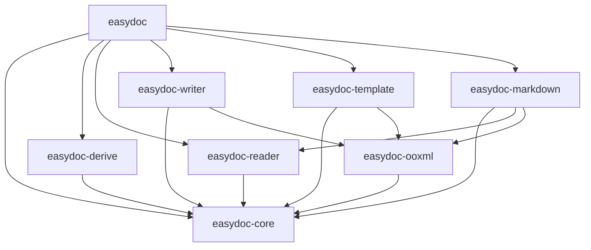
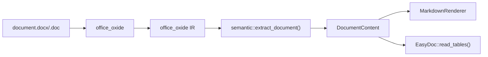
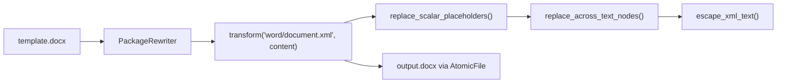
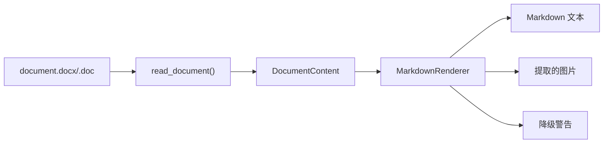

# easydoc-rust 架构设计文档

> **文档目的**：定义 easydoc-rust 的架构目标、边界、组件职责、运行主链、数据流、安全约束及演进路线，使设计、开发、测试和发布使用同一套可验证的架构合同。
>
> **架构版本**：0.1.0
> **文档状态**：草案
> **最后更新**：2026-08-09
> **事实核验日期**：2026-08-09

---

## 1. 文档控制与阅读指南

### 1.1 文档信息

| 字段 | 内容 |
|---|---|
| 系统/项目 | easydoc-rust |
| 架构版本 | 0.1.0 |
| 适用代码版本 | 当前 HEAD（未打 tag） |
| 适用部署形态 | 本地库 |
| 许可证 | Apache-2.0 |
| MSRV | 1.88 |
| Edition | 2024 |
| Resolver | 3 |

### 1.2 读者与阅读路径

| 读者 | 优先章节 | 期望获得 |
|---|---|---|
| 使用者 | 2、5、7、10 | 快速上手、API 入口、格式支持、示例 |
| 开发者 | 3、4、6、8、9 | 模块边界、依赖方向、核心模型、设计约束 |
| 安全 | 4、8 | ZIP/OOXML 限制、原子输出、失败安全 |
| 架构评审 | 全文 | 目标态 vs 当前态差距、演进路线 |

### 1.3 实现状态标签

| 标签 | 定义 | 必需证据 |
|---|---|---|
| `[已实现]` | 当前代码存在，可通过测试验证 | 源码、测试 |
| `[部分实现]` | 有骨架或局部闭环 | 已完成与缺失清单 |
| `[已实现]` | 目标架构，尚未落地 | ADR、计划 |
| `[非目标]` | 明确不由本系统承担 | 替代方案 |

---

## 2. 执行摘要

### 2.1 一句话架构

**easydoc-rust 是一个 Rust DOC/DOCX 文档操作库，通过 `EasyDoc` 静态工厂 + fluent builder + trait 扩展将文档读写、模板填充和 Markdown 转换统一到同一套类型安全 API 下。**

### 2.2 核心架构决策

三个最重要的架构决策：

| # | 决策 | 当前状态 | 证据 |
|---|---|---|---|
| 1 | `easydoc-core` 是唯一语义模型 | `[部分实现]` | `document/` 模块已建立；旧 `model.rs` 仍共存 |
| 2 | `easydoc-ooxml` 是唯一 DOCX 包操作层 | `[部分实现]` | atomic rewrite + limits 已实现；XML namespace/validation 未实现 |
| 3 | `easydoc-markdown` 是 Renderer，不是第二个 Parser | `[已实现]` | 消费 `DocumentContent`，不直接解析 ZIP |

### 2.3 核心结论

| 维度 | 架构结论 | 状态 |
|---|---|---|
| Workspace 结构 | 8 个核心 crate | `[已实现]` |
| 统一语义模型 | `DocumentContent` → blocks | `[部分实现]` |
| 后端无关读取 | `reader::read_document()` → `DocumentContent` | `[部分实现]` |
| Writer 使用 core model | Writer 仍用自建 Paragraph/Table/Run | `[设计目标]` |
| 跨 Run 占位符 | `replace_across_text_nodes()` | `[已实现]` |
| XML 转义 | `escape_xml_text()` | `[已实现]` |
| 原子输出 | `AtomicFile` + temp + persist | `[已实现]` |
| Markdown 转换 | headings/lists/tables/images/notes/code | `[已实现]` |
| integrations (CLI/MCP/Web) | 延后 | `[设计目标]` |

---

## 3. Workspace 与 Crate 架构

### 3.1 当前 Workspace 结构

```
easydoc-rust/
├── Cargo.toml                        workspace manifest
├── crates/
│   ├── easydoc/                      统一门面 — EasyDoc 静态工厂
│   ├── easydoc-core/                 后端无关模型、trait、错误、样式
│   ├── easydoc-derive/               #[derive(DocxRow)] 派生宏
│   ├── easydoc-ooxml/                安全包重写、资源限制、原子输出
│   ├── easydoc-reader/               DOC/DOCX 读取 via office_oxide
│   ├── easydoc-writer/               DOCX 创建 via docx-rs
│   ├── easydoc-template/             模板占位符填充
│   └── easydoc-markdown/             DOC/DOCX → Markdown 转换
├── docs/
│   ├── architecture.md               本文档
│   ├── usage-guide.md                使用指南
│   └── roadmap.md                    路线图
├── README.md
└── README_zh.md
```

### 3.2 职责矩阵

| Crate | 外部依赖 | 依赖于 | 角色 |
|---|---|---|---|
| **easydoc** | serde | 所有子 crate | 用户入口 + re-export |
| **easydoc-core** | thiserror, chrono | — | 共享类型、trait、错误 |
| **easydoc-derive** | syn, quote | — | 派生宏 |
| **easydoc-ooxml** | zip, tempfile | easydoc-core | ZIP 安全重写 + 原子写入 |
| **easydoc-writer** | docx-rs | easydoc-core, easydoc-ooxml | DOCX 创建 |
| **easydoc-reader** | office_oxide | easydoc-core | DOC/DOCX 读取 |
| **easydoc-template** | serde, serde_json | easydoc-core, easydoc-ooxml | 模板占位符填充 |
| **easydoc-markdown** | — | easydoc-core, easydoc-ooxml, easydoc-reader | Markdown 转换 |

### 3.3 依赖方向



---

## 4. 安全与资源约束 `[已实现]`

### 4.1 OOXML 资源限制

`easydoc-ooxml::PackageLimits` 定义以下默认限制：

| 限制项 | 默认值 |
|---|---|
| 最大 ZIP 条目数 | 10,000 |
| 单条目最大解压字节数 | 256 MB |
| 总解压字节数 | 1 GB |
| 最大压缩比 | 1,000:1 |

验证方式：`easydoc-ooxml/tests/package_rewriter_test.rs` 中 `rejects_packages_over_entry_limit` 测试。

### 4.2 原子输出

所有写入操作均通过 `AtomicFile` 完成：

1. 在目标目录创建临时文件
2. 写入完整内容
3. `flush()` + `sync_all()`
4. `persist()` 原子替换目标文件

写入失败时原目标文件保持不变。验证方式：`keeps_existing_target_when_transform_fails` 测试。

### 4.3 二进制保真

`PackageRewriter` 在重写 ZIP 时，对未修改的条目逐字节保留原内容（包括图片、样式、关系文件等）。验证方式：`preserves_binary_entries_byte_for_byte` 测试。

---

## 5. 核心数据流

### 5.1 写入流程 `[已实现]`


关键路径：
- `DocBuilder` 收集 heading/paragraph/table/image/pagebreak
- `DocWriteExecutor` 转换为 `docx_rs::Docx` 对象
- `docx.build().pack()` 生成 OOXML
- 通过 `AtomicFile` 写入磁盘

### 5.2 读取流程 `[部分实现]`



当前状态：
- `read_text()` / `read_tables()` 直接使用 `office_oxide` IR
- `read_document()` 转换为 `DocumentContent`（后端无关语义模型）
- `EasyDoc::to_markdown()` 消费 `DocumentContent`

### 5.3 模板填充流程 `[已实现]`



关键能力：
- 跨 `<w:r>/<w:t>` 节点的占位符识别与替换
- XML 特殊字符转义
- 二进制 ZIP 条目逐字节保留
- 原子输出

### 5.4 Markdown 转换流程 `[已实现]`



---

## 6. easydoc-core 模型设计

### 6.1 当前语义模型 `[部分实现]`

```text
easydoc-core/src/
├── lib.rs
├── error.rs                    DocError (7 variants) + Result<T>
├── types.rs                    DocValue, CellData, RowData, HeadingLevel, etc.
├── traits.rs                   DocxRow, DocConverter, DocReadListener, DocWriteHandler
├── converter/                  ConverterRegistry
├── style/                      Color, FontConfig, ParagraphStyle, TableStyle
├── metadata/                   TableColumn, DocumentMeta
├── model.rs                    (旧模型，待整合)
└── document/                   [新增] 后端无关语义模型
    ├── document_content.rs     DocumentContent { metadata, blocks }
    ├── document_block.rs       DocumentBlock enum (Heading/Paragraph/Table/List/Image/...)
    ├── document_text_run.rs    DocumentTextRun { text, bold, italic, strikethrough, hyperlink }
    ├── document_table.rs       DocumentTable { rows }
    ├── document_table_row.rs   DocumentTableRow { cells, is_header }
    ├── document_table_cell.rs  DocumentTableCell { blocks, column_span, row_span }
    ├── document_list.rs        DocumentList { ordered, start_number, items }
    ├── document_list_item.rs   DocumentListItem { blocks, nested }
    └── document_image.rs       DocumentImage { alt_text, data, extension }
```

### 6.2 与规划的差距

| 规划中的 model/ | 当前状态 | 说明 |
|---|---|---|
| `section.rs` | `[设计目标]` | 段落分节、页面布局 |
| `heading.rs` | `[已实现]` | `DocumentBlock::Heading { level, runs }` |
| `paragraph.rs` | `[已实现]` | `DocumentBlock::Paragraph(runs)` |
| `table.rs` | `[已实现]` | `DocumentTable` / `DocumentTableRow` / `DocumentTableCell` |
| `list.rs` | `[已实现]` | `DocumentList` / `DocumentListItem` |
| `image.rs` | `[已实现]` | `DocumentImage` |
| `text_run.rs` | `[已实现]` | `DocumentTextRun` |
| `hyperlink.rs` | `[部分实现]` | hyperlinks 作为 `DocumentTextRun.hyperlink` 字段 |
| `equation.rs` | `[设计目标]` | OMML 公式 |
| `footnote.rs` | `[已实现]` | `DocumentBlock::Footnote { id, blocks }` |
| `comment.rs` | `[设计目标]` | 批注 |
| `revision.rs` | `[设计目标]` | 修订追踪 |

### 6.3 与规划的 event model 差距

| 规划中的 event/ | 当前状态 | 说明 |
|---|---|---|
| `DocumentEvent` | `[设计目标]` | 逐事件文档消费 |
| `EventSink` | `[设计目标]` | 流式读取接口 |
| `DocumentReader` trait | `[设计目标]` | 统一读取入口 |
| `DocumentRenderer` trait | `[设计目标]` | 统一渲染入口 |
| `AssetSink` trait | `[设计目标]` | 资源提取接口 |

---

## 7. easydoc-ooxml 设计 `[部分实现]`

### 7.1 当前实现

```text
easydoc-ooxml/src/
├── lib.rs
├── atomic_file.rs              AtomicFile — 临时文件 + 原子替换
├── package_limits.rs           PackageLimits — ZIP 资源限制
└── package_rewriter.rs         PackageRewriter — 安全 ZIP 重写
```

### 7.2 与规划的差距

| 规划中的子模块 | 当前状态 | 说明 |
|---|---|---|
| `package/` (reader, writer, part, relationship, content_types) | `[设计目标]` | 包级抽象 |
| `xml/` (namespaces, stream_reader, stream_writer, xml_escape) | `[设计目标]` | XML 命名空间和流式读写 |
| `security/` (package_guard, compression_guard) | `[已实现]` | `PackageLimits` + `PackageRewriter` |
| `validation/` | `[设计目标]` | 包验证 |
| `repair/` | `[设计目标]` | 损坏修复 |
| `raw/` (element model) | `[设计目标]` | 原始 OOXML 元素模型 |

---

## 8. easydoc-template 设计 `[已实现]`

### 8.1 当前实现

```text
easydoc-template/src/
├── lib.rs                      fill_template(), fill_template_list()
├── placeholder.rs              Placeholder 检测 ({key}, {.field}, {prefix.field})
├── fill_executor.rs            PackageRewriter-based fill + 跨 Run 占位符 + XML 转义
└── fill_config.rs              FillConfig (direction, force_new_row, auto_style)
```

### 8.2 已实现能力

| 能力 | 状态 | 测试证据 |
|---|---|---|
| `{key}` 标量替换 | `[已实现]` | `test_template_scalar_fill` |
| `{.field}` 列表扩展 | `[已实现]` | `test_template_list_fill_basic` |
| 跨 `<w:r>/<w:t>` 占位符 | `[已实现]` | `binary_fidelity_test` (拆分 Run) |
| XML 特殊字符转义 | `[已实现]` | `binary_fidelity_test` (`A&B <team>`) |
| 二进制 ZIP 条目保真 | `[已实现]` | `binary_fidelity_test` (图片字节) |
| 原子输出 | `[已实现]` | `keeps_existing_target_when_transform_fails` |
| `{prefix.field}` 命名集合 | `[已实现]` | `test_named_collection_placeholder` |
| 条件引擎 / 图片引擎 / AST | `[设计目标]` | — |

---

## 9. easydoc-writer 设计

### 9.1 当前实现 `[已实现]`

```text
easydoc-writer/src/
├── lib.rs                      Paragraph, Run, Table, DocImage
├── builder/doc_builder.rs      DocBuilder (fluent API)
├── builder/table_builder.rs    TableWriteBuilder<T: DocxRow>
├── doc_editor.rs               DocEditor (原位编辑)
├── executor/write_executor.rs  DocWriteExecutor (→ docx-rs)
├── executor/table_executor.rs  TableWriteExecutor<T>
├── handler/mod.rs              DocWriteHandler trait
└── style/                      AutoWidthStrategy, BandedRowsStrategy
```

### 9.2 关键设计点

- H1–H6 标题写入 `Heading{N}` 样式 + outline level
- `AtomicFile` 原子写入
- `docx-rs` 作为后端

### 9.3 与规划的差距

| 规划 | 当前状态 | 说明 |
|---|---|---|
| Writer 使用 `easydoc-core::model::*` | `[设计目标]` | Writer 自建 Paragraph/Table/Run |
| `DocxRenderer` 抽象 | `[设计目标]` | 直接调用 docx-rs |
| `editor/` (document_editor, text_editor, node_editor) | `[部分实现]` | 只有 `DocEditor` |

---

## 10. easydoc-reader 设计

### 10.1 当前实现 `[部分实现]`

```text
easydoc-reader/src/
├── lib.rs                      read_text(), read_tables<T>(), read_document(), detect_format()
├── builder/read_builder.rs     DocReadBuilder
├── extractor/
│   ├── mod.rs                  DocumentFormat enum, detect_format()
│   ├── text.rs                 extract_text() via office_oxide
│   ├── table.rs                extract_tables<T>() via office_oxide IR
│   └── semantic.rs             [新增] extract_document() → DocumentContent
└── listener/collect.rs         CollectListener<T>
```

### 10.2 关键能力

| 能力 | 状态 | 说明 |
|---|---|---|
| 纯文本提取 | `[已实现]` | `office_oxide::Document::plain_text()` |
| 表格提取 + 反序列化 | `[已实现]` | `DocxRow` trait |
| 语义文档提取 | `[已实现]` | `read_document()` → `DocumentContent` |
| 格式自动检测 | `[已实现]` | ZIP magic (DOCX) / OLE2 magic (DOC) |
| `DocumentReader` trait | `[设计目标]` | 统一读取抽象 |
| 事件流读取 | `[设计目标]` | `read_events(sink)` |

---

## 11. easydoc-markdown 设计 `[已实现]`

### 11.1 当前实现

```text
easydoc-markdown/src/
├── lib.rs                      render_document()
├── markdown_builder.rs         MarkdownBuilder (fluent API)
├── markdown_options.rs         MarkdownOptions { image_directory, ... }
├── markdown_renderer.rs        MarkdownRenderer — 消费 DocumentContent
├── markdown_result.rs          MarkdownResult { markdown, assets, warnings }
├── conversion_warning.rs       ConversionWarning
└── extracted_asset.rs          ExtractedAsset
```

### 11.2 已实现能力

| Markdown 元素 | 状态 | 说明 |
|---|---|---|
| 标题 H1–H6 | `[已实现]` | `## **text**` 格式 |
| 粗体/斜体/删除线 | `[已实现]` | `**bold**` / `*italic*` / `~~strike~~` |
| 超链接 | `[已实现]` | `[text](url)` |
| GFM 表格 | `[已实现]` | 自动列宽，管道转义 |
| 合并单元格 | `[已实现]` | 降级为 HTML `<table>` + warning |
| 有序/无序列表 | `[已实现]` | 支持嵌套和起始编号 |
| 图片提取 | `[已实现]` | 可配置输出目录和引用前缀 |
| 代码块 | `[已实现]` | ` ```language ``` ` |
| 脚注/尾注 | `[已实现]` | `[^id]: text` |
| 分隔线/分页/分栏 | `[已实现]` | `---` / `<!-- page-break -->` |
| YAML front matter | `[已实现]` | 可选 title/author/subject/keywords |
| 原子文件输出 | `[已实现]` | `write_to()` via `AtomicFile` |
| 公式 (OMML/LaTeX) | `[设计目标]` | `office_oxide` IR 暂不暴露 OMML |
| 表格模式选择 (GFM/HTML/both) | `[设计目标]` | 当前自动选择 |
| Source map (Markdown ↔ 原文位置) | `[设计目标]` | — |
| OCR/LLM 图片描述 | `[设计目标]` | — |

---

## 12. easydoc 门面设计 `[已实现]`

### 12.1 当前 API

```rust
// 写入
EasyDoc::document("out.docx").add_heading(...).add_paragraph(...).save()?;
EasyDoc::write_table("out.docx", &users).do_write()?;

// 读取
let text = EasyDoc::read_text("doc.docx")?;
let tables: Vec<Vec<User>> = EasyDoc::read_tables::<User>("doc.docx")?;

// 模板
EasyDoc::fill_template("tpl.docx", "out.docx", &data)?;
EasyDoc::fill_template_list("tpl.docx", "out.docx", &items, "items")?;

// 编辑
EasyDoc::edit("doc.docx")?.replace_text("old", "new").save_as("new.docx")?;

// Markdown
let md = EasyDoc::to_markdown("doc.docx")?;
EasyDoc::markdown("doc.docx").image_directory("assets").write_to("out.md")?;
```

### 12.2 与规划的统一语法差距

| 规划中的 API | 当前状态 |
|---|---|
| `EasyDoc::write("out.docx").heading(...).paragraph(...).do_write()` | `[设计目标]` |
| `EasyDoc::read("in.docx", listener).do_read()` | `[设计目标]` |
| `EasyDoc::read_sync::<User>("in.docx").table(0).do_read()` | `[设计目标]` |
| `EasyDoc::fill("tpl.docx").output("out.docx").data(&data).do_fill()` | `[设计目标]` |
| `EasyDoc::edit("in.docx").replace_text(...).atomic(true).save()` | `[部分实现]` |

---

## 13. 后端依赖

| 功能 | Crate | 版本 | 许可证 |
|---|---|---|---|
| DOCX 写入 | `docx-rs` | 0.4 | MIT |
| DOCX/DOC 读取 | `office_oxide` | 0.1 | MIT |
| ZIP 操作 | `zip` | 8.6 | MIT |
| 错误类型 | `thiserror` | 2.0 | MIT/Apache-2.0 |
| 时间 | `chrono` | 0.4 | MIT/Apache-2.0 |
| 序列化 | `serde` + `serde_json` | 1.0 | MIT/Apache-2.0 |
| 临时文件 | `tempfile` | 3.27 | MIT/Apache-2.0 |

---

## 14. 测试与验证

### 14.1 当前测试矩阵

| 测试 | 输入 | 断言 | 测试文件 |
|---|---|---|---|
| 表格写入 | `Vec<User>` | 生成有效 DOCX ZIP | `writer_test.rs` |
| 文档写入 | heading + paragraph + table | 写入成功 | `writer_test.rs` |
| 往返读写 | write → read_text | 内容一致 | `writer_test.rs` |
| 表格往返 | write_table → read_tables | 数据一致 | `writer_test.rs` |
| 模板标量填充 | `{key}` 占位符 | 替换成功 | `writer_test.rs` |
| 模板列表填充 | `{.field}` 占位符 | 行扩展成功 | `writer_test.rs` |
| 二进制保真 | 模板含图片 | 图片字节不变 | `binary_fidelity_test.rs` |
| XML 转义 | `A&B <team>` | 正确转义 | `binary_fidelity_test.rs` |
| 跨 Run 占位符 | 拆分到两个 `<w:t>` | 替换成功 | `binary_fidelity_test.rs` |
| OOXML 二进制保真 | 含非 XML 条目 | 字节不变 | `package_rewriter_test.rs` |
| OOXML 失败安全 | transform 返回错误 | 原目标不变 | `package_rewriter_test.rs` |
| OOXML 资源限制 | 条目数超限 | 返回 Format 错误 | `package_rewriter_test.rs` |
| Markdown 语义渲染 | DocumentContent | GFM 表格/列表/图片 | `markdown_conversion_test.rs` |
| Markdown 端到端 | 生成 DOCX → Markdown | 内容正确 | `markdown_conversion_test.rs` |
| 格式检测 | DOCX/DOC 魔数 | 正确识别 | `writer_test.rs` |

### 14.2 验证命令

```bash
cargo fmt --all -- --check
cargo clippy --workspace --all-targets -- -D warnings
cargo test --workspace
RUSTDOCFLAGS="-D warnings" cargo doc --workspace --no-deps
```

### 14.3 当前通过情况（2026-08-09）

- 31 个测试通过，0 个失败，8 个 ignored
- `cargo clippy` 0 warnings
- `cargo doc` 0 warnings
- `cargo fmt` 无 diff

---

## 15. 演进路线

### Phase 1 — 基础设施 ✅ 已完成

- [x] 8 crate workspace 结构
- [x] `easydoc-ooxml` 基础（AtomicFile + PackageLimits + PackageRewriter）
- [x] 模板 XML 转义 + 跨 Run 占位符
- [x] 原子输出

### Phase 2 — 语义模型 🔧 进行中

- [x] `DocumentContent` / `DocumentBlock` 语义模型
- [x] `read_document()` reader → `DocumentContent`
- [x] `easydoc-markdown` 消费 `DocumentContent`
- [ ] 整合/废弃旧 `model.rs`
- [ ] Writer 使用 `easydoc-core` 语义模型
- [ ] 扩展 `DocumentBlock`：Section、Equation、Comment、Revision

### Phase 3 — Event 链 `[设计目标]`

- [ ] `DocumentEvent` 枚举
- [ ] `DocumentEventSink` trait
- [ ] `DocumentReader` trait（`read_model()` + `read_events()`）
- [ ] Writer refactored to use `DocxRenderer` + core model

### Phase 4 — 高级能力 `[设计目标]`

- [ ] 公式（OMML → LaTeX）
- [ ] 批注（Comments）
- [ ] 修订追踪（Revisions）
- [ ] 条件模板引擎
- [ ] 图片模板引擎
- [ ] Markdown source map

### Phase 5 — 生态 `[设计目标]`

- [ ] `easydoc-cli` 命令行工具
- [ ] `easydoc-mcp` MCP 集成
- [ ] `easydoc-web` Web 响应适配
- [ ] benchmarks、golden tests、fuzz tests
- [ ] `tests/fixtures/` 真实文档集

---

**文档版本**：V1.0.0
**创建日期**：2026-08-09
**最后更新**：2026-08-09
**文档状态**：✅ 草案
